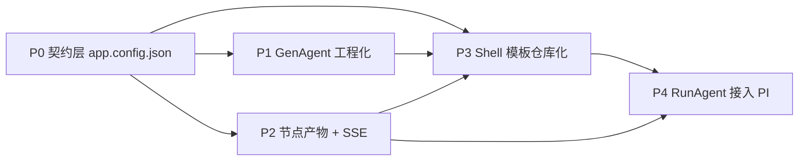

# app_generation 改造 P1/P3/P4 执行任务清单

整体阶段关系：

依赖与并行：

- P1 与 P3 在 P0/P2 契约稳定后可**并行启动**（两条独立工件，互相只看接口）。
- P4 必须在 P3 Shell 提供 SSE/focus/action_request 通道后才能联调。
- 三阶段都不改动 `document-to-skill-engineering-package/` 上游编译器代码。

落地文档归属：

- P1 任务详情写入新文件 [docs/app_generation_gen_agent_spec.md](docs/app_generation_gen_agent_spec.md)。
- P3 任务详情写入新文件 [docs/app_generation_shell_template_spec.md](docs/app_generation_shell_template_spec.md)。
- P4 任务详情扩展现有 [docs/pi_right_agent_protocol_spec.md](docs/pi_right_agent_protocol_spec.md) 与 [docs/app_generation_agent_bridge_spec.md](docs/app_generation_agent_bridge_spec.md)，新增 [docs/app_generation_run_agent_spec.md](docs/app_generation_run_agent_spec.md) 收口三栏联动协议在右栏侧的实现细节。

---

## P1: GenAgent 工程化（生成期 Code Agent 收窄）

目标：把 `python -m growth_dev app generate` 从「读 PRD → 让 Codex 自由写 SPA」改造为「读 PRD + tasks/current + skill artifact → 编译 `app.config.json` + 少量 custom hook → 实例化 Shell」。Codex 可写范围收窄到 `app.config.json` + `custom/*` + `acceptance_criteria.md`，不写 Shell 源码。

### P1-T1: 扩展 CLI 输入面

- 范围：[growth_dev/cli.py](growth_dev/cli.py) `_cmd_app_generate`（≈ 547 行附近）与 `app_sub.add_parser("generate")`（≈ 229-246 行）。
- 新增参数：`--task-yaml-path` / `--domain-yaml-path` / `--skill-dir`，全部可选；默认值 `tasks/current/task.yaml` / `tasks/current/domain.yaml` / 由 `task.yaml.skill_ref.dir` 推导。
- 把这三个路径塞进 `inputs` 字典传给 `_cmd_code_alias`。
- 验收：`tests/test_app_generation_cli.py`（新增）覆盖参数解析、缺省值推导、不存在路径报错。
- 依赖：无。

### P1-T2: `prepare_app_generation_artifacts` 输入扩容

- 范围：[growth_dev/team/app_generation.py](growth_dev/team/app_generation.py) `prepare_app_generation_artifacts`（59-160 行）。
- 落盘到 `runs/<run_id>/`：`input_prd.md`（已有）、新增 `input_task.yaml`、`input_domain.yaml`、`skill_snapshot/`（复制整个 `build/<skill_id>/`）。
- 校验：skill_snapshot 中 `SKILL.md / strategy_ir.yaml / workflow.dag.yaml / data_requirements.yaml / tool_bindings.yaml / output_schemas/ / eval_rules.yaml / evidence_schema.yaml` 缺一即 fail-fast。
- 验收：单测构造缺少 `eval_rules.yaml` 的假 skill_dir，期望 `ValueError`。
- 依赖：P1-T1。

### P1-T3: `app.config.json` 编译器（deterministic）

- 范围：[growth_dev/team/app_generation.py](growth_dev/team/app_generation.py) 新增 `compile_app_config(skill_snapshot, task_yaml, domain_yaml, prd_text) -> dict`。
- 输入只读上述四源，按 [docs/app_generation_rewrite_plan.md](docs/app_generation_rewrite_plan.md) 第 4 节字段映射表，纯函数生成 `app.config.json`。
- 关键字段：`schema_version=app-config-v1`、`shell_kind`、`skill_ref`、`task_ref`、`scope_form`、`nodes`、`aggregate`、`rules`、`tool_bindings`、`evidence`、`safety`、`customizations`。
- `customizations` 来源：解析 `prd.md` 末尾「customizations 清单」段，缺三件套（位置/行为/验收）即 fail-fast。
- 阈值与规则**只**引用 `eval_rules.yaml.rule_id`，PRD 二次发明的阈值视作冲突项报警。
- 落盘：`runs/<run_id>/app.config.json`。
- 验收：用市场洞察 fixture 跑端到端，期望 10 个 node、6 个 data_requirement 槽位、4 条 hard_requirements、3 个 preset 全部出现；snapshot 测试。
- 依赖：P1-T2。

### P1-T4: AppContract v2 派生 + 向后兼容

- 范围：同 `app_generation.py`，从 `app.config.json` 派生 `app_contract.json`（v2）。
- 在 v2 中追加 `acceptance_criteria` 字段（来自 `customizations[].acceptance + rules.hard_requirements + safety + nodes[*]` 四源，纯函数派生，禁止 LLM 介入）。
- 同时落 `runs/<run_id>/acceptance_criteria.md`（Markdown 视图）。
- 验收：现有消费 `app_contract.json` 的代码与测试全绿；新增 `tests/test_app_contract_v2.py` 校验 acceptance 派生 4 源不重不漏。
- 依赖：P1-T3。

### P1-T5: deterministic fallback 利用 `app.config.json` 实例化骨架

- 范围：现有 deterministic 模板生成器（[docs/app_generation_deterministic_fallback_spec.md](docs/app_generation_deterministic_fallback_spec.md) 描述的 `generate_deterministic_app_files`）。
- 改造：不再从 PRD 文本提标题，而是读 `app.config.json`：
  - `index.html` 从 `app_slug` + `shell_kind` 决定 title
  - 注入 `app.config.json` 引用到 `app.js` 启动配置
  - 生成左栏节点占位（不带交互，仅渲染节点 id+name 列表）
- 验收：`tests/test_app_deterministic_generator.py` 扩展用例，覆盖 10 节点 list 渲染。
- 依赖：P1-T3。
- 备注：完整 Shell（三栏 + SSE + 规则引擎）属于 P3 范围，本任务只保证 deterministic 路径产物可见且结构正确。

### P1-T6: Codex prompt 收窄

- 范围：现有 Codex prompt 模板（位于 `app_generation.py` 的 prompt 组装段，详见 `docs/app_generation_implementation_task_plan.md` T5/T6 + `docs/app_generation_codex_observability_spec.md`）。
- 改造：
  - `allowed_paths` 收窄为 `runs/<run_id>/worktree/generated_apps/<slug>/app.config.json` + `.../custom/**`。
  - prompt 上下文新增四块：`app.config.json (current)` / `acceptance_criteria.md` / `skill_snapshot/SKILL.md` / `customizations.md`。
  - 显式禁止：禁止修改 Shell 源码、禁止重画 DAG、禁止改写 `rules.registry`、禁止编造数字。
  - `verification_commands` 加入 `python -m growth_dev appcheck config --run-id <run_id>`（见 P1-T7）。
- 验收：codex executor 测试沿用 fake codex，验证 prompt 中包含上述四块；尝试越界写非 allowed_paths 触发 verifier 报错。
- 依赖：P1-T4、P3-T1（Shell 仓库就绪后才有「Shell 源码不可改」的对照路径）。本任务可分两步落，先文档后实施。

### P1-T7: `appcheck` 子命令

- 范围：[growth_dev/cli.py](growth_dev/cli.py) 新增 `app appcheck`，分 subcmd：
  - `config`：校验 `app.config.json` schema、阈值一致性（与 `eval_rules.yaml` 比对）、customizations 三件套完整性、tool_bindings 是否被强制降级为 `manual_upload_only`。
  - `acceptance`：校验 acceptance 派生闭包（4 源覆盖、无新增）。
- 验收：用市场洞察 fixture 跑 `appcheck config`，期望 0；故意改阈值后期望非 0 + 明确报错。
- 依赖：P1-T4。

### P1-T8: 端到端单测（fake codex 路径）

- 范围：扩展 `tests/test_app_generation_e2e.py`。
- 期望：用 `tasks/current/` 当前内容 + market_insight_skill fixture 跑 `app generate --executor deterministic --foreground`，断言：
  - `runs/<run_id>/app.config.json` 与 `acceptance_criteria.md` 存在且结构正确
  - `runs/<run_id>/skill_snapshot/` 完整
  - 生成应用目录骨架可被 `node --check server.js` 通过
- 依赖：P1-T5、P1-T7。

### P1 验收门

- 全部任务完成后，AGENTS.md 「文档不直接变 Prompt / Tool 必须有 Contract / 每个结论必须可追溯」三条铁律在配置层显式体现。
- `tests/test_app_generation_*` 全绿，包含 v1 既有用例不回归。

---

## P3: Shell 模板仓库化（固定骨架）

目标：把「固定 Shell」从描述性条款变成可被 `app.config.json` 实例化的真实模板仓库。Shell 提供三栏 SPA + Node server + Python 规则引擎 + SSE broker + Evidence drawer + 导出按钮。Shell 仓库不依赖 PRD/skill 内容，只认 `app.config.json`。

### P3-T1: Shell 仓库目录布局拍定

- 新增目录：`shells/report_generator/`（与 `domains/` 同级；理由：Shell 是跨 domain 的渲染层，归 domains 容易和 domain pack 混淆）。
- 布局草案：
  - `shells/report_generator/server/`（Node stdlib + SSE broker）
  - `shells/report_generator/web/`（三栏 SPA，含 `index.html` / `styles.css` / `app.js` / `components/*.js`）
  - `shells/report_generator/engine/`（Python 规则引擎，stdlib，对 `rule_id` 求值）
  - `shells/report_generator/contract.schema.json`（消费的 `app.config.json` schema 完整定义）
  - `shells/report_generator/README.md`（独立维护文档）
  - `shells/report_generator/version.txt`（Shell 版本号；Shell 升级与 `app.config.json` 版本绑定）
- 文档：[docs/app_generation_shell_template_spec.md](docs/app_generation_shell_template_spec.md) 写明目录约束、不可改名、不可塞业务字段。
- 依赖：无。

### P3-T2: `app.config.json` schema（JSON Schema 形式）

- 范围：`shells/report_generator/contract.schema.json`。
- 覆盖：[docs/app_generation_rewrite_plan.md](docs/app_generation_rewrite_plan.md) §2 全部字段，含 enum 取值（`shell_kind` 当前只允许 `report_generator`、节点 `kind` 限定 `form/data/llm/aggregate`、`tool_bindings.effective_mode` 限定 `manual_upload_only`）。
- 配合 P1-T7 的 `appcheck config` 使用同一 schema。
- 验收：用市场洞察 fixture 跑 schema 校验通过；改坏 enum 期望失败。
- 依赖：P1-T3（字段稳定）。

### P3-T3: 规则引擎 `engine/`（Python stdlib）

- 范围：`shells/report_generator/engine/`，纯 Python（stdlib，对齐根仓库 AGENTS.md「不引入新依赖」）。
- 暴露 4 个内置规则：`strong_hot_gene` / `trend_hot_gene` / `differentiated_opportunity_gene` / `opportunity_score`，签名 `eval_rule(rule_id, inputs: dict) -> RuleHit`。
- `opportunity_score` 严格按 `eval_rules.yaml` 公式（20+20+15+15+15+15）+ 三档阈值（85/70/60）。
- CSV → 规则输入的归一化层：通过 `custom/csv_alias_map.json`（PRD customizations 之一）做列名归一。
- 校验：每条 RuleHit 落 `runs/<run_id>/evidence/` 一条 evidence 记录（schema 来自 `evidence_schema.yaml`）。
- 验收：`tests/test_rule_engine.py` 用合成 fixture 覆盖 4 条规则全部分支 + 边界（`opportunity_score=85` / `=70` / `=60` / `<60`）。
- 依赖：P3-T1。

### P3-T4: Node SSE broker + 上传/调度 API

- 范围：`shells/report_generator/server/`，Node stdlib `http`（与 deterministic 模板同栈）。
- 端点：
  - `GET /api/config` → 返回 `app.config.json`
  - `POST /api/upload/<data_requirement_id>` → 文件落 `runs/<run_id>/uploads/`，触发 schema 校验
  - `POST /api/nodes/<node_id>/run` → 调度规则引擎子进程，发 SSE 事件
  - `GET /sse/nodes/<node_id>` → 节点 SSE 通道
  - `GET /sse/agent/<conv_id>` → Agent SSE 通道（占位，P4 接入）
  - `POST /api/export/final_report` → 渲染 aggregate
- SSE 事件格式与类型按 [docs/app_generation_rewrite_plan.md](docs/app_generation_rewrite_plan.md) §3.3 表格。
- 验收：`tests/test_shell_server.py`（Python 端用 `urllib` 起 Node 子进程跑 smoke）覆盖 5 类节点事件 + 1 类错误。
- 依赖：P3-T2、P3-T3。

### P3-T5: 三栏前端组件（`web/`）

- 范围：`shells/report_generator/web/`，原生 SPA（与 deterministic 同栈，零 npm 依赖）。
- 组件：
  - 左栏 `components/node_list.js`：竖排节点 + 5 态徽标 + 业务标题（中文）
  - 中栏 `components/node_detail.js`：`form` / `data` / `llm` / `aggregate` 四类卡片渲染器（按节点 kind 路由）
  - 中栏 `components/evidence_drawer.js`：右抽屉，按 `evidence_id` 拉取展示
  - 中栏 `components/report_preview.js`：aggregate 节点的 Markdown 渲染
  - 右栏 `components/agent_panel.js`：占位（P4 接入）+ focus 状态机
  - 顶部 `components/export_button.js`：触发 `/api/export/final_report`
- 状态机：节点 5 态严格按 `idle / waiting_input / running / done / degraded / failed`，`degraded` 显式徽标。
- 联动：`focus_change` 事件双向同步左中右（左栏点击 → 中栏切节点 + 右栏 focus；中栏点击结论 chip → 左栏滚动 + 右栏 focus）。
- 验收：`tests/test_shell_web.js`（Node 端 jsdom，零 npm；或用 Python `webtest` 走 SSE smoke）覆盖三栏联动 3 个核心场景。
- 依赖：P3-T4。

### P3-T6: aggregate 终节点渲染契约

- 范围：`shells/report_generator/web/components/report_preview.js` + `engine/aggregate.py`。
- `custom/report_template.md.tmpl` 占位符约束：
  - `{{table:<schema>}}` / `{{conclusions:<schema>}}`：Shell 强制注入，LLM 不可绕过
  - `{{narrative:<section>}}`：LLM 允许填充（受 `llm_forbidden_in: [numbers, rule_outputs]` 约束）
- `numbers` 守门：渲染前对 narrative 段做正则扫描（`\d+%` / `\d+\.\d+` / 价格符号），命中即报错并标记 `llm_safety_violation`。
- 验收：`tests/test_aggregate_renderer.py` 用三套 narrative 输入（合法、含数字、含表格）验证守门行为。
- 依赖：P3-T3、P3-T5。

### P3-T7: deterministic 模板与 Shell 关系收口

- 范围：[docs/app_generation_deterministic_fallback_spec.md](docs/app_generation_deterministic_fallback_spec.md) 改写。
- 主张：`shell_kind=report_generator` 时，deterministic 模式直接拷贝 `shells/report_generator/` 到 `generated_apps/<slug>/` + 注入 `app.config.json`，不再走「PRD 文本→静态 SPA」的旧路径。
- 旧 deterministic 模板（generic SPA）保留为 `shells/generic_spa/`，供未来其他 shell_kind 复用。
- 验收：现有 `tests/test_app_deterministic_generator.py` 拆为 generic_spa 与 report_generator 两组用例，全绿。
- 依赖：P3-T1 ~ P3-T6。

### P3-T8: Shell 版本与 `app.config.json` 绑定

- 范围：Shell 启动时校验 `app.config.json.shell_version`（新增字段）与 `shells/report_generator/version.txt` 一致；不一致返回 `412 + shell_version_mismatch`。
- GenAgent（P1）在编译 config 时写入当前 Shell 版本。
- 验收：刻意改 `version.txt` 后启动期望失败。
- 依赖：P3-T4、P1-T3。

### P3 验收门

- `shells/report_generator/` 可被任意 `app.config.json` 实例化（用市场洞察 fixture 通过，准备一个虚构「价格带分析 mini」fixture 也通过）。
- 全部对外接口只读 `app.config.json` + `runs/<run_id>/`，不依赖 PRD 文本、不依赖 skill artifact 路径硬编码。

---

## P4: RunAgent 接入 PI（运行期右栏 Agent）

目标：右栏 Agent 通过 `pi --mode rpc` 跑通。默认不改代码；可解释、对比、触发节点重跑；改代码走显式 `patch_app` / `patch_artifact` 链路，沿用 [docs/app_generation_agent_bridge_spec.md](docs/app_generation_agent_bridge_spec.md)。

### P4-T1: RunAgent 上下文契约

- 范围：新增 [docs/app_generation_run_agent_spec.md](docs/app_generation_run_agent_spec.md)。
- 定义 `RunAgentContext`：
  - `app_config_ref`：指向 `app.config.json`
  - `current_focus`：`{node_id?, output_schema?, conclusion_idx?}`
  - `runs_snapshot`：当前 run 的节点状态、产物 ref、evidence ref
  - `safety_capsule`：从 `app.config.json.safety` 派生，注入 prompt
- 与 [docs/app_generation_node_context_contract.md](docs/app_generation_node_context_contract.md) 的关系：RunAgent 复用 NodeContext 字段子集，不新建平行结构。
- 验收：文档评审通过。
- 依赖：P3-T2。

### P4-T2: `PiAgentProvider` 落地 RunAgent 行为

- 范围：[growth_dev/team/agent_bridge.py](growth_dev/team/agent_bridge.py) 的 `PiAgentProvider`（现状为占位）。
- 行为：
  - 启动 `pi --mode rpc` 子进程，按 [docs/pi_right_agent_protocol_spec.md](docs/pi_right_agent_protocol_spec.md) §2 wire protocol。
  - 把 `RunAgentContext` 编译成首条 system message + per-turn focus delta。
  - 翻译 PI 原生事件为前端归一化事件（`message_delta` / `tool_call` / `tool_result` / `agent_end` / `upstream_error`）。
  - 工具调用白名单：仅允许 `read_artifact` / `read_evidence` / `request_action`（其余 PI 内置 read/write/edit/bash 在 RunAgent 场景下用 `--exclude-tools` 关闭）。
- 验收：扩展 `tests/test_agent_bridge.py`，覆盖 5 类归一化事件 + 工具白名单越界拒绝。
- 依赖：P4-T1。

### P4-T3: RunAgent SSE 通道接入 Shell

- 范围：`shells/report_generator/server/` 的 `GET /sse/agent/<conv_id>` 端点（P3-T4 已建占位）。
- 后端实现：把 `PiAgentProvider` 输出流转发到此 SSE；同步 `focus_change` 事件到节点 SSE，实现「右栏 focus 改变 → 中栏高亮」。
- 验收：`tests/test_run_agent_sse.py` 覆盖 token 流、tool_call 流、focus_change 双向同步。
- 依赖：P4-T2、P3-T4。

### P4-T4: `action_request` 协议落地

- 范围：[docs/app_generation_agent_bridge_spec.md](docs/app_generation_agent_bridge_spec.md) 的 `patch_app` / `patch_artifact` / `rerun_node` 契约在 RunAgent 侧的实现。
- 行为：
  - `rerun_node`：调用 Shell `/api/nodes/<node_id>/run`，节点 SSE 状态切回 `running`
  - `patch_app`：把 PatchSet 应用到 `runs/<run_id>/generated_apps/<slug>/`（**仅允许 `custom/**` 与 `app.config.json` 两类路径**，禁止改 `shells/` 源码或 `skill_snapshot/`）
  - `patch_artifact`：仅允许改 `runs/<run_id>/artifacts/<node>/`，与现有契约对齐
- 强约束：任一 patch 越界即 `412 + patch_out_of_scope`。
- 验收：`tests/test_run_agent_actions.py` 覆盖 3 类 action 的合法路径 + 越界路径。
- 依赖：P4-T2、P3-T1。

### P4-T5: 自由输入路由（Code Agent 触发条件）

- 范围：新增 `dispatch_free_text(user_input, RunAgentContext) -> Route`。
- 路由策略（确定性，非 LLM）：
  - 命中关键词「解释/这是什么/为什么」→ `route=explain`，留在 RunAgent。
  - 命中「重跑/重新计算/换文件」+ 当前 focus 有 `node_id` → `route=rerun_node`。
  - 命中「改/补字段/加按钮/改文案」→ `route=patch_app_proposal`，由 RunAgent 起草 PatchSet 走 P4-T4。
  - 命中「修 bug / 改 Shell / 改规则引擎」→ `route=delegate_code_repair`（走现有 `docs/app_generation_agent_driven_repair_spec.md` 的 Code Agent 委托链路，不在 RunAgent 内完成）。
- 用户可强制 override route。
- 验收：`tests/test_free_text_routing.py` 覆盖 4 条路由的关键词分类。
- 依赖：P4-T2。

### P4-T6: 安全胶囊与脱敏

- 范围：`PiAgentProvider` 输入侧脱敏 + 输出侧拦截。
- 输入侧：CSV 内容、`.env`、`runs/<run_id>/codex/` 原始追踪绝不进入 PI prompt。
- 输出侧：PI 输出文本经 `redact_text`（沿用 [growth_dev/team/app_generation.py](growth_dev/team/app_generation.py) 的 `SECRET_PATTERNS`），命中 secret 直接替换为 `<redacted>` 并发 `risk_event`。
- 数字守门：与 P3-T6 一致，narrative 段含数字命中 `forbidden_outputs` 即拦截。
- 验收：扩展 `tests/test_pi_agent_provider.py` 覆盖 3 类敏感输入 + 数字守门。
- 依赖：P4-T2。

### P4-T7: 端到端 RunAgent 验收

- 范围：新增 `tests/test_run_agent_e2e.py`。
- 场景：
  - 用户上传 6 类 CSV → 节点跑完 → 右栏问「为什么 `strong_hot_gene` 没命中？」→ RunAgent 调 `read_evidence` 解释。
  - 用户问「能把链接规划的卖点段落改得更简洁吗？」→ RunAgent 起草 `patch_app` PatchSet 改 `custom/report_template.md.tmpl` → 用户确认应用 → aggregate 重渲染。
  - 用户问「TOP300 数据有问题，能重跑吗？」→ RunAgent 触发 `rerun_node`。
- 依赖：P4-T1 ~ P4-T6。

### P4 验收门

- RunAgent 默认运行期不改代码，行为可控、可回放。
- 任何代码改动有显式 PatchSet 与人工确认，越界路径全部拦截。
- PI 未配置时降级清晰（`not_configured` 显示在右栏），不影响左中两栏。

---

## 跨阶段交叉项（必须落到三阶段共有的 review checklist）

- **接口冻结时序**：P0 `app.config.json` 字段定义稳定后，才可启动 P1-T3 与 P3-T2；P3-T2 schema 与 P1-T3 编译器实现必须同一 review batch 通过。
- **Shell 不可被 GenAgent 改**：P1-T6 Codex prompt 与 P4-T4 patch_app 都要硬编码 `shells/**` 为禁写路径。
- **阈值唯一来源**：所有阶段禁止在 PRD / app.config.json / Shell 模板 / RunAgent prompt 中二次发明 `eval_rules.yaml` 已有阈值；冲突一律以上游为准并报警。
- **Evidence 闭环**：P3 规则引擎与 P4 RunAgent 共享 `evidence_schema.yaml`，evidence_id 全链路可追溯。
- **测试不引入新依赖**：三阶段全部测试用 Python stdlib + `unittest`（与根仓库现状一致），Node 侧用 stdlib，禁止引入 npm 包或 pytest 等新依赖。

## 不在本次范围

- 多 Shell 模板（如 `dashboard` / `monitor`）的具体实现，留待新业务文档接入时单独立项。
- 真实电商 API 接入、浏览器自动化、跨平台数据源接入（违反 manual_login_only 与无网络边界）。
- PRD 编译器对业务文档之外的多轮交互式澄清，留待 doc-to-skill 链路升级。