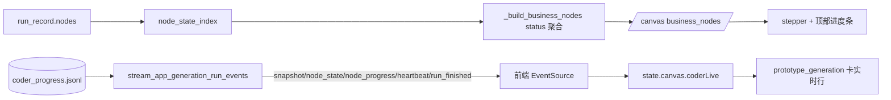
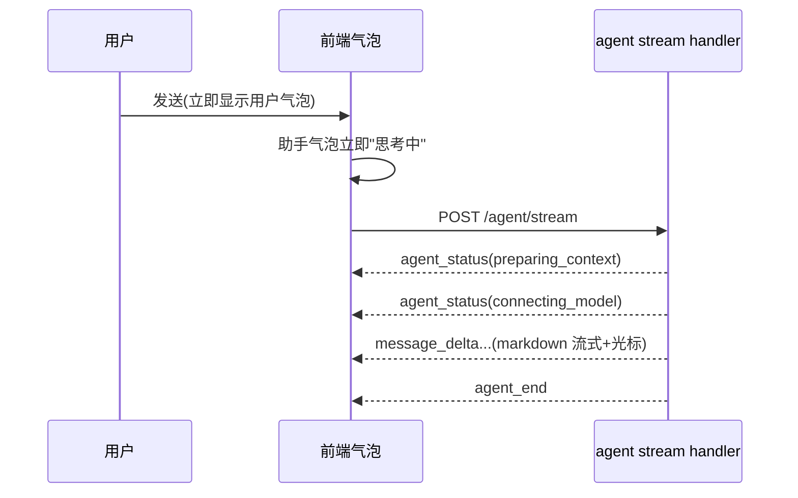

# PRD 生成画布 V2.x 体验升级与实时化计划

## 背景与现状（已重新核实当前代码，含你中途的改动）

你这次的改动已落地，下列**不要重做**：
- 后端 `BUSINESS_STEP_DETAILS`（[growth_dev/team/app_generation_canvas.py](growth_dev/team/app_generation_canvas.py):~58）：每个业务节点有 `input_summary/process_summary/output_summary/available_actions`，`_build_business_nodes`(:422) 已注入；`ENTRY_STEP`/`PREVIEW_STEP` 同样有。
- 前端 `renderStepDetail`([dashboard/app_generation.js](dashboard/app_generation.js):1075) 渲染五张卡（输入/执行过程/输出/你可以让Agent做什么/工程证据），`selectCanvasBusinessNode`(:1382) 已接通。
- `selectRun`(:691) 已调用 `subscribeRunEvents`(:2808)；`handleRunStreamEvent`(:2836) 在 `snapshot/node_state/run_finished` 时 `refreshCanvasProjection` 重拉 `/canvas`。

**真正缺口（导致“启动后看不到状态”）**：
- 后端 `_business_node_status`(:900) 是**纯产物文件投影**（只数 `required_existing`）：刚启动产物未写→6 节点全 `not_started`，看不出正在跑哪一步。
- 但 `build_app_generation_canvas`(:150) **已经返回 `node_state`**（`_node_state_index`(:178) 从 `run_record["nodes"]` 取每个工程节点真实 `status`，含 `running`），业务节点又有 `runtime_nodes` 映射——数据齐全，只是没接进 status。
- 前端 `handleRunStreamEvent` **丢弃 `node_progress`**（code agent 的 `coder_progress.jsonl` 整行），最耗时的 `prototype_generation` 跑动时卡片不动。
- stepper/overview 卡片(`renderBusinessNodeTrack`:1039 / `renderPipelineOverview`:1007) 只有 `title+status+产物x/y`，无“做什么”一句话、无 running 脉冲。
- code agent 长任务无心跳，卡住时无法区分“在算/真卡”。
- 真实字段：进度事件 `event_id/operation_id/event_type/title/summary/business_status`；agent 流 `message_delta/tool_call/tool_result/agent_end/upstream_error`；DESIGN token 全（`--color-status-*`、`--color-code-background/text`、elevation、card/button/statusBadge）。

## 目标效果
- 上传PRD→启动后，stepper 立刻能看出“正在执行第N步：理解业务目标…”，每步状态实时变（未开始/执行中/已完成）。
- code agent（最耗时）跑动时显示当前动作、已改N文件、工具M次、第K事件 + 脉冲。
- 每个业务节点卡可一句话看出职责，可重跑/看产物/找 Agent 改。
- 右侧 Agent 问答：提问即思考态、markdown 流式、可停止、气泡分明（cursor 风格）。
- 原生栈对齐 DESIGN.md：四态(loading骨架/empty/error/success) + 统一状态视觉与过渡。

## 运行态数据流（升级后）

## 阶段一 后端业务节点状态接入运行态（核心根因，先做）
- 改 `_build_business_nodes`(:422)：除现有产物投影外，传入/计算 `node_state`（`runtime_nodes` 命中）：
  - 任一 `runtime_node` 为 `running` → 业务节点 `status="running"`（执行中），并标记 `is_current=True`。
  - 全部 `runtime_node` 完成 + 产物齐 → 维持现 `drafted/planned/generated/verified/delivered`。
  - 已开始未完成 → `generating`；都未动且无产物 → `not_started`。
- `_business_node_status`(:900) 增加 `node_state` 入参（或新增 `_resolve_business_status` 合并“运行态优先于文件态”），保持旧返回值集合向后兼容。
- canvas 顶层补 `current_business_node_id`（首个 running，否则首个未完成步），供前端 stepper 高亮“当前步”。
- Checkpoint：启动后 `/canvas` 即返回某节点 `running` + `current_business_node_id`，无需等产物落盘。

## 阶段二 前端消费 node_progress + running 视觉 + 节点职责一句话
- `handleRunStreamEvent`(:2836) 增 `node_progress` 分支：把 `payload.event`(`business_status/title/summary/event_type`) 与累计 `files_changed/tool_calls/event_seq` 存入 `state.canvas.coderLive`（按 run_id），不整体重拉 `/canvas`，仅局部重渲 `prototype_generation` 卡与详情。
- `renderBusinessNodeTrack`(:1039)：卡片加一句 `process_summary[0]`（做什么）；`status==="running"` 加脉冲 class，`current_business_node_id` 高亮。
- `renderPipelineOverview`(:1007)：进度文案显示“正在执行：<title>”而非仅完成度。
- `prototype_generation` running 态展示当前动作(`title`)+`business_status`+已改N文件+工具M次+事件序号。
- Checkpoint：选中进行中 run，stepper 当前步随 code agent 实时跳动，卡片能 glance 出“做什么+状态”。

## 阶段三 code agent 长任务心跳
- 后端 `stream_app_generation_run_events`（[growth_dev/team/dashboard.py](growth_dev/team/dashboard.py)）增 `heartbeat`：无变化也按 `poll_interval` 周期 yield `{type:"heartbeat",payload:{run_id,ts,running_node}}`，保留 `max_iterations`/`sleeper` 注入。
- 前端 `prototype_generation` 卡用 heartbeat 维持“活着”脉冲；计数不增长时区分“在算/真卡”。
- Checkpoint：跑动期间秒级反馈；卡住时心跳在但计数停。

## 阶段四 业务节点三件套：重跑 / 看产物 / Agent 改
- 业务节点卡/`renderStepDetail` 操作行复用现有零件：重跑（`runtime_nodes[0]`→`triggerRerun`，新 run 自动订阅切换）、看产物（`artifact_refs`→`openArtifactPreview`）、Agent 改（`triggerStepAction`/`canvas_selection`）。
- Checkpoint：任一业务节点能一键重跑、看产物、就该步发起 Agent 修改。

## 阶段五 右侧 Agent 问答交互升级（cursor 风格）

- 后端 agent stream handler 在 `build_app_generation_node_context`/`context_revision` 校验/provider 检查前后，尽早 yield 轻量 `agent_status`(phase:`preparing_context`/`connecting_model`)；增量事件，老前端忽略，保持 `agent_end`/`upstream_error` 终止语义。
- 前端 `startStreamingAgentBubble` 立即渲染思考态（闪烁光标/三点 shimmer），消费 `agent_status` 更新阶段文案；首个 `message_delta` 切内容。
- 助手内容手写轻量 markdown 流式渲染（标题/列表/fenced 代码/行内代码/粗体/链接），不引第三方库，code 用 `--color-code-background/text`。
- 气泡分明：用户右、助手左，时间戳 hover；工具卡片去 emoji，运行 spinner、成功/失败用 DESIGN status 色；`AbortController` 加“停止”按钮；仅贴底自动滚动。
- Checkpoint：提问即思考态；markdown/代码正常；可中断；三类气泡视觉分明贴合 DESIGN。

## 阶段六 原生栈四态与视觉统一（对齐 DESIGN.md）
- 业务画布/对象详情/Agent 面板统一 loading(骨架屏)/empty/error/success 四态，替换裸 `meta`。
- [dashboard/styles.css](dashboard/styles.css) 状态徽标对齐 `--color-status-processing/completed/attention/waiting/muted`，running 用 processing 色+脉冲；卡片统一 `elevation-panel`/`radius-card`；状态切换/进度条/心跳加 `transition`。
- Checkpoint：上传→启动→生成全程视觉一致、状态语义统一。

## 阶段七 测试与核对
- 扩 [tests/test_app_generation_canvas.py](tests/test_app_generation_canvas.py)：构造 `run_record["nodes"]` 含 running，断言对应业务节点 `status=="running"` + `current_business_node_id` 正确；产物齐时回落到终态。
- 扩 [tests/test_dashboard.py](tests/test_dashboard.py)：`heartbeat` 周期产出、`node_progress` 持续推进、节点重跑映射工程 node、agent stream 内容前先产出 `agent_status` 且保持终止语义。
- 跑 `python -m unittest tests.test_app_generation_canvas tests.test_dashboard -v` 全绿；前端用进行中+已完成 `runs/` 记录手动核对各 Checkpoint。

## 关键约束
- 保持 `/api/app-generation/*` 与 SSE 事件 schema 向后兼容；新增事件(heartbeat/agent_status)与新字段(`is_current`/`current_business_node_id`)为增量，老前端忽略不报错。
- 业务节点 status 集合保持原值可识别，仅新增 `running`。
- 投影/流只读，沿用 `_safe_run_dir`/`_redact`，进度与对话脱敏。
- Dashboard 改动以 [DESIGN.md](DESIGN.md) token 为准、业务化措辞。
- 不引前端框架、不引第三方 markdown 库、不做无关重构、不使用 SubAgent。