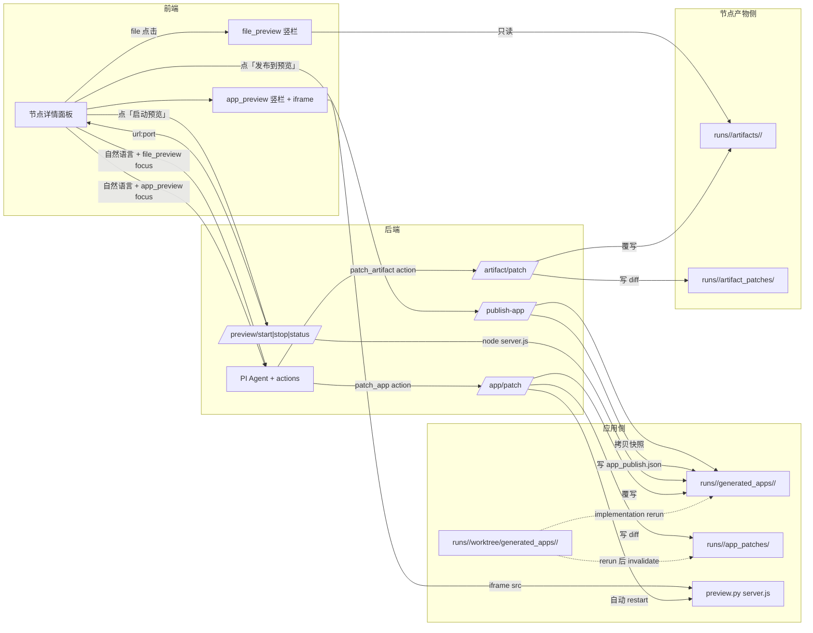

## 现状与定位

- 已有：`growth_dev/team/preview.py` 实现了 `start_preview / stop_preview / wait_for_health / list_active_previews`，按 `127.0.0.1` 绑定 + 端口扫描 + 健康检查 + `preview_run_record.json` 落盘；但**没接进 dashboard HTTP API**，前端也没预览按钮和 iframe 容器。
- 已有：`generate_deterministic_app_files`（`[growth_dev/team/app_generation.py](growth_dev/team/app_generation.py:719+)`）只产出 `server.js / index.html / styles.css / app.js` 的纯展示骨架，缺少 LLM 应用通用部件。
- 已有：右侧 Agent (`agent_bridge.py`) 支持 `explain / suggest / replan` 占位，**无双类直改动作**（节点产物 / 已发布应用）。
- 用户决策（round 2）：预览语义只支持 2 类 —— 节点产物（file_preview，直接读 artifacts，不启进程）+ 最终应用（app_preview，必须经过显式「发布到预览」生成快照，server.js + iframe 内嵌运行）；Agent 同时可改节点产物 + 已发布应用，分别走 `patch_artifact` + `patch_app`，落各自证据目录。worktree 不再是预览目标。

## 总体数据流




关键边界：

- `worktree/generated_apps/<slug>/` 是 Codex 的工作源，**只能**被 implementation 节点重跑刷新，Agent 不直接改。
- `runs/<run_id>/generated_apps/<slug>/` 是已发布快照，预览唯一目标；Agent 的 `patch_app` 在此目录原地改。
- `runs/<run_id>/codex/` 是 Codex 原始追踪，任何人都不得改。
- `runs/<run_id>/artifacts/<node>/` 是节点产物，file_preview 唯一来源，Agent 的 `patch_artifact` 在此目录原地改。

## 升级范围（五个工作流）

### 工作流 0：显式「发布到预览」

`[growth_dev/team/dashboard.py](growth_dev/team/dashboard.py)`：

- 新增路由 `POST /api/app-generation/runs/<run_id>/publish-app`：
  - body `{app_slug?: str}`；缺省时扫描 `worktree/generated_apps/*` 取唯一目录。
  - 前置检查：implementation 节点必须 `completed` 或 `warning`，否则 412 + `{"error": "implementation_not_complete"}`。
  - 检查 worktree dirty 状态；当前实现允许 dirty，但记录到 `app_publish.json` 的 `worktree_clean: bool` 字段。
  - 用 `shutil.copytree(src, dst, dirs_exist_ok=True)` 把 `worktree/generated_apps/<slug>/` 复制到 `runs/<run_id>/generated_apps/<slug>/`（已存在时直接覆盖，不做 `<slug>.prev/` 备份；历史靠 `app_publish.json` 的 `published_at + source_commit` 与 `app_patches/index.json` 追溯，需要回滚时走「重新发布上一次 commit」或单文件 `git apply -R`，避免快照目录里堆 `.prev` 噪音）。
  - 写 `runs/<run_id>/generated_apps/<slug>/app_publish.json`：
    ```json
    {
      "slug": "feature_x",
      "source_commit": "<git rev-parse HEAD in worktree>",
      "worktree_path": "runs/<run_id>/worktree/generated_apps/feature_x",
      "worktree_clean": true,
      "published_at": "<iso8601>",
      "published_by": "user"
    }
    ```
  - 返回 `{status, slug, snapshot_path, source_commit, published_at}`。

`[dashboard/app_generation.js](dashboard/app_generation.js)`：

- 新增「发布到预览」按钮，调上面路由；成功后把 preview 状态机切到「已发布·已停止」，「启动预览」按钮变可点击。

### 工作流 1：一键沙箱预览（HTTP API 接入）

后端 `[growth_dev/team/dashboard.py](growth_dev/team/dashboard.py)`：

- 新增三条路由，复用 `preview.py`：
  - `POST /api/app-generation/runs/<run_id>/preview/start`：
    - body `{app_slug?: str, port?: int}`；
    - 唯一从 `runs/<run_id>/generated_apps/<slug>/` 读（**不再读 worktree**）；
    - 目录不存在 → 412 + `{"error": "app_not_published", "hint": "请先点「发布到预览」"}`；
    - `app_publish.json` 缺失 → 412 + `{"error": "missing_publish_record", "hint": "请重新发布"}`；
    - 多 slug → 422 + `multiple_apps_found`；
    - 调 `start_preview(PreviewRunRequest(...), runs_dir=config.runs_dir)`；
    - 返回 `{status, url, port, pid, health_status, log_path, message}`。
  - `POST /api/app-generation/runs/<run_id>/preview/stop`：调 `stop_preview(record_path)`，幂等。
  - `GET /api/app-generation/runs/<run_id>/preview/status`：读 `preview/preview_run_record.json` + `generated_apps/<slug>/app_publish.json` + `app_patches/index.json`，返回合并的 `preview_status`，含 `state / url / port / health_status / published_at / source_commit / app_patches_count / invalidated_by_rerun / last_patch_restart_error?`。
- 安全：`generated_app_dir.resolve()` 必须在 `runs_dir.resolve()` 之下；`preview.py` 自带 `ALLOWED_COMMANDS={node, python3, python}` 与 `ALLOWED_DIR_MARKER=generated_apps` 校验，沿用即可。
- 端口策略：默认 `preferred_port=8788`，按 `allocate_port` 顺延，避免与 dashboard 自身端口冲突。

前端 `[dashboard/app_generation.html](dashboard/app_generation.html)` + `[dashboard/app_generation.js](dashboard/app_generation.js)`：

- 新增「应用预览」面板，含：`发布到预览 / 启动预览 / 停止预览 / 在新窗口打开 / 刷新` 按钮 + `<iframe id="app-generation-app-frame" sandbox="allow-scripts allow-forms allow-same-origin">`。
- 状态机：`未生成 → 未发布 → 已发布·已停止 → 启动中 → 运行 / 降级 / 失败`，UI 按状态置灰对应按钮。
- 失败时展示 `log_path` 末 200 行可点击查看。
- 文案直接复用 DESIGN.md token，不引入新颜色。

### 工作流 2：LLM 应用默认脚手架升级（API_KEY 服务端唯一来源）

> **规范对齐**：`[docs/app_generation_prd_to_local_app_spec.md](docs/app_generation_prd_to_local_app_spec.md)` § 服务端 .env 配置 + AC-047/AC-049 明确「API Key 唯一来源是服务端 process.env / .env，禁止前端持有」。本工作流按此安全边界实施。

`[growth_dev/team/app_generation.py](growth_dev/team/app_generation.py)` 的 `generate_deterministic_app_files`：

- `public/index.html`：增「模型选择 select / 提示词 textarea / 单张生图按钮 / 批量生图按钮 / provider 配置状态徽标（显示『未配置 / 已配置 / 错误』，**绝不显示 key 本身**）/ 调用历史区 / 结果展示区 / 错误提示区」骨架（仍是 zero-dep 原生 SPA）。
- `public/app.js`：增 `loadConfig() / saveConfig()` 只持久化**模型选择**到 localStorage，**不保存 API_KEY**；`fetchHealth()` 启动时调 `GET /api/health` 渲染配置状态徽标；`callImageModel(prompt)` 默认 `fetch('/api/images/generate', {body:{model,prompt}})` 走 server.js 代理，请求体**不含 key**。
- `server.js`：增 `GET /api/health` 返回 `{provider, model, configured: bool, message}`，`configured` 由 `process.env.OPENROUTER_API_KEY`（或对应 provider key）是否存在决定；增 `POST /api/images/generate` 从 `process.env` 读 key，**不从请求体或 config.json 读**；key 缺失返回 422 + `{"error":"provider_not_configured","hint":"请在服务端 .env 配置 OPENROUTER_API_KEY 后重启"}`；用 Node stdlib `https` 发起最小调用。
- 增 `.env.example`（仅占位 key + 默认模型，**不含真实 key**）+ `README.md` 段落「如何在服务端配置 API_KEY」（明确说在 `generated_apps/<slug>/.env` 或启动 server.js 前 `export OPENROUTER_API_KEY=...`）。
- `.gitignore` 默认含 `.env`，防止 key 落入 worktree。

`[growth_dev/team/codex.py](growth_dev/team/codex.py)` 主 coder prompt 的 `## App Generation` 段增「默认图片应用结构契约」清单：

```
图片类 PRD 生成应用必须包含：
- 前端：模型选择、provider 配置状态徽标（不显示 key）、单张/批量生图按钮、结果区、错误提示
- 服务端：GET /api/health + POST /api/images/generate，API key 只从 process.env 读取
- .env.example：占位 key + 默认模型，README 说明配置方式
- 必须保留 AGENT_EDIT:<id> 锚点段，便于 patch_app replace_block 定位
- 禁止：前端 API_KEY 输入框、localStorage 保存 key、config.json 持久化 key
```

安全约束（强制）：

- API_KEY 唯一来源是服务端 `process.env`；前端任何代码路径都不得读 / 写 / 传 key。
- server.js 不通过任何接口把 key 回传给前端；`/api/health` 只返回 `configured: bool`，不返回 key 任何前缀或后缀。
- 禁止生成 `config.json` 持久化方案，禁止 localStorage 保存 key。

### 工作流 3：Agent 双类增量编辑（patch_artifact + patch_app）

`[growth_dev/team/agent_bridge.py](growth_dev/team/agent_bridge.py)`：

- `ALLOWED_OPERATIONS` 改为 `["explain", "patch_artifact", "patch_app", "rerun_from_node", "suggest_input_patch"]`。
- intent 路由按 `focus.card` 区分：
  - `focus.card == "file_preview"` → `patch_artifact`；
  - `focus.card == "app_preview"` → `patch_app`；
  - 跨 focus 或大改 → `rerun_from_node` / `suggest_input_patch`。
- PI prompt 协议追加两类 action 的字段约束：

```jsonc
// patch_artifact
{
  "type": "patch_artifact",
  "target_node_id": "context_contract",
  "target_files": ["artifacts/context_contract/app_contract.json"],
  "patch_diff": "<unified diff>",
  "summary": "补充 image_generation required_capability",
  "preserved_capabilities": ["four_stage_workflow", "..."]
}

// patch_app
{
  "type": "patch_app",
  "app_slug": "feature_x",
  "target_files": ["public/index.html", "public/app.js", "server.js"],
  "patch_diff": "<unified diff per file>",
  "edit_kind": "replace_block | append | create_file",
  "anchor": "AGENT_EDIT:image-button",
  "summary": "加生图按钮 + 模型下拉",
  "preserved_capabilities": ["four_stage_workflow", "..."]
}
```

- `target_files` 越界规则：
  - `patch_artifact` 必须以 `artifacts/<node>/` 起头；
  - `patch_app` 必须以 `generated_apps/<slug>/` 内文件起头（不含 `app_publish.json`）；
  - 任何含 `codex/`、`worktree/` 或绝对路径的目标 → 403 + `codex_immutable` / `worktree_immutable`。

`[growth_dev/team/dashboard.py](growth_dev/team/dashboard.py)`：

- 新增 `POST /api/app-generation/runs/<run_id>/artifact/patch`：
  - 先写 `runs/<run_id>/artifact_patches/<ts>__<node>__<file>.diff`；
  - 再覆写 `runs/<run_id>/artifacts/<node>/<file>`；
  - 更新 `artifact_patches/index.json`：`{"timestamp", "node_id", "file", "operation": "patch", "diff_path", "agent_action_id"}`；
  - 覆写失败 → 回滚 diff 文件，422。
- 新增 `POST /api/app-generation/runs/<run_id>/app/patch`：
  - 先写 `runs/<run_id>/app_patches/<ts>__<file>.diff`；
  - 再覆写 `runs/<run_id>/generated_apps/<slug>/<file>`，按 `edit_kind`：
    - `replace_block`：找 `// === AGENT_EDIT:<id> START === ... END ===` 锚点；缺锚点 422；
    - `append`：追加到文件尾，前面留 1 行空；
    - `create_file`：仅当不存在；存在则 422。
  - 更新 `app_patches/index.json`；
  - 覆写成功且当前 preview 处于 `running` → 自动 `stop_preview` + `start_preview` 重启加载新代码；
  - 重启失败 → **保留旧 server 进程**，`preview_status.last_patch_restart_error` 记录错误，不杀旧 pid，UI 显示「重启失败，当前预览仍为旧版本，建议手动停止后重新启动」。
- SSE 推 `artifact_patch_applied` / `app_patch_applied` 事件。

`[dashboard/app_generation.js](dashboard/app_generation.js)`：

- 右侧 Agent 对话「待确认建议」面板识别两类 action，分别展示 `target_files / edit_kind / summary / preserved_capabilities` + diff 折叠（show first 30 lines）；用户点「应用」时调对应 POST。
- `patch_app` 应用成功后弹顶部 banner「应用已更新，是否重启预览查看？」；`patch_artifact` 应用成功后在 timeline 增加一条「产物补丁」轨道点。

### 工作流 4：内嵌浏览器与 rerun invalidate

- iframe 用 `sandbox="allow-scripts allow-forms allow-same-origin"`；`src` 由后端返回的 `http://127.0.0.1:<port>` 直接挂载。
- `patch_app` restart 成功后，前端自动 `iframe.contentWindow.location.reload()`；restart 失败时不刷新，提示用户手动。
- 「在新窗口打开」给一个普通 `<a target="_blank">`，对应用调试时切换设备宽度有用。
- implementation 节点重跑时：
  - dashboard 把 `runs/<run_id>/app_patches/index.json` 内所有记录的 `invalidated_by_rerun` 标为 `true`；
  - `preview_status` 退回「未发布」，UI 显示「上游节点已重跑，旧补丁失效，请重新发布到预览」；
  - 旧 `app_patches/<ts>.diff` 文件保留为审计证据，不删除。

## 文件清单与改动点

- `[growth_dev/team/preview.py](growth_dev/team/preview.py)`：保持现有 API，可能补 1 个 `restart_preview(record_path)` 便捷封装。
- `[growth_dev/team/dashboard.py](growth_dev/team/dashboard.py)`：新增 `publish-app` 1 路由 + 预览 3 路由 + `artifact/patch` 与 `app/patch` 各 1 路由 + SSE `artifact_patch_applied` / `app_patch_applied` 事件 + rerun invalidate 逻辑。
- `[growth_dev/team/app_generation.py](growth_dev/team/app_generation.py)`：`generate_deterministic_app_files` 模板扩充 4 文件内容 + `AGENT_EDIT` 锚点注释；新增 `apply_app_patch(run_dir, app_slug, target_path, edit_kind, ...)` 与 `apply_artifact_patch(run_dir, node_id, target_path, ...)` 工具函数；新增 `publish_app(run_dir, app_slug)`。
- `[growth_dev/team/codex.py](growth_dev/team/codex.py)`：主 coder prompt 增「默认 LLM 应用结构契约」段落与锚点要求；fix-slice prompt 同步一句话指令。
- `[growth_dev/team/agent_bridge.py](growth_dev/team/agent_bridge.py)`：`ALLOWED_OPERATIONS` 与协议字段扩展 `patch_artifact` / `patch_app`；`_dispatch` 中按 `focus.card` 路由 intent。
- `[dashboard/app_generation.html](dashboard/app_generation.html)`：节点详情右上加「应用预览」面板含发布/启动/停止/刷新/新窗口 + iframe；右侧 Agent 建议区新增两类 patch 卡片样式。
- `[dashboard/app_generation.js](dashboard/app_generation.js)`：新增 `publishApp / startAppPreview / stopAppPreview / refreshAppPreview / applyAgentArtifactPatch / applyAgentAppPatch`；SSE 处理 `artifact_patch_applied` / `app_patch_applied`。
- `[dashboard/styles.css](dashboard/styles.css)`：预览面板 / patch banner / 建议卡片样式。
- 测试：
  - `[tests/test_preview.py](tests/test_preview.py)`：覆盖路由调用 → record 落盘 → stop 幂等。
  - `[tests/test_dashboard.py](tests/test_dashboard.py)`：新增 `test_publish_app_route / test_preview_start_requires_publish / test_artifact_patch_route / test_app_patch_route / test_codex_path_forbidden_403 / test_patch_app_restart_failure_keeps_old_server / test_implementation_rerun_invalidates_app_patches`。
  - `[tests/test_app_generation.py](tests/test_app_generation.py)`：脚手架增项后断言 `public/index.html` 含「生图按钮」「模型选择」「provider 配置状态徽标」锚点、`server.js` 含 `GET /api/health` 与 `POST /api/images/generate` 路由、`.env.example` 存在、`README.md` 含「如何在服务端配置 API_KEY」段落；**不含**前端 API_KEY 输入框、localStorage 保存 key、config.json 持久化 key。
  - `[tests/test_agent_bridge.py](tests/test_agent_bridge.py)`：协议解析 `patch_artifact` / `patch_app` action + 字段校验 + focus.card 路由红→绿。

## 阶段与检查点

- 阶段 A 显式发布 + 一键预览（最短闭环）
  - 实施：dashboard 新增 publish-app + preview 3 路由 + 前端「发布到预览」「启动预览」按钮 + iframe；脚手架不动。
  - 检查点：现有 run 先点「发布到预览」生成快照 + `app_publish.json`；再点「启动预览」5 秒内出 iframe；未发布点启动返回 412；`stop` 后 pid 不在；`test_publish_app_route` + `test_preview_start_requires_publish` 绿。
- 阶段 B 脚手架升级
  - 实施：`generate_deterministic_app_files` + Codex prompt 同步；新增 `AGENT_EDIT` 锚点注释；新增 `.env.example` + README 配置段。
  - 检查点：本地非 Codex 路径产出文件包含「模型选择 / provider 状态徽标 / 生图按钮 / GET /api/health / POST /api/images/generate / .env.example」；产出**不含**前端 API_KEY 输入框、localStorage 保存 key、config.json；`test_app_generation` 新断言绿；真机跑一个新 run，发布后预览能看到这些控件；先不 export key 时徽标显示「未配置」，export key 后徽标显示「已配置」。
- 阶段 C Agent 双类增量编辑
  - 实施：`ALLOWED_OPERATIONS` + 协议；`apply_artifact_patch` / `apply_app_patch` 与对应路由；前端建议卡片 + 应用按钮 + 重启 banner。
  - 检查点：file_preview focus 下「这个 contract 加一行 image_generation」→ `patch_artifact` 建议 → 前端确认 → `artifacts/context_contract/app_contract.json` 改动 + `artifact_patches/<ts>.diff` 落盘；app_preview focus 下「把生图按钮文案改成『出图』」→ `patch_app` 建议 → 前端确认 → `generated_apps/<slug>/public/index.html` 改动 + `app_patches/<ts>.diff` 落盘 + 预览自动重启；`test_codex_path_forbidden_403` 红→绿。
- 阶段 D 体验闭环打磨
  - rerun invalidate UI；patch 历史面板（读 `artifact_patches/index.json` 与 `app_patches/index.json`）；预览健康降级提示；重启失败兜底 UI。

## 不确定与权衡

1. **预览语义已锁定（round 2）**：预览只看 `runs/<run_id>/generated_apps/<slug>/` 已发布快照，worktree 不参与预览；implementation 重跑会把当前 patch 标 `invalidated_by_rerun=true`，但保留 diff 文件作为审计证据。回滚不靠 worktree，靠重新发布或 `git apply -R` 单个 patch 文件。
2. **API_KEY 配置方式**（已按规范锁定）：API_KEY 唯一来源是服务端 `process.env`（从 `.env` 或启动前 `export` 加载）；前端通过 `GET /api/health` 查询配置状态（只返回 `configured: bool`，绝不返回 key 本身）；禁止前端 API_KEY 输入框、localStorage 保存 key、config.json 持久化 key。规范来源：`[docs/app_generation_prd_to_local_app_spec.md](docs/app_generation_prd_to_local_app_spec.md)` § 服务端 .env 配置 + AC-047/AC-049。
3. **Agent 双类增量 vs rerun**：增量编辑（patch_artifact / patch_app）只在「不需要重生成节点结构」时使用；若用户提出的修改实际需要重新规划（增加新节点、新槽位、改变 contract 结构），Agent 应仍走 `suggest_input_patch + rerun_from_node`。判定靠 `focus.card` + Agent 自我评估修改幅度。
4. **沙箱锚点**：`replace_block` 依赖脚手架预埋的 `AGENT_EDIT:<id>` 锚点；Codex 模式可能不会保留锚点。先把锚点写进脚手架模板与 Codex prompt 的输出契约，缺锚点时 patch 自动降级为 `append` 或 422 报错。
5. **重启失败兜底**：`patch_app` 自动重启失败时不杀旧进程，preview 保持旧版本可用 + UI 提示。原因是杀掉旧进程会让用户陷入「改完什么都看不到」的状态；保留旧进程至少让用户能验证「旧版本还能跑」并手动决定下一步。
6. **预览权限**：preview.py 已限定 `127.0.0.1` 绑定与 generated_apps 路径；本期不考虑外网/局域网访问。

## 验收标准

1. 现成 run 点「发布到预览」后 `runs/<run_id>/generated_apps/<slug>/app_publish.json` 写入 `source_commit + published_at`；未发布点「启动预览」返回 412 + `app_not_published`。
2. 发布后点「启动预览」5 秒内 iframe 加载完成，`preview_run_record.json` 含 `health_status=ok`；点「停止预览」后 pid 不存在。
3. 用阶段 B 的脚手架重生成一个新 run，应用 UI 内可见「模型选择 / provider 配置状态徽标（显示『未配置 / 已配置 / 错误』，不显示 key）/ 提示词 / 生图按钮 / 调用历史 / 结果展示」；README 说明在服务端 `.env` 配置 OPENROUTER_API_KEY；启动 server.js 前 `export OPENROUTER_API_KEY=...` 后点生图走 `POST /api/images/generate`；key 缺失时 `GET /api/health` 返回 `provider: not_configured`，`POST /api/images/generate` 返回 422 友好提示。
4. file_preview focus 下右侧 Agent 收到「app_contract.json 加 image_generation 能力声明」→ 输出 `patch_artifact` → 用户点「应用」→ `artifacts/context_contract/app_contract.json` 被改 + `artifact_patches/<ts>__context_contract__app_contract.json.diff` 落盘 + `artifact_patches/index.json` 更新。
5. app_preview focus 下右侧 Agent 收到「把生图按钮文案改成『出图』」→ 输出 `patch_app` → 用户点「应用」→ `generated_apps/<slug>/public/index.html` 被改 + `app_patches/<ts>__public-index.html.diff` 落盘 + 预览自动重启 + iframe 刷新看到新文案。
6. `target_files` 越界（如 `../etc/passwd` 或 `codex/implementation_trace.json`）→ 403 + `codex_immutable` 或 `path_out_of_scope`，落 `*_patches/index.json` 失败记录。
7. `patch_app` 重启失败时旧 server 进程仍在跑 + UI 提示「重启失败，当前预览仍为旧版本」+ `preview_status.last_patch_restart_error` 有值。
8. implementation 节点 rerun 后 `app_patches/index.json` 所有记录 `invalidated_by_rerun=true`，`preview_status` 退回「未发布」，UI 显示重新发布提示。
9. 所有新增/修改单测 OK，老测试不回归。
10. 真机 dashboard 启动 `--codex-provider aicodemirror`，整条「跑生成 → 发布到预览 → 启动预览 → 与 Agent 对话改 contract → 应用补丁 → 对话改按钮文案 → 应用补丁 → 重启预览看到 → rerun implementation 验证 patch invalidate」走通。

## 不做（本轮显式排除）

- 不引入新的运行时依赖（保持 stdlib-only / 已有 Node stdlib）。
- 不做远程预览暴露、不做 https、不做多用户并发预览。
- 不做 patch 自动回滚 UI（先用 `git apply -R` 单个 diff 文件文档替代）。
- 不做 Codex 模式下脚手架锚点的强校验（先以 prompt 软约束 + 降级为 append 兜底）。
- 不做 worktree 直接预览的回退路径（worktree 不再是预览目标）。

