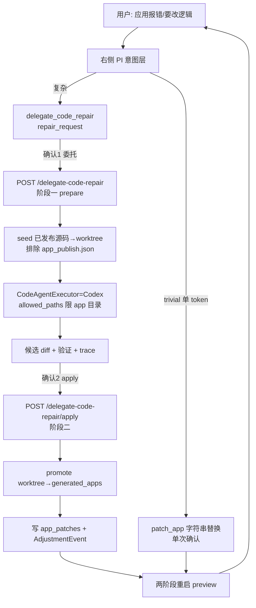

# 落地 delegate_code_repair：统一 code agent 到 CodeAgentExecutor

## 关键修正（相对上一版 plan）

- 命名对齐既有规范：用 `delegate_code_repair` / `repair_request` / `CodeAgentExecutor`，**废弃**杜撰的 `repair_app_run`。
- 确认模型改为**两段**：委托确认 → code agent 在 worktree 产出候选 diff → 用户审 diff 再确认 → apply。对应 bridge spec L756 与所选 worktree_promote 写回。
- 架构已在 6 份文档规范化（repair_spec / bridge_spec / architecture / node_context / acceptance AC-063 / task_plan T27）；代码零实现。本轮 = 把契约层落到执行契约 + 实现。

## D0 — 文档先行（用户审核 gate）

新增 [docs/app_generation_code_agent_executor_spec.md](docs/app_generation_code_agent_executor_spec.md)：CodeAgentExecutor 执行契约（抽象接口、两阶段 prepare/apply、worktree seed 排除 app_publish.json/app_patches、promote、失败与安全语义、端点契约、与 patch_app 分界）。草案已在对话给出，按用户审核意见定稿后落盘。

更新 [docs/app_generation_acceptance_and_testing.md](docs/app_generation_acceptance_and_testing.md)：在 AC-063 旁补一条「delegate_code_repair 两阶段执行」验收（prepare 不改 generated_apps、apply 才 promote、失败不动旧应用、写 AdjustmentEvent）。

**未获用户对文档确认前，不进入 D1-D6 代码改动。**

## 数据流

## D1 — agent_bridge：delegate_code_repair intent + 协议

[growth_dev/team/agent_bridge.py](growth_dev/team/agent_bridge.py)

- `PI_ALLOWED_ACTION_TYPES`（L49-66）已含 `patch_app`，追加 `delegate_code_repair`。
- `_PI_TRAILING_ACTIONS_PROTOCOL`（L68-81）补路由表与 `delegate_code_repair` schema（`{type, target:"published_app", problem_source, repair_request:{app_slug, problem, constraints[], expected_behavior[], verification[]}, requires_confirmation:true}`，**不含 old/new 字节**）。
- `_resolve_intent`（L266-318）：app_preview focus + 复杂修复语义（多文件/加功能/说不清行）或 patch_app 无法唯一定位 → `delegate_code_repair`，替换现在的 `diagnose_app_bug` 死路兜底。
- `_baseline_actions` / `_fallback_actions_for_provider_text`：patch_app 不可安全构造时，降级产出 `delegate_code_repair`（repair_request.problem = 用户原话）。

## D2 — codex：CodeAgentExecutor 抽象 + CodexExecutor.run_app_repair

新增 [growth_dev/team/code_agent_executor.py](growth_dev/team/code_agent_executor.py)：`CodeAgentExecutor` 抽象 + `run_repair(repair_request, *, run_dir, repo_root, config) -> RepairResult`，Provider 注册 `{"codex": ...}`。Codex provider 内部调用 [growth_dev/team/codex.py](growth_dev/team/codex.py) 新增的 `CodexExecutor.run_app_repair(context)`：

- `prepare_worktree()`（L846）后 seed 已发布 `generated_apps/<slug>/`（排除 `app_publish.json`/`app_patches/`）进 worktree。
- 复用 `write_prompt_bundle` + `_run_process`（L992）+ `_write_diff_artifacts`，stage=`app_repair`，`allowed_paths=["generated_apps/<slug>"]`（`TASK_ALLOWED_PATH_SAFE_ROOTS` L39 已含）。
- 产物 implementation_trace / slice_loop_state / diff 与生成同构；**不碰 `run_coder`**，生成 baseline 零回归。

## D3 — dashboard：两段端点

[growth_dev/team/dashboard.py](growth_dev/team/dashboard.py)

- 新增 `start_app_generation_delegate_repair(config, payload)`（阶段一）：校验已发布→`CodeAgentExecutor.run_repair`→返回候选 diff + RepairResult，**不 promote**。
- 新增 `apply_app_generation_delegate_repair(config, payload)`（阶段二）：promote `worktree/generated_apps/<slug>/`→run 级（复用 `publish_app_generation_run` L935-1018 拷贝）→写 `app_patches/` + 重写 `app_publish.json` 溯源→`_restart_preview_two_stage`（L1167）→写 `adjustment_events.jsonl`。失败/取消不 promote。
- 路由：`POST /runs/<id>/delegate-code-repair` 与 `/delegate-code-repair/apply`（参考 publish 路由 L1981）。

## D4 — 前端：delegate_code_repair 两段交互

[dashboard/app_generation.js](dashboard/app_generation.js)

- 新增 `handleDelegateCodeRepairAction`：确认1「委托 code agent 修复」→POST prepare→复用现有 codex trace 展示进度→展示候选 diff→确认2→POST apply。
- review/验证失败展示 diff + risk_events，明确「未发布、旧应用未改」。AdjustmentEvent 进节点流「应用调优」轨道。
- patch_app fast-path 前端不动。

## D5 — patch_app 收敛

放弃 `replace_in_block`/`replacements` 扩展，patch_app 维持 `replace_text`/`replace_block` 现状，定位 trivial fast-path、单次确认。

## D6 — 测试

[tests/test_agent_bridge.py](tests/test_agent_bridge.py)：delegate_code_repair 进白名单、协议含路由表与 repair_request schema、focus=app_preview 复杂语义→delegate_code_repair、patch_app 不可定位→降级 delegate_code_repair。

[tests/test_dashboard.py](tests/test_dashboard.py)：prepare 未发布→412；fake CodeAgentExecutor 成功→候选 diff 不 promote；apply→promote+重启+AdjustmentEvent；review 失败→不 promote、旧应用不变；两端点路由解析。

[tests/test_codex_executor.py](tests/test_codex_executor.py)：`run_app_repair` seed 排除 app_publish.json、allowed_paths 限定 app 目录、缺二进制清晰失败、diff 产物生成。

回归（保持绿）：`python -m unittest tests.test_agent_bridge tests.test_dashboard tests.test_app_generation tests.test_app_generation_image_scaffold tests.test_codex_executor tests.test_reference_index tests.test_benchmark_fix_slice`

## 端到端验证（用户实机）

1. 焦点 app_preview，输入「生图按钮点了没反应，加错误提示并重试一次」→ PI emit delegate_code_repair。
2. 确认1→看 codex trace→候选 diff。
3. 确认2 apply→promote+重启→新行为生效，节点流出现「应用调优」事件。
4. 对照 trivial：「把默认模型换成 gpt-5.4-image-2」→走 patch_app fast-path 单次确认。

## 范围外

- code agent 只有 CodexExecutor 一个 Provider；不引入 PI 自有编码引擎。
- 不动生成 `run_coder` 路径。
- `rollback_patch` / `promote_patch_to_generation_rule` 延后（AdjustmentEvent 本轮纳入）。
- 不动 reference_app、PI base_url/api_key、脚手架默认值。

## 风险

1. **两段确认体验偏慢**：trivial 走 fast-path 兜即时体验；复杂修复用户已接受 code agent 时延。
2. **worktree seed/promote 遗漏隐藏文件**：复用 publish 拷贝实现 + dotfile 覆盖测试；明确排除 app_publish.json。
3. **apply 破坏旧应用**：promote 仅在阶段二且 review 通过后执行；失败保旧 generated_apps，重启失败保旧 preview。
4. **SANDBOX 无法 bind socket**：preview 重启与 /api/health 只能用户实机验证；本机用 fake executor + 文件级断言。

