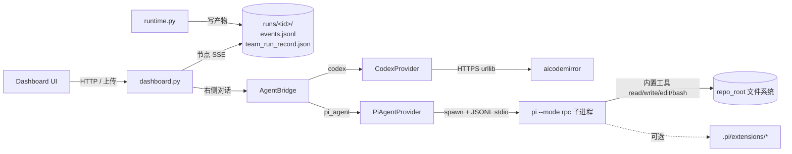

# PRD 生成轻量本地应用架构

## 状态

本文档定义当前 v1 `app_generation` 架构契约。仓库已实现 `domains/app_generation/domain.yaml`、`python -m growth_dev app generate` CLI、Dashboard PRD 生成模式、Codex prompt / verifier 接入和端到端 fake Codex 验收测试。

v1 生成结果默认位于 Codex 隔离 worktree 的 `generated_apps/<app_slug>/` 下。主工作区仍需人工确认 apply gate 后才会被修改。

## 架构原则

- 复用现有 Agent Team Runtime，不新建一套平行编排器。
- PRD 是一等输入，必须被保存为可审计 run artifact。
- 需求理解可以有候选草稿，但官方 artifact 必须通过确定性门禁生成和验证。
- Codex 只能在隔离 worktree 中生成代码。
- 生成代码必须有允许路径、验证命令、风险事件和 blocker。
- v1 只生成本地原型应用，不自动部署。

## 端到端链路

```text
PRD text/file
-> input_prd.md
-> requirements/normalized_prd.md
-> acceptance_criteria.md
-> context_pack.md
-> planning/acceptance_coverage_matrix.json
-> planning/tdd_plan.json
-> slices/*.yaml
-> codex prompt bundle
-> generated app diff in isolated worktree
-> review_report.md
-> test_report.md
-> preview_instructions.md
-> final_report.md
-> human-confirmed apply gate
```

## Domain Pack 契约

当前 `domains/app_generation/domain.yaml` 声明以下信息。

```yaml
domain_id: app_generation
title: PRD To Local App Generation
summary: Generate a lightweight local prototype app from a PRD for fast product validation.
input_schema:
  prd_text:
    type: string
    required: false
  prd_file:
    type: path
    required: false
  app_slug:
    type: string
    required: true
  ui_style:
    type: string
    required: false
  seed_data:
    type: object
    required: false
defaults:
  output_root: generated_apps
  frontend: native_spa
  backend: node_stdlib
  storage: localStorage
  database: "none"
output_schema:
  app_slug: string
  generated_app_dir: string
  preview_command: string
  preview_url: string
  changed_files: list
  tests_run: list
  risk_events: list
  blockers: list
allowed_paths:
  - generated_apps/
  - tests/
  - domains/app_generation/
  - docs/
required_before_coding_artifacts:
  - input_prd.md
  - requirements/normalized_prd.md
  - app_contract.json
risk_rules:
  - manual_human_apply_only
  - no_database
  - local_storage_only
  - no_secret_persistence
  - no_hidden_network_calls
  - no_external_deploy
evaluation_rules:
  - input_prd_artifact_created
  - normalized_prd_created
  - app_contract_created
  - generated_app_under_allowed_path
  - native_spa_node_server_shape
  - local_storage_persistence_only
  - preview_instructions_created
  - tests_or_clear_blocker_recorded
  - no_disallowed_risk_behavior
verification_commands:
  - node --check generated_apps/{app_slug}/server.js
  - python3 -m unittest discover -s tests -v
```

## 输入契约

必须满足以下规则：

- `prd_text` 和 `prd_file` 至少提供一个。
- 当两者同时存在时，`prd_file` 作为原始文档来源，`prd_text` 可作为补充说明。
- `app_slug` 只能包含小写字母、数字和连字符，不能包含路径分隔符、空白、`.`、`..`。
- PRD 内容不得被直接拼进 shell 命令。
- 从 PRD 中识别到的 secret、token、password、DSN 等内容必须在摘要中脱敏，并作为风险事件或 blocker 处理。

## Run Artifact 契约

`app_generation` run 至少产生：

- `input_prd.md`：用户提交的原始 PRD 内容。
- `requirements/normalized_prd.md`：标准化后的目标、用户、流程、页面、数据、边界和假设。
- `app_contract.json`：生成应用的机器可读契约。
- `acceptance_criteria.md`：官方验收标准。
- `context_pack.md`：给后续 planner/coder/reviewer 的最小上下文。
- `planning/acceptance_coverage_matrix.json`：验收标准到 slices 的覆盖关系。
- `planning/tdd_plan.json`：测试计划。
- `slices/*.yaml`：可独立实现和验证的垂直切片。
- `preview_instructions.md`：本地预览命令、端口、入口地址和已知限制。

`app_contract.json` 建议结构：

```json
{
  "schema_version": 1,
  "app_slug": "example-app",
  "target_stack": {
    "frontend": "native_spa",
    "backend": "node_stdlib",
    "storage": "localStorage",
    "database": "none"
  },
  "generated_app_dir": "generated_apps/example-app",
  "required_files": [
    "server.js",
    "public/index.html",
    "public/styles.css",
    "public/app.js",
    "README.md"
  ],
  "preview": {
    "command": "node server.js",
    "url": "http://127.0.0.1:8788"
  },
  "constraints": [
    "no database",
    "no external deploy",
    "localStorage only",
    "no secret persistence"
  ]
}
```

## 生成应用目录契约

生成代码必须位于：

```text
generated_apps/<app_slug>/
```

最小文件结构：

```text
generated_apps/<app_slug>/
  README.md
  server.js
  public/
    index.html
    styles.css
    app.js
```

可选文件：

```text
generated_apps/<app_slug>/
  public/fixtures.json
  tests/
    smoke.test.js
```

`server.js` 只负责本地服务：

- 监听 `127.0.0.1`。
- 服务 `public/` 静态文件。
- 可提供只读 mock fixture endpoint。
- 不写数据库。
- 不读取 `.env`。
- 不向外部网络发起请求。

`public/app.js` 负责浏览器状态：

- 使用 `localStorage` 保存用户输入、筛选、草稿或原型状态。
- 必须处理空状态、加载状态、错误状态和成功状态。
- 不保存 secret。

## Codex Prompt 边界

Codex coder prompt 必须包含：

- `input_prd.md`
- `requirements/normalized_prd.md`
- `app_contract.json`
- `acceptance_criteria.md`
- `planning/acceptance_coverage_matrix.json`
- `planning/tdd_plan.json`
- `slices/*.yaml`
- 允许路径
- 验证命令
- 停止条件和风险规则

Codex final response 继续使用现有 JSON 字段：

```json
{
  "summary": "",
  "files_changed": [],
  "tests_run": [],
  "risk_events": [],
  "blockers": [],
  "next_action": ""
}
```

## Dashboard 展示契约

当前 Dashboard 的 PRD 生成模式应展示：

- 原始 PRD 和标准化 PRD。
- 验收标准和 coverage matrix。
- slice-loop 状态。
- 生成文件清单和 diff。
- preview command 和 preview URL。
- review/test 结果。
- risk events 和 blockers。
- 人工确认 apply 状态。

Dashboard 不应展示未实现命令为可用能力，也不应隐藏风险事件。

## 可观测工作台扩展契约

`PRD生成应用` 后续工作台是 Dashboard 的可观测扩展层，处于 spec-first 阶段。它不替代现有 Team Runtime，也不新建平行编排器。工作台只从 run artifacts、Dashboard API 和受控 AgentBridge 聚合状态。

工作台三栏职责：

- 左侧：`app_generation` run、comparison group 和重跑历史。
- 中间：节点事实层，内部拆为可伸缩两列；左列竖排节点流，右列展示当前节点详情、卡片化中间产物和可预览文件引用。
- 右侧：Agent 协作层，默认 Provider 为 Codex，可切换 PI-Agent 或其他 LLM，保持固定宽度和独立滚动。

中间节点区是事实源。右侧 Agent 区只能基于 `NodeContext` 返回解释、对比、patch 建议、variant 选择或 `rerun_from_node` 动作。Agent 不得直接覆盖旧 run artifacts。

中间节点区默认使用业务友好语言。节点流只展示中文业务标题、状态和摘要；内部 `node_id`、artifact path、executor、provider、raw JSON 和日志只在开发者详情、文件预览或可展开原始信息中出现。

列宽约束：

- 左侧任务列表保持最小可读宽度，不得因预览栏打开而被压缩到文字换行不可读。
- 中间节点流和节点详情允许伸缩，但不得把右侧 Agent 挤压到不可用。
- 文件预览栏打开时应位于中间区和 Agent 区之间，占用中间区的伸缩空间。
- 右侧 Agent 区固定在最右侧，除窄屏响应式降级外不参与预览栏收缩。

## Artifact Preview Rail

Artifact Preview Rail 是工作台的只读文件预览竖栏。它从节点详情卡片中的文件引用打开，用于查看 run artifacts 或允许的 `generated_apps/<app_slug>/` 文件，并且位于中间节点区与右侧 Agent 协作区之间。

预览栏职责：

- 受控读取当前 run 的 artifact 或允许的生成应用文件。
- 展示文件名、来源节点、大小、类型、hash、路径摘要和内容预览。
- 支持文本、代码、Markdown、JSON、YAML、HTML、CSS、JS、图片和 PDF。
- 对未知二进制或超大文件只展示元信息和不可内联预览提示。
- 保持右侧 Agent 协作区独立，不占用 Agent Provider、对话历史或待确认动作区域。

预览栏不是新的事实源。它不修改 run artifacts，不写入 `user_overrides`，不触发重跑，不改变 selected variant，也不改变 `context_revision`。只有 artifact 引用或 hash 变化时，`NodeContext` 才需要更新。

后续实现可增加只读 artifact preview API，但必须满足：

- preview path 只能解析到当前 run artifacts 或允许的 `generated_apps/<app_slug>/` 文件。
- 拒绝绝对路径、路径穿越、跨 run 读取和未允许仓库路径。
- 超大文件不得默认全量加载正文。
- 未知文件类型不得尝试执行或自动下载。

## NodeContext 与 AgentBridge

后续工作台必须使用 `NodeContext` 作为中间节点区和右侧 Agent 区的唯一共享上下文。`NodeContext` 至少包含：

- `run_id`
- `node_id`
- `selected_variant`
- `context_revision`
- artifact refs
- skills
- tool calls
- usage
- scores
- risks
- user overrides

`context_revision` 用于防止 Agent 基于旧上下文误操作。每次节点、variant、artifact 引用或 override 变化时都必须更新。

`AgentInteractionContext` 是 `NodeContext` 的配套交互上下文，用于描述右侧 Agent 当前讨论的 UI 焦点。它包含当前详情卡片、当前 artifact、选中文本和允许操作。`AgentInteractionContext` 不属于节点事实源，焦点变化不改变 `NodeContext.context_revision`。

`AgentBridge` 在调用 Provider 前必须完成两件事：

1. 生成 `AgentPromptContext`：把 `NodeContext` + `AgentInteractionContext` 派生为业务友好上下文包，包含节点标题、节点摘要、输入列表、输出列表、当前 focus、artifact 摘要、skills、tool calls、usage、scores、risks 和 allowed operations。不得只传内部 `node_id`、输入数量、输出数量或风险数量。
2. 解析 `resolved_intent`：当 `intent=auto` 时，根据用户消息、当前卡片、当前 artifact、选中文本和 allowed operations，解析为 `explain_node`、`explain_inputs`、`explain_outputs`、`read_artifact`、`compare_variants`、`suggest_input_patch`、`patch_artifact`、`patch_app`、`rerun_from_node` 或 `ask_clarification`。

`resolved_intent` 是治理层结果，不是 Provider 自由发挥结果。Provider 可以生成更好的自然语言回答，但不得突破 `allowed_operations` 或确认边界。

`AgentBridge` 负责适配不同右侧 Agent Provider：

- `CodexBridge`
- `PiAgentBridge`
- `GenericLlmBridge`

PI-Agent 通过 bridge 接入。`PiAgentProvider` 默认以 `pi --mode rpc` 子进程 + JSONL stdio 通信，凭据由 pi 自管（`ANTHROPIC_API_KEY` / `OPENAI_API_KEY` / `AICODEMIRROR_API_KEY` 等环境变量或 `~/.pi/agent/auth.json`）。`pi` 不在 PATH 时，Dashboard 显示 `not_configured` 并保持默认 Codex 路径可用。

### 四层分工

| 层 | 定位 | 负责 | 不负责 |
| --- | --- | --- | --- |
| 中间节点区 | 事实源 | 节点状态、输入、输出、中间产物、usage、scores、risks、run artifacts | 自由对话和模型推理 |
| 右侧 Agent UI | 协作界面 | 用户消息、当前 focus、对话历史、待确认动作 | 直接修改事实源 |
| PiAgentProvider | 薄桥接 / 治理层 | 启动 PI、注入 env/model、传递上下文、转译事件、脱敏、usage/tool/action 归一化 | 业务推理、二次编排、工具实现 |
| PI Agent runtime | Agent 执行层 | 推理、对话、工具调用、返回流式事件和 usage | 覆盖 run artifacts、推进节点状态、绕过确认 gate |

工作台负责事实、边界和可观测；PI Agent 负责推理、对话和工具执行；PiAgentProvider 只负责把两者安全、可审计地接起来。

### Agent 操作闭环

右侧 Agent 对节点和中间产物的操作必须走以下闭环：

```text
用户选择节点/卡片/artifact
-> 前端生成 NodeContext + AgentInteractionContext
-> AgentBridge 生成 AgentPromptContext 并解析 resolved_intent
-> AgentBridge 路由到 codex / pi_agent / llm
-> Provider 返回 message_delta / tool_call / tool_result / agent_end
-> agent_end.payload.actions 进入待确认动作区
-> 用户确认
-> Dashboard 调用 read_artifact / rerun_from_node / override / select_variant 等受控 API
-> 新状态回到中间节点事实层
```

操作边界：

- 解释、对比、读取 artifact 不改变事实源。
- 修改输入只生成 override 或新 run 输入，不覆盖旧 artifact。
- 修改输出或中间产物只能建议重生成，不原地覆盖。
- 重跑节点必须创建新 run，并保留旧 run。
- PI tool call 结果只作为右侧证据展示；未转成 AgentAction 并确认前，不进入 run artifacts。

## 运行时与对话通道分层



分层约束：

- `runtime.py` 是节点事实源的唯一写入者，把 6 个固定节点的状态与产物写入 `runs/<id>/`。它不调用 PI，不感知右侧 Provider。
- 节点 SSE 通道是 `runs/<id>/events.jsonl` 的 tail + 广播；所有事件必须可由文件系统重放复现。
- 右侧对话 SSE 通道走 `AgentBridge`，与节点流互不依赖。CodexProvider 经 `urllib` 调 aicodemirror；PiAgentProvider 经子进程 JSONL 调 `pi`。
- PI 子进程的内置工具调用直接落到 `cwd=repo_root` 的文件系统，**不写** `runs/<id>/` 事实源，也不进入 codex apply gate；前端工具卡必须显示路径与 diff，由人工判断是否回滚。
- 右侧对话 usage 来自 pi 的 `agent_end.usage`（pi 透传的真实 provider usage）；节点流 usage 仍由 codex / deterministic 贡献。两类 usage 不混算。

## Comparison Group 与重跑关系

工作台支持同一 PRD 下的多次对比。comparison group 必须记录：

- `comparison_group_id`
- `source_run_id`
- `rerun_from_node`
- `selected_variant`
- `override_instructions`

从节点重跑必须创建新 run，不覆盖旧 run。旧 run 是审计和对照来源。

## Rule vs Codex/LLM 边界

工作台可以展示 rule 与 Codex/LLM 的节点对比，但职责边界必须明确：

- rule 只用于 baseline、结构化检查、评分、风险扫描和对照。
- `implementation` 节点的代码实现固定走 Codex 或 LLM。
- rule 不生成最终应用代码。
- usage 缺失时显示 `unknown`，不得伪造 token。

## Evaluation 与 Benchmark 层

`app_generation` 的评估层用于衡量 PRD 生成应用的过程质量和最终产品效果，规范见 `docs/app_generation_evaluation_and_benchmark_spec.md`。它是工作台可观测层之上的分析层，不替代 Team Runtime，也不直接修改 run artifacts。

评估层输入：

- benchmark fixture：`benchmarks/app_generation/<benchmark_id>/`
- run artifacts：`input_prd.md`、`requirements/normalized_prd.md`、`app_contract.json`、planning、review、test、preview 和 final report
- NodeContext：节点、artifact refs、skills、tool calls、usage、scores、risks 和 user overrides
- generated app：Codex/LLM 在隔离 worktree 中产生的应用代码

评估层输出：

- AGQS 总分和分维度评分
- hard gate 状态
- 节点评分
- capability coverage
- usage / cost summary
- top gaps
- recommended next actions

评估层不得伪造 usage，不得把参考应用当作唯一标准答案，不得为了单个 benchmark 把特例写进通用 runtime。所有 benchmark-specific 规则必须保存在 benchmark metadata、domain pack 扩展或后续明确的 scorer 配置中。

### Benchmark Parity Context

当 `prd_file` 位于 `benchmarks/app_generation/<benchmark_id>/input_prd.md` 时，runtime 进入 `benchmark_parity` 模式：

- 读取 `benchmark.yaml`、`acceptance_criteria.md`、`expected_capabilities.json` 和 `scoring_rubric.json`。
- 写入 `benchmark_context.json` 与 `benchmark_context.md`。
- 在 Codex state summary 中加入 benchmark 必需能力和 reference app 能力基线。
- 生成完成后写入 `benchmark_diff.md` 和 `agqs_score.json`。

普通 PRD 仍使用 `prototype` 模式。`benchmark_parity` 不要求逐文件复制 reference app，但必须覆盖其核心用户能力。Dingdang benchmark 中，产品图上传、参考图上传、显式图片 provider、单张/批量出图、Prompt 下载、图片下载和 provider setup error 都是必需能力。

显式图片 provider 不是隐藏网络调用，前提是调用由本地 Node server 发起，API key 来自本地 `.env` 或进程环境，前端、localStorage、源码和 run artifact 摘要不保存真实 secret，provider 未配置或失败时向用户显示清晰错误。

### Benchmark 目录

第一个 benchmark 为：

```text
benchmarks/app_generation/dingdang_main_image_agent/
```

目录契约：

```text
benchmarks/app_generation/<benchmark_id>/
  benchmark.yaml
  input_prd.md
  acceptance_criteria.md
  expected_capabilities.json
  scoring_rubric.json
  reference_app/
```

`reference_app/` 是对照参考实现，用于人工审查、差距分析和 runner 验证，不是唯一标准答案，也不改变 v1 默认“原生 SPA + Node 本地服务、无数据库、localStorage”的生成约束。

### Auto-Research 优化闭环

auto-research 风格优化基于 benchmark 和 comparison group 做实验：

1. 用同一 PRD 和安全边界运行多个 variant。
2. 收集 AGQS、hard gates、节点分、usage、耗时和失败原因。
3. 识别弱节点，例如 PRD 标准化漏掉阻断点或应用实现缺局部迭代。
4. 生成优化假设，例如改 normalized PRD 模板、AC 映射、Codex prompt 或 verifier。
5. 只输出待确认动作；人工确认后才进入实施和 apply gate。

该闭环的目标是优化生成系统，而不是自动覆盖旧产物或对 benchmark 过拟合。

## README 标注规则

README 可记录真实可用的 v1 入口，但必须遵守：

- CLI 示例必须与 `python -m growth_dev app generate` 的真实参数一致。
- 明确 v1 是本地 PRD 原型验证，不是生产级应用交付。
- 不承诺数据库、自动部署、公开托管或远端发布。
- 保持人工确认 apply gate 的说明。
