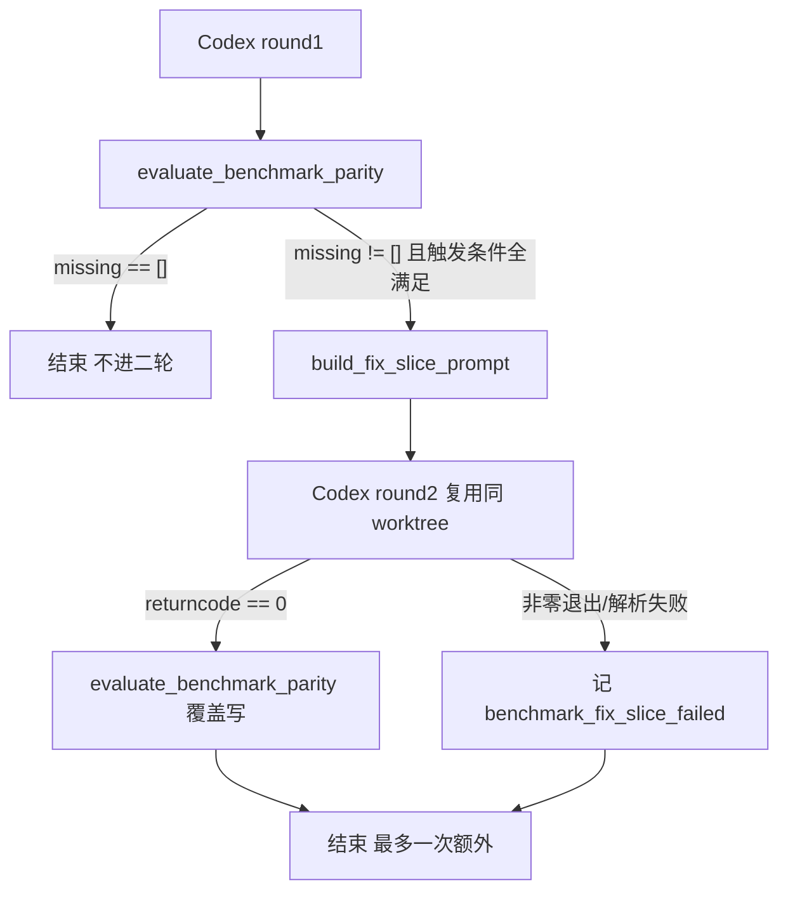

# Benchmark Fix-Slice 二轮回路规范

## 状态

本文档处于 spec-first 阶段，尚未实现对应模块。它定义 `benchmark_parity` 模式下，当第一轮生成结果缺失必需能力时触发的「最多一轮」修复回路，叠加在现有 `single_codex_pass_over_planned_slices_v1`（单轮跑完全部 slice）执行策略之上，是一层薄反馈层。

设计动机来自真机证据：第一轮生成常常通不过 completion gate、缺关键能力且每次结果不同。本回路给生成器一次「带着结构提示和缺口清单重试」的机会，把非确定性收敛一档，而不引入无界重试与成本失控。

## 设计目标

- 当评估器报告必需能力缺失（`missing[]` 非空）时，复用同一 worktree 跑第二轮 coder，最多一次。
- 第二轮带上明确的缺口清单和参考结构提示，做定向修复，而非整体重写。
- 全程产物可回放：二轮 prompt、stdout、stderr、最终消息、修复前后能力对照都落盘。
- 任意失败都不污染第一轮产物，节点最终状态仍由原有失败分类决定。

## 触发条件（合取，全部满足才进二轮）

- benchmark 模式启用，且第一轮评估 `enabled = true`。
- 第一轮 codex 进程 `returncode == 0`（exit 失败走原有失败路径，不进二轮）。
- `missing[]` 非空，且至少一项属于 required capability。
- 开关 `enable_benchmark_fix_slice` 为真（默认 `true`；环境变量 `BENCHMARK_FIX_SLICE_DISABLE=1` 关闭，供沙箱与回归使用）。
- 本节点尚未进入过二轮（硬上限 1）。
- codex 二进制可用（复用既有可用性检查）。

任一条件不满足即不进二轮，节点按第一轮结果收尾。

## 二轮 prompt 契约

第二轮 prompt 在第一轮 prompt 基础上叠加两段：

- `## Previous Attempt`
  - 复用既有 `previous_record` 钩子渲染。
  - 内容为第一轮的结构化结果摘要：`status` / `summary` / `files_changed` / `blockers`。
- `## Benchmark Fix Slice`（新增段）
  - 逐条列出 missing capability 的 `id` / `label` / `expected_behavior` / `evidence_hint`。
  - 交叉引用 [app_generation_reference_index_spec.md](app_generation_reference_index_spec.md) 中 `capability_to_files`，指明每个缺失能力在参考实现里涉及的文件名（**仅文件名，不引代码**）。
  - 显式约束：
    - 只修改与 missing 能力相关的文件。
    - 不得破坏已通过的 capability 实现。
    - 不引入新依赖，保持 v1 stdlib 边界。

## 产物契约

二轮产物使用固定命名，与第一轮产物物理隔离，避免覆盖：

| 产物 | 说明 |
| --- | --- |
| `codex/fix_slice_prompt.md` | 二轮完整 prompt，用于回放 |
| `codex/fix_stdout.jsonl` | 二轮 codex stdout 流 |
| `codex/fix_stderr.log` | 二轮 codex stderr |
| `codex/last_message_fix.json` | 二轮 `--output-last-message` 落点 |

二轮结束后**覆盖写**以下产物（它们表示「最新可信状态」）：

- `agqs_score.json`
- `benchmark_diff.md`

并在 `code_run_record.json` 新增字段：

- `benchmark_fix_slice`
  - `attempted`：是否进入二轮。
  - `before_missing`：一轮缺失能力 id 列表。
  - `after_missing`：二轮后缺失能力 id 列表。
  - `remediated_capabilities`：本轮被补齐的能力 id 列表。
  - `status`：`succeeded` / `failed`。

`output_paths` 与 `record["artifacts"]` 在二轮发生时追加上述四个 `fix_*` 产物路径。

## 失败语义

- 二轮 codex 非零退出或最终消息解析失败 → `benchmark_fix_slice.status = failed`。
- 不回滚第一轮产物（第一轮的 worktree 状态与产物保留）。
- `blocking_events` 追加 `benchmark_fix_slice_failed:<reason>`。
- 节点最终状态仍由原有 failure classification 决定，二轮失败不额外升级或降级节点状态。

## 数据流

## 与既有契约的关系

- 与 [app_generation_evaluation_and_benchmark_spec.md](app_generation_evaluation_and_benchmark_spec.md)：本回路消费该规范评估产物中的 `missing[]` 作为触发信号，并在二轮后按同一评估器覆盖写评分；不改变评分与 hard gates 语义。
- 与 [app_generation_capability_detection_metadata_spec.md](app_generation_capability_detection_metadata_spec.md)：`missing[]` 的可靠性依赖该规范定义的 `detection.match_any`；占位白名单避免参考侧合法占位被反复修正而无限触发。
- 与 [app_generation_reference_index_spec.md](app_generation_reference_index_spec.md)：二轮 prompt 的定向提示来自该索引的 `capability_to_files`。
- 与 [app_generation_node_context_contract.md](app_generation_node_context_contract.md)：二轮产物以 artifact 形式接入 `NodeContext` 产物引用层，不新增字段。
- 与 [app_generation_architecture.md](app_generation_architecture.md)、[app_generation_prd_to_local_app_spec.md](app_generation_prd_to_local_app_spec.md)：回路叠加在既有 coder 执行策略之上，不改动节点 pipeline 骨架。

## 不做

- 不做 ≥2 轮回环（硬上限固定为 1，避免成本失控）。
- 不做跨节点回环。
- 不自动重写 slice yaml 或验收矩阵。
- 不接入 prototype 模式（仅 benchmark_parity 模式生效）。
- 不在二轮失败时回滚或重建 worktree。
- 不引入 preview smoke 作为触发或验收信号。