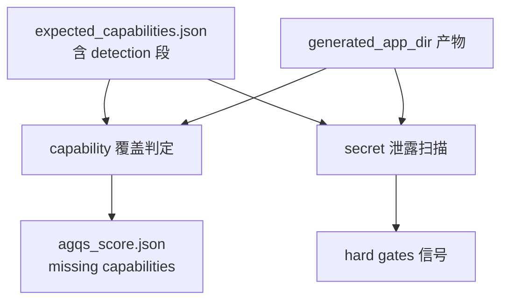

# Capability 检测元数据规范

## 状态

本文档处于 spec-first 阶段，尚未实现对应模块。它定义 `expected_capabilities.json` 中每个 capability 节点的可选 `detection` 段，用于把当前散落在评估器代码中的检测关键字下沉到 benchmark 元数据层。

本规范**不**新增评分维度，**不**改变 AGQS 评分契约，**不**接入语义判定或 LLM judge。它仅替换「capability 是否被生成结果覆盖」这一布尔判定的输入源。

## 设计目标

- 让「某能力是否被覆盖」的判定输入显式落在 benchmark 元数据里，而不是全局硬编码的关键字字典。
- 让 fix-slice 二轮回路的触发信号（`missing[]`）来源可追溯、可调整、可逐 benchmark 演进。
- 给参考实现中合法的占位字符串（演示用 API key 占位、示例 token 等）一个白名单出口，避免被误判为 secret 泄露而污染回路。
- 保持向后兼容：未声明 `detection` 段的 capability 走原有回退路径，既有 benchmark 不受影响。

## 数据契约（capability 节点 schema 扩展）

在 `expected_capabilities.json` 的每个 capability 节点上新增可选段 `detection`，结构如下：

- `detection.match_any: [string, …]`
  - 任一字符串在生成应用产物中出现即视为该 capability 被覆盖。
  - 匹配为子串匹配，大小写不敏感，作用域默认覆盖整个 `generated_app_dir`。
- `detection.evidence_files: [string, …]`（可选）
  - 作用域提示：命中需出现在这些相对路径文件之一才算数。
  - 路径相对 `generated_app_dir`，允许通配（如 `src/server/*.js`）。
  - 缺省时不做文件范围约束。
- `detection.placeholders_allowed: [string, …]`（可选）
  - 占位字符串白名单。匹配到这些字符串时不计入 `secret_leak` 类硬规则。
  - 典型值：`sk-test`、`sk-your-key-here`、`sk-or-v1-your-key-here`。
  - 应与 benchmark `benchmark.yaml` 的 `reference.notes` 保持一致，避免参考侧合法占位被 fix-slice 反复修正。

未声明 `detection` 段的 capability 节点保持现状语义不变。

## 回退顺序

capability 命中判定按以下顺序选第一条命中：

1. capability 节点的 `detection.match_any` 存在 → 用 metadata 判定，并应用 `evidence_files` 作用域约束。
2. 否则 → 回退到评估器侧现有的全局关键字字典（`BENCHMARK_CAPABILITY_PATTERNS` 当前行为）。
3. 都没有 → capability 判定为「未配置检测」，按既有规则记入 `unknown` 而非 `missing`。

本规范阶段**不删除**现有全局字典，仅作为元数据迁移入口；未来 v2 evaluator 可整体替代后再清理。

## 模块边界

- 影响范围限定在评估器的两处：
  - capability 覆盖判定（即生成 `agqs_score.json` 中 capability 维度与 `missing[]` 列表的判定路径）。
  - secret 泄露扫描（即生成 `secret_leak` 类 hard gate 信号的扫描路径），消费 `placeholders_allowed` 白名单。
- 不影响：
  - `agqs_score.json` 已有字段结构与命名。
  - hard gates 规则集合（参考 [app_generation_evaluation_and_benchmark_spec.md](app_generation_evaluation_and_benchmark_spec.md)）。
  - 节点级评分与 AGQS 维度权重。
  - 节点 pipeline 与 coder 编排骨架。

## 数据流位置

- 元数据在产物准备阶段被读取一次，与既有 benchmark context 加载共用入口。
- 评估器在每次评估调用（含 fix-slice 二轮后的覆盖写）时按上述回退顺序消费。

## 与既有契约的关系

- 与 [app_generation_evaluation_and_benchmark_spec.md](app_generation_evaluation_and_benchmark_spec.md)：本规范是该规范的「检测层元数据扩展」，不替换其 AGQS 评分契约与 hard gates 规则；仅替换「capability 是否覆盖」与「占位白名单」两个布尔输入源。
- 与 [app_generation_reference_index_spec.md](app_generation_reference_index_spec.md)：两者共享同一份 capability 元数据；`reference_app_index` 的 `capability_to_files` 反向匹配优先消费 `detection.match_any`，未声明时回退到 `evidence` 字段。
- 与 [app_generation_benchmark_fix_slice_loop_spec.md](app_generation_benchmark_fix_slice_loop_spec.md)：本规范提升 `missing[]` 触发信号的可靠性，是 fix-slice 回路的前置条件之一。
- 与 [app_generation_node_context_contract.md](app_generation_node_context_contract.md)：不引入新的 `NodeContext` 字段，仅丰富既有 capability artifact 内容。

## 不做

- 不引入 7 维分维评分、不引入新 AGQS 维度。
- 不引入动态语义检测、AST 检测、LLM judge。
- 不改变 `agqs_score.json` 字段结构。
- 不改变 hard gates 规则集合。
- 不删除现有全局关键字字典；本阶段仅做迁移入口。
- 不接入 preview smoke / 运行期信号；命中判定仍是静态扫描。