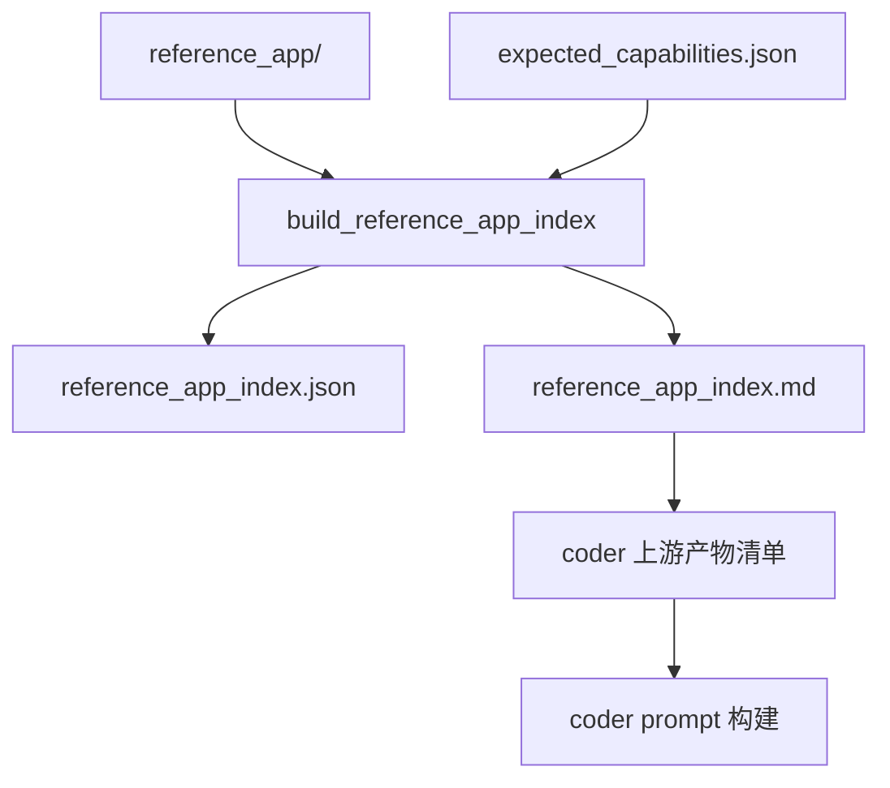

# Reference App 结构索引规范

## 状态

本文档处于 spec-first 阶段，尚未实现对应模块。它定义 `benchmark_parity` 模式下从参考应用 `reference_app/` 提取「结构信号」并注入 coder 上下文的契约。

核心边界：**只暴露结构，不暴露源码**。索引产物里只包含文件名、路由形态、导出符号名、能力到文件的映射，绝不包含任何源代码片段、函数体、注释原文或配置值。

## 设计目标

- 让 coder 在生成时能看到参考应用「长什么样」（有哪些文件、有哪些路由、有哪些对外能力），而不是只拿到能力清单和验收摘要。
- 提升生成稳定性：让多次运行收敛到相似的文件结构和路由划分，降低非确定性。
- 严守安全与公平边界：参考实现的具体写法不进 prompt，避免生成器退化成「抄参考代码」而非「理解 PRD 后自主实现」。
- 体积可控：索引人话版必须落在 coder 上下文截断窗口内，不挤占其它上游产物。

## 数据契约

索引产出两份产物，一份机器可读、一份人话可读。

### `reference_app_index.json`（机器可读）

包含四个段：

- `file_tree`
  - 作用域限定 `src/**`、`public/**`、`tests/**` 与根级文件。
  - 目录深度上限 3 层。
  - 只列文件名与相对路径，**不含**文件尺寸、hash、修改时间、内容。
- `server_routes[]`
  - 每条形如 `{method, path, file, line}`。
  - 由静态匹配器识别三种常见路由形态：
    - `app.METHOD('/path'`（Express 风格）
    - `if (req.url === '/path')`（Node stdlib 分发风格）
    - `router.METHOD(...)`（router 风格）
  - `line` 为命中行号，仅作定位提示，不携带该行源码。
- `key_exports[]`
  - 每条形如 `{file, symbols:[…]}`。
  - 抓取顶层导出符号名：`module.exports = { … }` 的键、`export function X`、`exports.X =`。
  - 每个文件最多记录 12 个符号，超出截断并标注省略。
  - 只记录符号名，不记录签名、参数、实现。
- `capability_to_files[]`
  - 每条形如 `{capability_id, files:[…]}`。
  - 由 `expected_capabilities.json` 中每个 capability 的 `evidence` 字段，在 `reference_app/` 内做反向匹配得到。
  - 给出「该能力在参考实现里落在哪些文件」的映射，供 fix-slice 阶段做定向提示。

### `reference_app_index.md`（人话可读）

- 把上述四段渲染成 bullet 清单（不使用 markdown 表格，避免渲染与截断问题）。
- 整文件目标 ≤ 1200 字，以适配 coder 上游产物的截断窗口（参考 codex 侧约 1800 字/产物的摘录预算）。
- 超预算时按「file_tree → server_routes → capability_to_files → key_exports」优先级保留，低优先段先截断。

## 模块边界

- 纯静态扫描：只读文件、做正则/字符串形态匹配，不执行参考应用、不做 AST 解析、不做跨文件符号解析。
- 零 benchmark 专属硬编码：匹配器对路由/导出形态通用，不针对 Dingdang 写死任何路径或关键字。
- 输入：`reference_dir`（参考应用根目录）+ `capabilities`（来自 `expected_capabilities.json`）。
- 输出：两份产物的文件路径，交由产物准备流程写盘并登记。

## 数据流位置

- 索引在产物准备流程（`prepare_app_generation_artifacts`）的末段生成并写盘，加入产物输出清单。
- 人话版 `reference_app_index.md` 进入 coder 的上游产物摘录清单，作为一段带标题（如「参考实现结构索引」）的上下文。
- 机器版 `reference_app_index.json` 不进 prompt，仅供 fix-slice 阶段与回放查询。

## 与既有契约的关系

- 与 [app_generation_evaluation_and_benchmark_spec.md](app_generation_evaluation_and_benchmark_spec.md)：索引消费该规范定义的 benchmark 目录结构（`reference_app/`、`expected_capabilities.json`），不改变其评分语义。
- 与 [app_generation_capability_detection_metadata_spec.md](app_generation_capability_detection_metadata_spec.md)：`capability_to_files` 的反向匹配输入来自同一份 capability 元数据；两者共享 capability id 命名。
- 与 [app_generation_benchmark_fix_slice_loop_spec.md](app_generation_benchmark_fix_slice_loop_spec.md)：fix-slice 二轮 prompt 引用本索引的 `capability_to_files`，给出缺失能力的参考落点（仅文件名）。
- 与 [app_generation_node_context_contract.md](app_generation_node_context_contract.md)：索引以 artifact 形式接入 `NodeContext` 的产物引用层，不新增 `NodeContext` 字段。
- 与 [app_generation_architecture.md](app_generation_architecture.md)、[app_generation_prd_to_local_app_spec.md](app_generation_prd_to_local_app_spec.md)：索引是生成器侧上下文增强，不改动节点 pipeline 骨架与 PRD 转换语义。

## 不做

- 不嵌入任何源码片段、函数体、注释、配置值。
- 不做 AST 解析、跨文件符号解析、依赖图分析。
- 不做运行期采样（不启动参考应用、不抓真实请求）。
- 不针对具体 benchmark 写死路径或关键字。
- 不改动 coder 编排骨架与节点 pipeline。