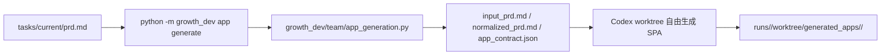
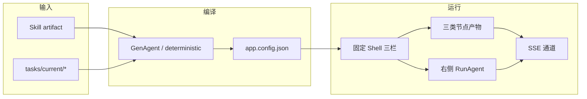
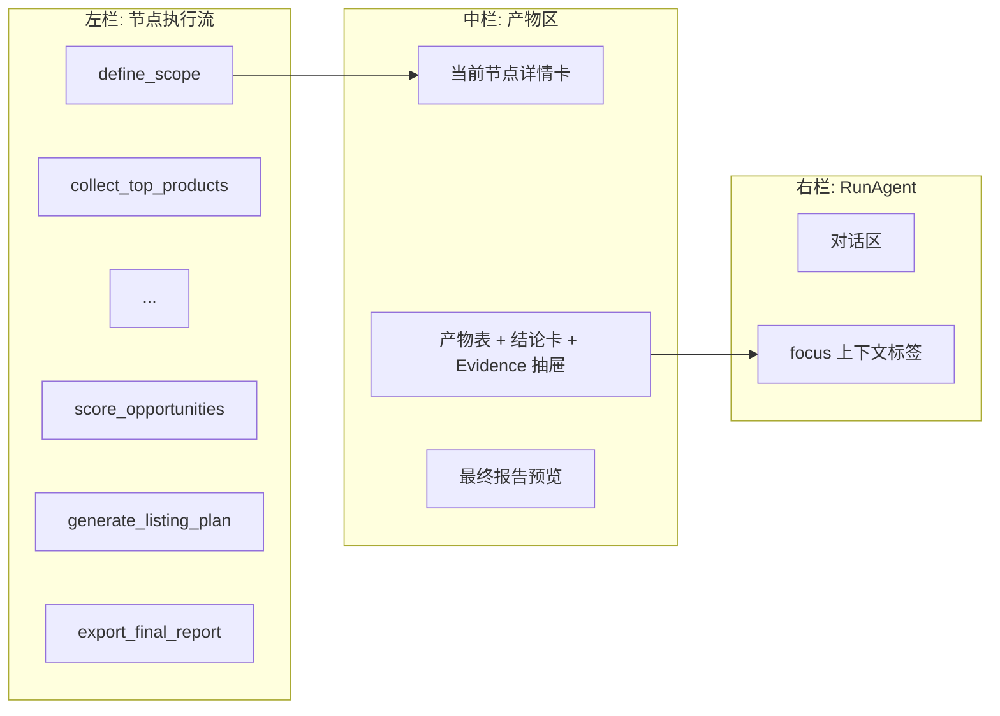

# app_generation 改造方案：固定 Shell + 单一配置 + 三类节点

## 状态

本规范定义 app_generation 链路下一轮改造。当前形态由 `growth_dev/team/app_generation.py` + Codex 隔离 worktree 主导，自由度高、Code Agent 产出不稳定。改造目标：把 app_generation 退化为「编译一份配置 + 实例化一套固定 Shell」，把 Code Agent 的发挥空间收窄到「配置 + 少量 custom hook」。

本次先交付 P0（契约层）+ P2（节点产物与三栏联动协议），P1（编译期 GenAgent）单独立项。

上游：[`document-to-skill-engineering-package/build/<skill_id>/`](../document-to-skill-engineering-package/) 编译产物 + `tasks/current/` 任务包。
下游：本地可运行的「左节点流 / 中产物区 / 右 Agent」三栏应用。

读者：app_generation 链路实现者、Shell 模板维护者、写 PRD 的产品/业务负责人。

---

## 0. 当前形态与问题



观察到的问题：

- 输入只读 `--prd-file` 一个文件，`tasks/current/domain.yaml`、`tech_spec.md`、`ui_spec.md`、`eval.md`、上游 Skill artifact 都不进入下游。
- 「应用形态」语义弱：`app_contract.json` 只声明前后端栈、必备文件、preview 命令，没有节点流、产物区、SSE 协议、规则引擎、Evidence 入口。
- Codex 在 worktree 内自由生成 HTML/JS/CSS，每次结果差异大，难以做差量改进；评估只能跑端到端 smoke，回归性差。
- Skill 已编译出可执行的 DAG、字段、阈值、output schema、tool binding、evidence schema，但下游应用每次都重写一遍。

---

## 1. 改造主张

三条约束：

- **固定 Shell**：左节点流 / 中产物区 / 右 Agent 三栏布局、SSE 通道、Evidence 抽屉、导出按钮、规则引擎调用入口，全部由仓库内固定模板托管。Code Agent 不动 Shell 源码。
- **单一配置**：把「这个应用是什么」整体压成一份 `app.config.json`。配置足够，Shell 就能跑起来。
- **三类节点产物**：节点输出统一为三种形状：`form` / `data` / `llm`，加一个特殊的 `aggregate` 终节点。所有产物区卡片、Evidence 链路、导出报告都围绕这四种形状构造。



两个 Code Agent 时态明确区分：

- **GenAgent**（生成期）：读 PRD + tasks/current + skill artifact，产出 `app.config.json`，必要时产出极少量 `custom/*.js` hook。可动范围 = 配置 + custom hook。
- **RunAgent**（运行期）：用户右侧自由输入路由到的那次 Agent。默认不改代码；可读 Evidence、解释结论、触发节点重算、提示用户上传数据。改代码需要走显式 `patch_app` 链路，沿用 [`docs/app_generation_agent_bridge_spec.md`](app_generation_agent_bridge_spec.md)。

---

## 2. P0：契约层（`app.config.json`）

### 2.1 顶层结构

| 字段 | 类型 | 说明 |
| --- | --- | --- |
| `schema_version` | `"app-config-v1"` | 固定 |
| `app_slug` | string | `tasks/current/task.yaml` 中的 task_id |
| `shell_kind` | enum | `report_generator` / `dashboard` / `monitor`，本次只实现 `report_generator` |
| `skill_ref` | object | 指向上游 Skill |
| `task_ref` | object | 指向 tasks/current |
| `scope_form` | object | 边界表单字段定义 |
| `nodes` | array | 节点列表（拓扑顺序） |
| `aggregate` | object | 终节点（导出报告） |
| `rules` | object | 规则引擎引用 |
| `tool_bindings` | object | 工具降级链 |
| `evidence` | object | Evidence 落盘策略 |
| `safety` | object | 安全边界 |
| `customizations` | array | 必须列出的定制点（位置 / 行为 / 验收） |

### 2.2 `skill_ref` / `task_ref`

```
skill_ref:
  dir: document-to-skill-engineering-package/build/market_insight_skill
  artifacts:
    - SKILL.md
    - strategy_ir.yaml
    - workflow.dag.yaml
    - data_requirements.yaml
    - tool_bindings.yaml
    - output_schemas/
    - eval_rules.yaml
    - evidence_schema.yaml

task_ref:
  dir: tasks/current
  files: [task.yaml, domain.yaml, prd.md, tech_spec.md, ui_spec.md, eval.md]
```

Shell 运行时把这些文件视为只读资源，路径相对仓库根。

### 2.3 `scope_form`

字段定义来自 `tasks/current/task.yaml` + `domain.yaml`：

```
scope_form:
  fields:
    - id: category
      label: 类目
      type: string
      required: true
    - id: shop_stage
      type: enum
      enum: [new_brand, growing, established]
    - id: goal
      type: enum
      enum: [validate_new_line, optimize_existing, expand_price_band]
    - ...
  presets:
    - id: new_category_launch
      label: 新类目立项
      defaults: { goal: validate_new_line, ... }
    - id: existing_optimize
      label: 老类目优化
    - id: price_band_expand
      label: 价格带扩张
```

`presets` 来自 PRD「用户与场景」节，是这个 PRD 独有的定制段，写在 customizations 里。

### 2.4 `nodes`（三类产物 + aggregate）

节点拓扑直接复用 `workflow.dag.yaml`，不在 config 里重画：

```
nodes:
  - id: define_scope
    name: 确定分析边界
    kind: form
    inputs: { scope_form_id: scope_form }
    outputs: [market_insight_project_definition]

  - id: collect_top_products
    name: 行业大盘与热销商品分析
    kind: data
    depends_on: [define_scope]
    data_requirement: category_top_products_300
    output_schema: top_300_product_analysis_table
    tool_chain: tool_bindings.category_top_products_300
    rules_applied: [strong_hot_gene, trend_hot_gene, differentiated_opportunity_gene]
    conclusions_template: prd_2_5_seven_conclusions

  - id: analyze_hot_product_genes
    kind: llm
    depends_on: [collect_top_products]
    inputs_from: [top_300_product_analysis_table]
    output_schema: hot_product_gene_table
    llm_role: classify_and_summarize
    forbidden_outputs: [sales_numbers, gmv_numbers, growth_rate]

  - ...

  - id: score_opportunities
    kind: llm   # 实际是规则+LLM 文案
    rules_applied: [opportunity_score]
    output_schema: product_opportunity_score_table

  - id: generate_listing_plan
    kind: llm
    output_schema: product_development_listing_plan
    aggregate_role: false   # 这是业务终点，但不是导出终点

aggregate:
  id: export_final_report
  kind: aggregate
  collects:
    - top_300_product_analysis_table
    - hot_product_gene_table
    - keyword_demand_breakdown_table
    - keyword_root_top20_table
    - review_qa_painpoint_table
    - price_band_opportunity_table
    - competitor_landscape_table
    - cross_platform_trend_table
    - product_opportunity_score_table
    - product_development_listing_plan
  conclusions_collect:
    - { from: top_300_product_analysis_table, template: prd_2_5_seven_conclusions }
    - { from: keyword_demand_breakdown_table, template: prd_4_7_eight_conclusions }
  output: final_report.md
  output_format: markdown
  llm_allowed_in: [summary_paragraph, transition_paragraph]
  llm_forbidden_in: [numbers, rule_outputs]
```

三类节点的共同产物形状（沿用 Skill 的 output_schemas）：

```
{
  rows: [...],
  conclusions: [...],
  evidence_ids: [...]
}
```

差别只在生产方式：

| kind | 生产者 | LLM 可否进入 |
| --- | --- | --- |
| `form` | 表单 | 否 |
| `data` | CSV 上传 + schema 校验 + 规则引擎 | 否（仅校验和规则） |
| `llm` | 规则引擎产生 rows + LLM 归类/写文案 | 是，但禁止编造数字 |
| `aggregate` | 拼接前面所有产物 + LLM 写过渡段 | 是，受 `llm_forbidden_in` 限制 |

### 2.5 `rules`

```
rules:
  source: skill_ref.eval_rules.yaml
  hard_requirements:
    - required_outputs_present
    - evidence_required_for_each_conclusion
    - score_formula_required
    - no_data_no_strong_claim
  registry:
    - rule_id: strong_hot_gene
      runtime: builtin   # 由 Shell 内置规则引擎执行
    - rule_id: trend_hot_gene
      runtime: builtin
    - rule_id: differentiated_opportunity_gene
      runtime: builtin
    - rule_id: opportunity_score
      runtime: builtin
      formula:
        components:
          - { id: demand_clarity, weight: 20 }
          - { id: growth_trend, weight: 20 }
          - { id: competition_intensity, weight: 15 }
          - { id: profit_space, weight: 15 }
          - { id: supply_chain_feasibility, weight: 15 }
          - { id: differentiation_strength, weight: 15 }
        thresholds:
          - { gte: 85, label: 优先立项开发 }
          - { gte: 70, lt: 85, label: 小批量测试 }
          - { gte: 60, lt: 70, label: 继续观察 }
          - { lt: 60, label: 暂不开发 }
```

阈值与公式只来自 `eval_rules.yaml`，PRD 不二次发明。Shell 内置规则引擎只认 `rule_id`。

### 2.6 `tool_bindings`

```
tool_bindings:
  source: skill_ref.tool_bindings.yaml
  effective_mode: manual_upload_only   # 本地原型默认
  fallback_visible: true
  reason: 不出网 / 不绕过手动登录
```

把上游 6 条 tool_binding 全部降级为 `manual_upload.*_excel`。Shell 上传槽位与 data_requirement 一一对应。Code Agent 不得改这一条。

### 2.7 `evidence`

```
evidence:
  schema: skill_ref.evidence_schema.yaml
  store_dir: runs/<run_id>/evidence/
  per_conclusion_min_evidence: 1
  required_fields_per_evidence:
    - evidence_id
    - skill_run_id
    - step_id
    - claim
    - evidence_type
    - source_data
```

Shell 提供 evidence drawer，结论卡点击「证据」抽屉展示 source_data 引用。

### 2.8 `safety`

```
safety:
  network: offline
  database: none
  storage: localStorage + runs/<run_id>/
  secret_persistence: forbidden
  hidden_network_calls: forbidden
  no_real_ecommerce_api: true
  manual_login_only: true
```

直接对齐根仓库 AGENTS.md 与 `docs/app_generation_prd_to_local_app_spec.md` 的安全边界，照搬不重述。

### 2.9 `customizations`

强约束：每条必须三件套「位置 / 行为 / 验收」，否则 GenAgent 没法产 hook。例：

```
customizations:
  - id: csv_column_alias_map
    location: custom/csv_alias_map.json
    behavior: 把「支付买家数 / 成交买家数 / 30天成交人数」归一为 sales_or_pay_buyer_count
    acceptance: 上传含三种列名变体的 CSV 都能通过 schema 校验

  - id: scope_form_presets
    location: app.config.json/scope_form/presets
    behavior: 提供 new_category_launch / existing_optimize / price_band_expand 三套预设
    acceptance: 切换预设后表单默认值被填入，且默认展示顺序按预设调整

  - id: final_report_template
    location: custom/report_template.md.tmpl
    behavior: 拼装 10 张表 + 7+8 条结论 + 机会评分 + 链接规划
    acceptance: 导出 final_report.md 长度≥3KB，包含全部 10 个 schema 的 rows 与 conclusions
```

PRD 的 customizations 清单 ⇄ app.config.json 的 customizations 是 1:1 关系，不允许只在一处出现。

### 2.10 AppContract v2 派生

为了向前兼容现有 `app_contract.json` 消费者，GenAgent 把 `app.config.json` 派生出 v2 contract 同时落盘：

| v2 字段 | 来源 |
| --- | --- |
| `schema_version` | `2` |
| `app_slug` | `app.config.json.app_slug` |
| `shell_kind` | `app.config.json.shell_kind` |
| `target_stack` | 由 `shell_kind` 决定，固定取值 |
| `generated_app_dir` | `generated_apps/<app_slug>/` |
| `required_files` | Shell 模板 + `app.config.json` + custom 目录 |
| `preview` | Shell 启动命令固定 |
| `acceptance_criteria` | 由 `customizations[].acceptance` + `rules.hard_requirements` 派生 |
| `verification_commands` | Shell 自带 smoke + Python rule engine 单测 |
| `constraints` | 由 `safety` 派生 |

`acceptance_criteria` 列表是 Code Agent 派生 coverage matrix / TDD plan 的唯一入口。任何不出现在 `customizations[].acceptance` 或 `rules.hard_requirements` 的条目都不能进入 acceptance。

---

## 3. P2：三类节点产物 + SSE 协议 + 三栏联动

### 3.1 三栏布局



左栏只展示业务标题、业务状态、简短摘要，对齐 [`docs/app_generation_workbench_spec.md`](app_generation_workbench_spec.md) 的工作台规范。

### 3.2 节点状态机

所有节点状态机统一为 5 态：

```
idle → waiting_input → running → done
                      ↘ degraded
                      ↘ failed
```

| 状态 | 触发条件 | 中栏呈现 |
| --- | --- | --- |
| `idle` | 依赖未就绪 | 灰色，不可点击 |
| `waiting_input` | `form` 等待提交；`data` 等待 CSV 上传 | 表单 / 上传槽位 |
| `running` | 规则计算 / LLM 调用进行中 | 进度条 + SSE 流式日志 |
| `done` | 产物校验通过 | 表格 + 结论卡 + Evidence 入口 |
| `degraded` | 数据缺失 / 阈值不足以下结论 | 「待补数据」徽标 + 缺失字段清单 |
| `failed` | schema 校验失败 / 规则计算异常 | 错误卡 + retry 按钮 |

`degraded` 是显式状态，不能静默。`no_data_no_strong_claim` hard requirement 在这里落地。

### 3.3 SSE 协议

两路 SSE 通道：

```
GET /sse/nodes/<node_id>      # 节点执行流
GET /sse/agent/<conv_id>      # 右侧 Agent 输出
```

事件格式统一：

```
event: <event_name>
data: { "ts": ISO8601, "node_id": "...", "payload": {...} }
```

节点通道事件类型：

| event | payload 关键字段 |
| --- | --- |
| `state_change` | `from`, `to`, `reason` |
| `log` | `level`, `message` |
| `rule_hit` | `rule_id`, `claim`, `inputs`, `result` |
| `evidence_appended` | `evidence_id`, `step_id` |
| `output_partial` | `schema`, `rows_delta` |
| `output_finalized` | `schema`, `row_count`, `conclusion_count`, `evidence_count` |
| `error` | `code`, `message` |

Agent 通道事件类型：

| event | payload 关键字段 |
| --- | --- |
| `token` | `delta` |
| `tool_call` | `tool`, `arguments` |
| `tool_result` | `tool`, `result_ref` |
| `focus_change` | `node_id` / `output_schema` |
| `action_request` | `kind: rerun_node / patch_app / patch_artifact`，按 [`docs/app_generation_agent_bridge_spec.md`](app_generation_agent_bridge_spec.md) 契约 |
| `final` | `summary` |

两个通道由同一个 conv_id 串联：右侧 Agent 通过 `focus_change` 表明它当前在看哪个节点 / 哪个 schema，中栏据此高亮，左栏据此滚动到对应节点。

### 3.4 中栏卡片

`form` 节点：

- 卡 1：字段表（label / type / value）
- 卡 2：preset 切换器
- 提交按钮 → 触发下游 `data` 节点切到 `waiting_input`

`data` 节点：

- 卡 1：上传槽位（拖拽 + 文件名 + 行数 + 字段校验状态）
- 卡 2：表格（rows）
- 卡 3：规则命中（按 `rule_hit` SSE 累积）
- 卡 4：结论列表（每条带 `evidence_ids` chips）
- Evidence 抽屉：点击 chip 拉起，展示 source_data

`llm` 节点：

- 卡 1：输入引用（来自哪些上游 schema）
- 卡 2：表格（rows，由规则引擎或 LLM 归类产生）
- 卡 3：结论列表（LLM 写文案，但 numbers 必须来自规则引擎）
- 卡 4：禁止域提示（如 `forbidden_outputs: [sales_numbers]`）

`aggregate` 节点：

- 卡 1：报告大纲（基于 `collects` 顺序）
- 卡 2：报告预览（Markdown 渲染）
- 卡 3：导出按钮（下载 `final_report.md`）

### 3.5 左右联动协议

| 用户动作 | 触发事件 | 左栏反应 | 中栏反应 | 右栏反应 |
| --- | --- | --- | --- | --- |
| 点击左栏某节点 | `focus_change(node_id)` | 高亮节点 | 切到节点详情 | Agent 接收 focus，回答以该节点为上下文 |
| 中栏点击结论 chip | `focus_change(output_schema, conclusion_idx)` | 高亮归属节点 | 高亮该结论 | Agent 接收 focus，可解释该结论的 Evidence |
| 右栏 `action_request: rerun_node` | server 调度节点 | 状态切回 `running` | 清空旧产物，等待新 SSE | Agent 等待 `output_finalized` |
| 右栏 `action_request: patch_app` | 走 [`app_generation_agent_bridge_spec.md`](app_generation_agent_bridge_spec.md) | 无 | 显示 PatchSet diff | Agent 落 `app_patches/` 证据 |

### 3.6 终节点的「灵活聚合」

`aggregate` 节点允许 LLM 写过渡段（`llm_allowed_in: [summary_paragraph, transition_paragraph]`），但：

- 数字 / 表格 / 规则结论 → 必须直接来自上游产物，禁止 LLM 改写。
- 段落顺序 → 由 `collects` 决定，LLM 不重排。
- 结论引用 → 必须保留 `evidence_ids`，LLM 不丢字段。

实现上，aggregate 模板用 `custom/report_template.md.tmpl` 渲染，Shell 提供 `{{table:<schema>}}` / `{{conclusions:<schema>}}` 两个不可绕过的占位符。LLM 只能填充 `{{narrative:<section>}}`。

---

## 4. 输入侧映射表（字段穿透）

| 来源 | 字段 | → app.config.json |
| --- | --- | --- |
| `tasks/current/task.yaml` | `task_id` | `app_slug` |
| `tasks/current/task.yaml` | 表单字段集 | `scope_form.fields` 候选 |
| `tasks/current/domain.yaml` | `input_schema` | `scope_form.fields` 最终定义 + `nodes[*].data_requirement` |
| `tasks/current/domain.yaml` | `output_schema` | `nodes[*].output_schema` 校验目标 |
| `tasks/current/domain.yaml` | `evaluation_rules` | `rules.hard_requirements` |
| `tasks/current/prd.md` | 应用形态 | `shell_kind` |
| `tasks/current/prd.md` | 用户与场景 presets | `scope_form.presets` |
| `tasks/current/prd.md` | customizations | `customizations` |
| `tasks/current/prd.md` | 输出区呈现规则 | `nodes[*].conclusions_template`、aggregate 模板引用 |
| `tasks/current/tech_spec.md` | 规则引擎位置 | `rules.registry[*].runtime` |
| `tasks/current/ui_spec.md` | 三栏比例 / 抽屉宽度 | Shell 默认值的覆写项（很少用） |
| `tasks/current/eval.md` | hard requirements | `rules.hard_requirements`（与 domain.yaml 取并集校验） |
| `skill/workflow.dag.yaml` | 节点拓扑 + type | `nodes[*].id / depends_on / kind` |
| `skill/data_requirements.yaml` | `required_fields` | `nodes[*]` 上传槽位字段定义 |
| `skill/tool_bindings.yaml` | primary + fallback | `tool_bindings`（强制降级到 manual_upload） |
| `skill/output_schemas/*.json` | schema | `nodes[*].output_schema` |
| `skill/eval_rules.yaml` | rules + thresholds | `rules.registry` |
| `skill/evidence_schema.yaml` | schema | `evidence.schema` |

任何字段如果在 PRD 与 Skill 之间冲突，以 Skill 为准。PRD 的对应条目改写或删除，不在 config 里二次发明。

---

## 5. CLI 与目录变化（仅声明，不在本规范实现）

为支持上述输入，`python -m growth_dev app generate` 需新增可选参数：

```
--task-yaml-path     默认 tasks/current/task.yaml
--domain-yaml-path   默认 tasks/current/domain.yaml
--skill-dir          默认 document-to-skill-engineering-package/build/<skill_id>
```

`_cmd_app_generate` 把这三个路径塞进 `inputs`。`prepare_app_generation_artifacts` 读取后落盘：

```
runs/<run_id>/
  input_prd.md
  input_task.yaml
  input_domain.yaml
  skill_snapshot/                # 复制 skill 编译产物
  requirements/normalized_prd.md
  app.config.json                # 新增：本规范产物
  app_contract.json              # 向后兼容：由 app.config.json 派生
  acceptance_criteria.md
```

GenAgent 的输入边界 = `input_prd.md` + `input_task.yaml` + `input_domain.yaml` + `skill_snapshot/`；输出边界 = `app.config.json` + `custom/*` + `app_contract.json`。Shell 模板源码不在 GenAgent 改写范围内。

---

## 6. acceptance 派生规则

`acceptance_criteria.md` 自动生成，条目来源四类：

1. `customizations[].acceptance` → 每条独立 acceptance。
2. `rules.hard_requirements` → 四条全局 acceptance：
   - 「每个声明的 output schema 都在最终报告中出现」
   - 「每条结论都至少绑定 1 个 evidence_id」
   - 「`opportunity_score` 必须有公式输出，禁止裸结论」
   - 「无数据时禁止给出强结论，必须以 degraded 状态呈现」
3. `safety` → 安全 acceptance：「无网络调用」「无数据库」「无真实电商 API」「无 secret 持久化」。
4. `nodes[*]` → 节点 acceptance：「每个 node 都有 5 态状态机」「每个 data 节点都触发 schema 校验」「`output_finalized` SSE 事件必须被发出」。

派生过程是纯函数，没有 LLM 参与。Code Agent 不允许新增不在这四类中的 acceptance。

---

## 7. 反模式（禁止）

- Code Agent 修改 Shell 模板源码（应通过 `app.config.json` 或 `custom/*` hook 表达差异）。
- 在 `app.config.json` 内复述 `workflow.dag.yaml` 的节点拓扑。
- 在 PRD 或 config 里二次发明阈值，与 `eval_rules.yaml` 不一致。
- 让 LLM 在 `data` 节点直接产生 rows。
- 让 LLM 在 `aggregate` 节点改写数字 / 改写表格 / 丢弃 `evidence_ids`。
- 跳过 `degraded` 状态强行让节点进入 `done`。
- 把 customizations 简化为「位置」一项（必须三件套）。
- 把 PRD 的所有 UI 决策塞进 customizations（让 Shell 默认形态失去价值）。

---

## 8. 演进路径与本次范围

本次（P0 + P2）交付：

- `app.config.json` schema 草案（本文档第 2 节）
- 三类节点产物形状 + 4 类 SSE 事件协议（本文档第 3 节）
- 输入字段映射表（本文档第 4 节）
- acceptance 派生规则（本文档第 6 节）

后续（不在本次范围）：

- P1：GenAgent 工程实现，含 `_cmd_app_generate` 参数扩展、`prepare_app_generation_artifacts` 改造、deterministic fallback 利用 skill artifact 生成应用骨架。
- P3：Shell 模板仓库化（三栏 SPA + Node server + Python rule engine + SSE broker），独立目录、独立版本、独立 smoke。
- P4：RunAgent 走 PI 协议接入右栏，沿用 [`docs/pi_right_agent_protocol_spec.md`](pi_right_agent_protocol_spec.md)；自由输入路由策略单独立项。

本次只产文档，不动 `growth_dev/`、`tasks/current/` 或 `document-to-skill-engineering-package/`。