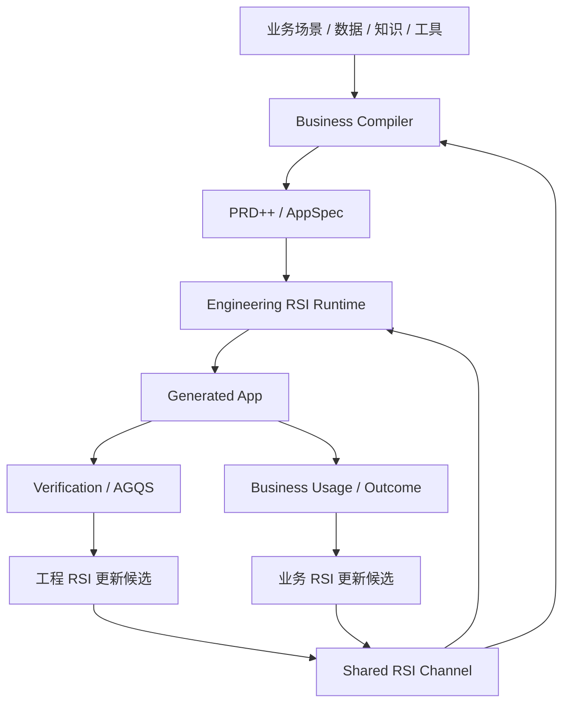

# app_generation_spec.md

# PRD 生成应用升级版规格：面向电商经营场景的 Business App Compiler 与受控 RSI 闭环

## 0. 文档定位

本文档是 `app_generation` 的升级版规格，用于在现有 “PRD 生成本地轻量应用” 架构基础上，扩展为面向电商经营场景的 **业务应用编译器（Business App Compiler）**。

它不再把 PRD 当成简单自然语言输入，而是把 PRD 视为一个中间产物：

```text
业务目标 / 经营场景 / 数据 / 知识 / 工具 / 业务逻辑
-> Business PRD++
-> AppSpec / DataSpec / KnowledgeSpec / ToolSpec / WorkflowSpec / EvalSpec
-> 受控 Code Agent 生成本地应用
-> Verifier / Reviewer / Benchmark
-> 右侧 LOOP-Agent 校准
-> 工程 RSI + 业务 RSI 双向迭代
```

本文档面向四类读者：

1. **业务场景专家**：定义电商经营场景、角色、流程、成功指标和业务规则。
2. **知识专家**：把行业 know-how、案例、策略、Claim Pack、规则沉淀为可编译知识。
3. **数据专家**：把数仓指标、数据表、字段、质量规则、API 能力编译为 DataSpec。
4. **Agent / 工程团队**：把 PRD++ 和 AppSpec 转化为可生成、可验证、可重跑、可审计的本地应用。

---

## 1. 核心结论

`app_generation` 的目标不应停留在：

```text
自然语言 PRD -> Code Agent -> 应用
```

而应升级为：

```text
电商经营场景
-> 业务上下文编译
-> PRD++ / AppSpec
-> 固定主节点 + 动态业务切片
-> Code Agent 受控生成
-> Verifier / Reviewer 评估
-> LOOP-Agent 校准
-> Benchmark / Outcome 回流
-> 工程 RSI + 业务 RSI
```

本系统的核心差异不是“多一个工作流编排器”，而是：

1. **业务场景先编译**：先把电商经营中的数据、知识、工具、业务逻辑变成机器可读契约，再交给 Code Agent。
2. **生成路径受控**：固定主节点、动态切片、受限 worktree、allowed paths、verification commands、human apply gate。
3. **失败可诊断、可重跑、可比较**：任何失败都映射到输入、契约、规划、实现、验证、业务规则中的具体节点。
4. **右侧 Agent 不直接改事实源**：Agent 只生成解释、诊断、patch 建议、rerun_from_node、variant 选择，所有事实变更必须经过确认。
5. **工程 RSI 与业务 RSI 共享资产**：工程侧提升生成器，业务侧提升经营策略，两者通过 Claim Pack、AppSpec、DataSpec、ToolSpec、Eval Report、Outcome Log 等共享通道互相增强。

---

## 2. 继承 v1 架构原则

当前 v1 已经具备正确的系统骨架，应继续保留：

- 复用现有 Agent Team Runtime，不新建平行编排器。
- PRD 是一等输入，必须保存为可审计 run artifact。
- 官方 artifact 必须通过确定性门禁生成和验证。
- Codex / Code Agent 只能在隔离 worktree 中生成代码。
- 生成代码必须包含 allowed paths、verification commands、risk events、blockers。
- v1 默认只生成本地原型应用，不自动部署。
- 主工作区修改必须经过 human-confirmed apply gate。

原始链路仍然有效：

```text
PRD text/file
-> input_prd.md
-> requirements/normalized_prd.md
-> acceptance_criteria.md
-> context_pack.md
-> planning/acceptance_coverage_matrix.json
-> planning/tdd_plan.json
-> slices/*.yaml
-> codex prompt bundle
-> generated app diff in isolated worktree
-> review_report.md
-> test_report.md
-> preview_instructions.md
-> final_report.md
-> human-confirmed apply gate
```

升级版在此基础上增加：

```text
Business Context Compiler
-> contracts/*.json
-> business_claim_pack.md
-> scenario_runtime_spec.md
-> loop_action_queue.jsonl
-> comparison_group
-> agqs_score.json
-> business_outcome_log.json
-> rsi_update_candidates.json
```

---

## 3. 从 PRD Generator 到 Business App Compiler

### 3.1 旧定位

旧定位是：

```text
把用户提交的 PRD 生成一个轻量本地原型应用。
```

适合：

- 快速验证产品想法。
- 生成轻量页面。
- 生成本地 demo。
- 辅助产品经理表达需求。

### 3.2 新定位

新定位是：

```text
把电商经营场景中的业务目标、数据、知识、工具和业务逻辑，编译成可生成应用的 PRD++ / AppSpec，并通过受控 Code Agent 生成可运行、可验证、可迭代的经营应用。
```

适合：

- 商品诊断应用。
- 关键词机会分析应用。
- 爆款机会卡应用。
- 主图实验应用。
- 内容种草规划应用。
- 投流预算诊断应用。
- 竞品监控应用。
- 店铺经营日报应用。
- 经营复盘和任务拆解应用。

### 3.3 关键抽象

| 抽象 | 说明 |
|---|---|
| Business PRD++ | 业务语义增强后的 PRD，不只是自然语言需求，还包含数据、知识、工具、流程、指标、验收。 |
| Product Contract | 应用要解决什么业务问题、服务谁、成功指标是什么。 |
| DataSpec | 需要哪些数据源、字段、指标、质量规则、mock 方式、真实 API 接入方式。 |
| KnowledgeSpec | 业务规则、策略、Claim Pack、行业经验、企业策略、边界条件。 |
| ToolSpec | 应用可以调用哪些工具/API/MCP/本地执行能力，输入输出和权限是什么。 |
| WorkflowSpec | 用户流程、业务流程、状态流转、任务生成逻辑。 |
| UISpec | 页面、组件、卡片、筛选器、详情页、错误态、空状态、预览态。 |
| EvalSpec | 验收标准、AGQS 评分、hard gates、业务价值评估。 |
| LoopSpec | 失败如何诊断，用户如何校准，Agent 如何建议 patch，如何重跑和比较。 |
| Shared RSI Channel | 工程 RSI 与业务 RSI 共享的资产通道。 |

---

## 4. 面向电商经营场景的输入编译

电商经营场景不是一个普通产品需求，它天然包含四类上下文：

```text
业务场景
数据资产
知识资产
工具能力
```

如果这些内容没有被前置编译，Code Agent 只会生成“看起来像电商应用”的界面，而不是能服务真实经营决策的应用。

### 4.1 业务场景编译

业务场景专家需要把经营任务拆成以下结构：

```yaml
scenario_id: ecommerce_opportunity_card
scenario_name: 爆款机会卡生成
business_goal: 从多源数据中识别可执行的新品 / 内容 / 投流机会
primary_user:
  - 品牌运营负责人
  - 类目运营
  - 商品企划
  - 投流负责人
core_decisions:
  - 是否值得切入某个细分机会
  - 机会对应的人群、场景、痛点是什么
  - 应该做商品、内容还是投流动作
  - 下一步实验如何设计
success_metrics:
  - 机会卡完整率
  - 证据覆盖率
  - 行动建议可执行率
  - 实验转化率
  - CTR / CVR / GMV / ROI uplift
```

业务场景编译不是写长篇 PRD，而是把经营活动抽象成：

```text
角色 -> 决策 -> 数据 -> 判断规则 -> 行动 -> 反馈指标
```

### 4.2 数据编译

数据专家需要把企业数仓、平台数据、行业数据、外部采集数据编译成 DataSpec。

示例：

```json
{
  "schema_version": 1,
  "data_sources": [
    {
      "source_id": "keyword_data",
      "source_type": "uploaded_csv_or_warehouse_api",
      "description": "类目关键词搜索、竞争、趋势和付费数据",
      "required_fields": [
        "keyword",
        "category",
        "search_volume",
        "competition_index",
        "paid_cpc",
        "trend_30d",
        "trend_90d"
      ],
      "optional_fields": [
        "conversion_rate",
        "click_rate",
        "gmv",
        "platform",
        "seasonality"
      ],
      "quality_rules": [
        "keyword must not be empty",
        "search_volume should be numeric",
        "paid_cpc missing should be treated as unknown, not zero",
        "trend_30d should be normalized before scoring"
      ]
    }
  ],
  "mock_policy": {
    "enabled": true,
    "sample_size": 50,
    "must_cover": ["high_demand_low_competition", "high_paid_competition", "seasonal_growth"]
  }
}
```

DataSpec 需要解决四个问题：

1. 应用需要什么数据。
2. 数据来自哪里。
3. 数据质量不足时怎么展示。
4. v1 本地原型如何 mock，v2 如何接真实 API。

### 4.3 知识编译

知识专家需要把行业经验、策略、规则、案例编译成 KnowledgeSpec 和 Claim Pack。

#### 4.3.1 Claim Pack

Claim Pack 是事实主张和判断依据，不直接等同于策略。

示例：

```yaml
claim_pack_id: paid_keyword_competition_rule
claims:
  - claim: 高搜索量 + 高 CPC 的词不一定适合作为新品切入词
    evidence_type: keyword_data
    confidence: medium
    applicable_when:
      - category_is_mature
      - paid_cpc_above_category_p75
    implication: 需要结合长尾场景词、内容证据、竞品弱点判断切入方式
  - claim: 评论中高频痛点如果与关键词增长趋势一致，机会可信度更高
    evidence_type: review_and_keyword_cross_validation
    confidence: high
```

#### 4.3.2 Strategy Rule

策略是基于 Claim Pack 形成的可执行判断方法。

示例：

```yaml
strategy_rule_id: opportunity_scoring_v1
inputs:
  - demand_strength
  - competition_strength
  - paid_pressure
  - content_evidence
  - supply_feasibility
formula:
  opportunity_score: 0.3*demand_strength + 0.2*trend_strength + 0.2*content_evidence + 0.2*supply_feasibility - 0.1*paid_pressure
outputs:
  - opportunity_score
  - confidence
  - recommended_action_type
```

知识编译需要区分：

| 类型 | 作用 |
|---|---|
| Claim Pack | 记录事实主张、证据来源、适用条件。 |
| Strategy Rule | 把知识转成可执行判断逻辑。 |
| Heuristic | 经验规则，允许后续通过业务 RSI 更新。 |
| Eval Rubric | 判断应用输出是否符合业务专家预期。 |

### 4.4 工具编译

工具专家或 Agent 工程师需要把企业内部 API、MCP、浏览器执行能力、OpenClaw skills、RPA 能力编译成 ToolSpec。

示例：

```json
{
  "tool_id": "query_warehouse_metrics",
  "display_name": "查询数仓经营指标",
  "tool_type": "warehouse_api",
  "mode": "mock_first_real_later",
  "input_schema": {
    "category": "string",
    "date_range": "string",
    "metrics": "array<string>",
    "filters": "object"
  },
  "output_schema": {
    "rows": "array<object>",
    "warnings": "array<string>",
    "source_freshness": "string"
  },
  "permission": {
    "requires_user_confirm": true,
    "read_only": true,
    "allowed_tables": ["keyword_metrics", "product_metrics", "traffic_metrics"]
  },
  "prototype_behavior": {
    "use_fixture": true,
    "fixture_path": "public/fixtures/keyword_metrics.json"
  }
}
```

ToolSpec 的核心是让生成应用知道：

1. 真实工具未来怎么接。
2. v1 原型如何 mock。
3. 权限边界是什么。
4. 错误、超时、无权限、字段缺失时如何展示。

### 4.5 业务流程编译

WorkflowSpec 描述经营任务如何发生。

示例：

```yaml
workflow_id: opportunity_card_workflow
steps:
  - step_id: upload_or_select_data
    title: 上传或选择数据
    user_action: 上传 CSV 或选择数仓查询条件
    app_state: data_pending
  - step_id: field_mapping
    title: 字段映射
    user_action: 确认 keyword/search_volume/cpc/trend 字段
    app_state: mapping_confirmed
  - step_id: score_opportunities
    title: 机会评分
    system_action: 按 Strategy Rule 生成 opportunity_score
    app_state: scored
  - step_id: generate_cards
    title: 生成机会卡
    system_action: 生成卡片、证据链、建议动作
    app_state: cards_ready
  - step_id: export_tasks
    title: 导出任务
    user_action: 选择机会卡并导出任务包
    app_state: exported
```

WorkflowSpec 会直接影响页面设计、按钮、状态、错误处理和验收标准。

---

## 5. PRD++ 与 AppSpec 结构

升级版不应只生成 `normalized_prd.md`，而应该生成以下结构：

```text
requirements/
  input_prd.md
  normalized_prd.md
  business_prd_plus.md
contracts/
  product_contract.json
  app_contract.json
  data_contract.json
  knowledge_contract.json
  tool_contract.json
  workflow_contract.json
  ui_contract.json
  evaluation_contract.json
planning/
  acceptance_criteria.md
  acceptance_coverage_matrix.json
  tdd_plan.json
  slice_plan.json
slices/
  slice_001_data_intake.yaml
  slice_002_field_mapping.yaml
  slice_003_opportunity_cards.yaml
  slice_004_evidence_detail.yaml
  slice_005_task_export.yaml
loop/
  loop_policy.json
  failure_taxonomy.json
  agent_action_queue.jsonl
benchmark/
  agqs_score.json
  business_outcome_log.json
```

### 5.1 Product Contract

```json
{
  "schema_version": 1,
  "product_name": "电商机会卡分析应用",
  "target_users": ["品牌运营", "类目负责人", "投流负责人"],
  "business_goal": "从关键词、竞品、内容和经营数据中识别可执行机会",
  "core_decisions": [
    "是否值得切入该机会",
    "应该做新品、内容还是投流动作",
    "下一步实验如何设计"
  ],
  "success_metrics": [
    "opportunity_card_completion_rate",
    "evidence_coverage_rate",
    "action_executability_score"
  ],
  "non_goals": [
    "不自动投放广告",
    "不自动修改线上商品",
    "不自动部署生产系统"
  ]
}
```

### 5.2 App Contract

```json
{
  "schema_version": 1,
  "app_slug": "ecommerce-opportunity-cards",
  "target_stack": {
    "frontend": "native_spa",
    "backend": "node_stdlib",
    "storage": "localStorage",
    "database": "none"
  },
  "generated_app_dir": "generated_apps/ecommerce-opportunity-cards",
  "required_files": [
    "server.js",
    "public/index.html",
    "public/styles.css",
    "public/app.js",
    "public/fixtures.json",
    "README.md"
  ],
  "constraints": [
    "no database",
    "no external deploy",
    "localStorage only",
    "no secret persistence",
    "no hidden network calls"
  ]
}
```

### 5.3 Evaluation Contract

```json
{
  "hard_gates": [
    "generated_app_under_allowed_path",
    "app_runs_locally",
    "required_files_exist",
    "no_secret_persistence",
    "no_hidden_network_calls",
    "all_acceptance_criteria_mapped_to_slices"
  ],
  "agqs_dimensions": [
    "business_goal_alignment",
    "data_contract_coverage",
    "knowledge_rule_application",
    "workflow_completeness",
    "ui_decision_support_quality",
    "verification_pass_rate",
    "risk_compliance",
    "cost_efficiency"
  ],
  "business_review_questions": [
    "业务人员是否能看懂机会为什么成立？",
    "证据链是否足以支持下一步动作？",
    "导出的任务是否可执行？",
    "数据缺失时是否有清晰提示？"
  ]
}
```

---

## 6. 节点设计：固定主干 + 动态业务切片

### 6.1 固定主节点

主节点应固定，保证可观测、可审计、可重跑。

```text
1. intake
2. business_compile
3. contract_compile
4. planning
5. implementation
6. verification
7. review
8. finalization
```

### 6.2 动态业务切片

不同电商应用动态生成不同 slices。

机会卡应用示例：

```text
slice_001_data_intake
slice_002_field_mapping
slice_003_score_opportunities
slice_004_card_list
slice_005_evidence_detail
slice_006_task_export
slice_007_local_state_persistence
```

商品诊断应用示例：

```text
slice_001_product_selector
slice_002_metric_dashboard
slice_003_problem_detection
slice_004_root_cause_ranking
slice_005_action_plan
slice_006_validation_plan
slice_007_review_report
```

主图实验应用示例：

```text
slice_001_product_image_upload
slice_002_reference_image_upload
slice_003_prompt_generation
slice_004_provider_setup_check
slice_005_single_generation
slice_006_batch_generation
slice_007_download_and_compare
```

### 6.3 节点元数据

每个节点必须有机器可读元数据。

```json
{
  "node_id": "planning",
  "node_type": "fixed_backbone",
  "title": "规划与切片",
  "inputs": [
    "contracts/product_contract.json",
    "contracts/data_contract.json",
    "contracts/workflow_contract.json",
    "contracts/evaluation_contract.json"
  ],
  "outputs": [
    "planning/acceptance_coverage_matrix.json",
    "planning/tdd_plan.json",
    "slices/*.yaml"
  ],
  "rerunnable": true,
  "dynamic_children": true,
  "gates": [
    "all_acceptance_criteria_covered",
    "all_slices_have_verification",
    "no_unbounded_external_dependency"
  ]
}
```

---

## 7. 受控 LOOP-Agent 校准机制

### 7.1 LOOP 的本质

这里的 LOOP 不是普通聊天循环，而是一个 artifact 驱动的受控校准循环：

```text
Spec
-> Generate
-> Verify
-> Diagnose
-> Patch Proposal
-> Human Confirm
-> Rerun
-> Compare
-> Promote
```

核心原则：

1. 旧 artifact 不被覆盖。
2. 右侧 Agent 不直接改事实源。
3. 每次变更都形成 override、new run 或 variant。
4. 用户确认后才触发受控 API。
5. 每次 LOOP 都记录成本、失败原因、AGQS 变化和业务反馈。

### 7.2 NodeContext

中间节点区是事实源。右侧 Agent 必须基于 NodeContext 工作。

```json
{
  "run_id": "run_20260627_001",
  "node_id": "verification",
  "selected_variant": "v1",
  "context_revision": 12,
  "artifact_refs": [
    "test_report.md",
    "review_report.md",
    "contracts/evaluation_contract.json"
  ],
  "scores": {
    "agqs": 0.74,
    "hard_gate_pass": false
  },
  "risks": [
    "missing_error_state_for_invalid_csv"
  ],
  "user_overrides": []
}
```

### 7.3 AgentAction

右侧 Agent 输出必须结构化为 AgentAction。

```json
{
  "action_id": "action_001",
  "action_type": "rerun_from_node",
  "target_node": "implementation",
  "reason": "当前应用未覆盖字段缺失时的错误状态，违反 DataSpec 和 EvalSpec。",
  "override_instruction": "Add invalid CSV field mapping error state and smoke test coverage.",
  "requires_confirmation": true,
  "expected_impact": {
    "agqs_delta": "+0.05~0.10",
    "risk_reduction": ["data_quality_error_unhandled"]
  }
}
```

### 7.4 失败分型

失败必须进入 Failure Triage。

| 失败类型 | 例子 | 建议动作 |
|---|---|---|
| Input Gap | PRD 没说明核心用户或数据来源 | 从 business_compile 重跑 |
| Contract Conflict | 要 localStorage，又要求多人实时协作 | 修改 app_contract / product_contract |
| Data Gap | 缺字段、字段含义不清 | 修改 data_contract |
| Knowledge Gap | 评分规则没有依据 | 修改 knowledge_contract / claim_pack |
| Planning Gap | 验收标准没有映射到 slice | 从 planning 重跑 |
| Implementation Gap | 代码没有实现某个 slice | 从 implementation 或 slice 重跑 |
| Verification Gap | 测试没有覆盖关键路径 | 修改 tdd_plan / tests |
| Business Misfit | 应用能跑但业务人员觉得不可用 | 回到 business_compile / workflow_contract |

### 7.5 LOOP API

受控 API 建议包括：

```text
read_artifact(run_id, artifact_ref)
create_override(run_id, node_id, override_instruction)
rerun_from_node(run_id, node_id, override_id)
compare_runs(source_run_id, target_run_id)
select_variant(comparison_group_id, variant_id)
promote_run(run_id)
reject_action(action_id)
```

---

## 8. 电商经营应用生成范式

### 8.1 机会卡应用

输入：

```text
关键词数据
竞品数据
评论数据
内容平台证据
企业商品数据
行业策略
```

输出应用能力：

```text
数据上传 / 字段映射
机会评分
机会卡列表
证据链详情
推荐动作
任务导出
本地状态保存
```

关键业务对象：

```json
{
  "OpportunityCard": {
    "fields": [
      "opportunity_id",
      "category",
      "target_user",
      "scenario",
      "pain_point",
      "keyword_cluster",
      "demand_strength",
      "competition_strength",
      "paid_pressure",
      "content_evidence",
      "supply_feasibility",
      "opportunity_score",
      "confidence",
      "recommended_actions"
    ]
  }
}
```

### 8.2 商品诊断应用

输入：

```text
商品指标
流量指标
成交指标
客服/评论反馈
竞品对照
历史动作
```

输出应用能力：

```text
商品选择
经营状态检测
根因排序
证据链展示
行动建议
验证计划
复盘报告
```

### 8.3 主图实验应用

输入：

```text
产品图
参考图
主图策略
平台规则
生成模型 provider
```

输出应用能力：

```text
上传产品图
上传参考图
生成 prompt
单图/批量生成
provider 错误提示
图片下载
A/B 记录
```

### 8.4 投流诊断应用

输入：

```text
计划消耗
点击率
转化率
ROI
关键词 CPC
人群包
商品承接数据
```

输出应用能力：

```text
预算使用诊断
关键词分层
人群包诊断
ROI 异常原因
调价建议
实验计划
```

---

## 9. 与普通工作流 / Agent 平台的差异

本系统不是替代 Dify、Coze、n8n、OpenClaw、Hermes，而是处在更上游的业务应用编译层。

### 9.1 与 Dify 的差异

Dify 适合构建 Agentic workflow、RAG 应用、聊天应用、知识库问答和工具调用应用。它的优势是快速搭建 LLM 应用和工作流。

本系统的差异：

| 维度 | Dify | app_generation |
|---|---|---|
| 核心对象 | Workflow / Agent / Knowledge App | PRD++ / AppSpec / Code Artifact |
| 主要产物 | 可运行的 AI 应用或工作流 | 生成出的本地业务应用代码 |
| 知识使用 | RAG grounding | 业务知识编译为 KnowledgeSpec / Claim Pack / EvalSpec |
| 生成方式 | 节点编排 + 模型调用 | Spec-first + Code Agent + Verifier |
| 失败处理 | 工作流调试 | 节点级 failure triage + rerun_from_node |
| RSI | 主要依赖人工迭代 workflow | 工程 RSI + 业务 RSI 共享资产闭环 |

Dify 可以成为本系统的下游执行或应用承载平台，但不是替代 Business App Compiler。

### 9.2 与 Coze 的差异

Coze 适合搭建 Bot、Agent、插件、知识库和 workflow，优势是面向 AI Agent 应用的快速构建。

本系统的差异：

| 维度 | Coze | app_generation |
|---|---|---|
| 核心形态 | Bot / Agent 应用平台 | 业务场景到代码应用的编译系统 |
| 用户输入 | Bot 需求、插件、知识库 | 经营场景、数据、知识、工具、业务逻辑 |
| 产物 | Agent/Bot | 可审计生成应用 + run artifacts |
| 校准方式 | 修改 Bot / Workflow | LOOP-Agent 生成 AgentAction，确认后重跑 |
| 业务深度 | 依赖使用者配置 | 前置业务契约和场景编译 |

Coze 更适合做对话入口，本系统更适合做经营应用生成和生成系统自进化。

### 9.3 与 n8n 的差异

n8n 适合自动化集成、触发器、API 串联和传统工作流自动化，也支持 AI Agent 节点。

本系统的差异：

| 维度 | n8n | app_generation |
|---|---|---|
| 核心对象 | Trigger / Node / Workflow | Business Contract / AppSpec / Generated App |
| 擅长 | 系统集成、自动化执行 | 业务需求编译、应用生成、受控迭代 |
| 输入 | 事件、API、表单、Webhook | 电商经营场景 + 数据/知识/工具契约 |
| 输出 | 自动化动作 | 本地业务应用 + 评估报告 |
| 变更方式 | 编辑 workflow | patch contract / rerun node / compare variant |
| 评估 | 工作流运行成功 | AGQS + hard gates + business outcome |

n8n 可以作为 ToolSpec 中的执行工具或外部自动化通道，但不是本系统的核心运行时。

### 9.4 与 OpenClaw 的差异

OpenClaw 更偏本地个人 AI assistant / skills / 浏览器和桌面自动化能力，适合执行具体任务、控制浏览器、调用本地技能。

本系统的差异：

| 维度 | OpenClaw | app_generation |
|---|---|---|
| 核心对象 | Skill / Browser / Local Agent / Automation | PRD++ / AppSpec / Generated App |
| 擅长 | 端侧执行、浏览器控制、本地自动化 | 业务场景编译、应用生成、评估与重跑 |
| 权限 | 高权限本地执行 | 默认隔离 worktree + apply gate |
| 技能 | 执行型 skill | 业务编译型 spec + code generation |
| 安全重点 | skill 供应链和本地权限 | 生成代码边界、工具权限、artifact 审计 |

OpenClaw 可以作为本系统的下游执行层：例如生成应用中的“采集数据”“打开后台”“下载报表”等动作，可以通过 OpenClaw skill 执行。

### 9.5 与 Hermes 的差异

Hermes 更强调 agent 自学习、技能沉淀和长期记忆。它的优势是 agent 在使用过程中形成技能和个性化能力。

本系统的差异：

| 维度 | Hermes | app_generation |
|---|---|---|
| 核心对象 | Self-improving Agent / Skill / Memory | Controlled RSI / Business App Compiler |
| 学习方式 | Agent 从使用经验中创建或改进技能 | 基于 benchmark、AGQS、业务 outcome 的受控更新 |
| 风险 | 自学习可能边界不清 | 所有更新进入候选队列，人工确认后发布 |
| 产物 | Skills / Memory / Agent capability | Contracts / Apps / Evaluations / RSI patches |
| 适合 | 长期个人或团队 agent | 企业级经营应用生成和业务系统迭代 |

Hermes 的自学习思想值得借鉴，但企业经营场景不能让 Agent 自由修改业务规则和生成系统。必须是：

```text
Agent proposes
Human / Gate reviews
Runtime applies
Benchmark validates
Business outcome confirms
```

### 9.6 总结：不是 workflow，而是 compiler + controlled runtime

普通工作流的核心是：

```text
节点连接 -> 执行动作
```

本系统的核心是：

```text
业务上下文编译 -> 生成应用 -> 验证 -> 诊断 -> 受控重跑 -> RSI 更新
```

普通工作流解决的是“如何把步骤连起来”。

本系统解决的是：

```text
如何把一个经营场景编译成可运行、可验证、可迭代、可沉淀的应用生成系统。
```

---

## 10. RSI：工程 RSI 与业务 RSI 的雏形

### 10.1 为什么这是 RSI 的雏形

本系统具备 RSI 的基本结构：

```text
生成系统产生应用
应用被验证和使用
失败与效果回流
系统修改自己的生成规则、prompt、模板、verifier、business spec
下一次生成更好
```

但它不是无限制自我修改，而是 **Controlled RSI**。

### 10.2 工程 RSI

工程 RSI 优化对象：

```text
PRD 编译模板
AppSpec schema
slice planning 策略
Codex prompt bundle
scaffold 模板
verifier
reviewer rubric
benchmark fixture
failure triage rule
token routing policy
```

工程 RSI 的输入：

```text
AGQS 分数
hard gate failure
test_report
review_report
failure_taxonomy
usage / cost
rerun success rate
benchmark diff
```

工程 RSI 的输出：

```text
compiler_patch_candidate
prompt_patch_candidate
verifier_patch_candidate
scaffold_patch_candidate
schema_patch_candidate
benchmark_patch_candidate
```

### 10.3 业务 RSI

业务 RSI 优化对象：

```text
业务场景定义
数据字段和指标体系
知识规则
Claim Pack
策略公式
评分模型
工具能力
业务验收标准
经营动作库
```

业务 RSI 的输入：

```text
业务专家反馈
应用使用结果
经营指标变化
机会卡命中率
任务执行结果
实验复盘
客户反馈
```

业务 RSI 的输出：

```text
business_rule_update
claim_pack_update
data_contract_update
metric_definition_update
tool_card_update
scenario_template_update
eval_rubric_update
```

### 10.4 双 RSI 共享通道

工程 RSI 和业务 RSI 不能各自为政，必须共享一套中间资产。

```text
Shared RSI Channel
├─ Claim Pack
├─ Strategy Rule
├─ DataSpec
├─ ToolSpec
├─ WorkflowSpec
├─ AppSpec
├─ EvalSpec
├─ Benchmark Fixture
├─ AGQS Report
├─ Failure Taxonomy
├─ Business Outcome Log
├─ User Override
└─ Generated App Case Library
```

### 10.5 双 RSI 协作图



### 10.6 关键机制

| 机制 | 说明 |
|---|---|
| Bounded Edit | RSI 只能修改有限范围的模板、规则、prompt、schema。 |
| Held-out Benchmark | 每次工程更新必须在保留 benchmark 上验证，防止过拟合。 |
| Business Review Gate | 业务规则和策略更新必须经过业务专家确认。 |
| Human Apply Gate | 生成代码和 runtime 更新必须人工确认。 |
| Outcome Confirmation | 业务 RSI 不能只靠专家感觉，需要看经营结果。 |
| Rollback | 所有更新可回滚。 |
| Audit Trail | 每次更新都记录原因、输入、输出、影响范围。 |

---

## 11. 迭代路径

### Phase 0：规格升级与边界固定

目标：把 `app_generation` 从 PRD generator 升级为 Business App Compiler 的 spec-first 设计。

产物：

```text
app_generation_spec.md
contracts schema 草案
电商场景模板
loop policy
failure taxonomy
AGQS rubric
```

### Phase 1：单场景 MVP

建议选择一个最适合验证闭环的场景：

```text
电商机会卡应用
```

原因：

1. 能体现数据、知识、业务逻辑。
2. 能体现卡片化经营决策。
3. 能生成可视化本地应用。
4. 能形成后续业务 RSI 的反馈。
5. 不需要一开始接真实生产系统。

MVP 能力：

```text
上传 / mock 关键词数据
字段映射
机会评分
机会卡列表
证据链详情
推荐动作
任务导出
本地保存
测试与预览
右侧 Agent 诊断失败
rerun_from_node
compare run
```

### Phase 2：数据 / 知识 / 工具编译层

目标：把业务专家、知识专家、数据专家的输入编译成 PRD++。

产物：

```text
DataSpec compiler
KnowledgeSpec compiler
ToolSpec compiler
WorkflowSpec compiler
Business PRD++ generator
```

### Phase 3：受控 LOOP-Agent 工作台

目标：让右侧 Agent 与中间节点事实层联动。

能力：

```text
NodeContext
AgentInteractionContext
AgentAction Queue
Human Confirm
rerun_from_node
variant comparison
artifact preview
failure triage
```

### Phase 4：Benchmark 与 AGQS

目标：从“能生成”升级到“能度量生成质量”。

产物：

```text
benchmark fixture
reference app
scoring rubric
AGQS score
hard gate report
usage / cost summary
business review checklist
```

### Phase 5：工程 RSI

目标：让系统基于 benchmark 和失败记录改进自身生成能力。

可优化对象：

```text
normalized PRD 模板
contract schema
slice planner
Codex prompt
verifier
scaffold
review rubric
```

### Phase 6：业务 RSI

目标：让真实经营应用的使用结果回流业务知识和策略。

可优化对象：

```text
机会评分规则
关键词分类规则
证据权重
业务动作库
场景模板
数据字段规范
工具能力定义
```

### Phase 7：多场景矩阵

扩展场景：

```text
商品诊断
关键词分析
机会卡
主图实验
内容种草
投流诊断
竞品监控
经营日报
```

每个场景都有：

```text
ScenarioSpec
DataSpec
KnowledgeSpec
ToolSpec
WorkflowSpec
EvalSpec
Benchmark
Generated App Cases
```

---

## 12. 最新 MVP 资源分配

### 12.1 推荐团队：7 人左右

| 角色 | 人数 | 主要职责 |
|---|---:|---|
| 产品 / 架构负责人 | 1 | 定义整体系统边界、MVP 优先级、验收标准、跨角色协调。 |
| 电商业务场景专家 | 1 | 定义机会卡 / 商品诊断等经营场景、用户决策、业务流程、成功指标。 |
| 知识专家 / 策略专家 | 1 | 把行业 know-how、Claim Pack、策略规则、案例沉淀为 KnowledgeSpec。 |
| 数据专家 / 数据工程师 | 1 | 定义 DataSpec、字段、指标、mock 数据、数仓 API 映射和数据质量规则。 |
| Agent 工程师 | 1-2 | 实现 Business Compiler、NodeContext、AgentBridge、rerun_from_node、Code Agent prompt bundle。 |
| 前端 / 全栈工程师 | 1 | 实现 Dashboard、Artifact Preview、生成应用 scaffold、预览体验。 |
| Eval / QA 工程师 | 0.5-1 | 实现 verifier、AGQS、benchmark、smoke test、failure taxonomy。 |

最小团队可以压缩为 4 人：

```text
1 产品/架构负责人
1 电商业务 + 知识专家
1 数据专家
1 Agent/全栈工程师
```

但 4 人版本适合验证原型，不适合快速形成可复用平台。

### 12.2 角色分工方式

#### 业务场景专家

负责输出：

```text
scenario_brief.md
business_workflow.md
business_decision_map.md
business_acceptance_criteria.md
```

核心问题：

```text
这个应用帮谁做什么决策？
这个决策需要什么证据？
证据不够时如何提示？
生成结果如何判断有用？
```

#### 知识专家

负责输出：

```text
claim_pack.md
strategy_rules.yaml
heuristics.yaml
business_review_rubric.md
```

核心问题：

```text
机会为什么成立？
哪些行业经验可以规则化？
哪些规则只是经验假设，需要后续验证？
业务专家如何评审应用输出？
```

#### 数据专家

负责输出：

```text
data_contract.json
metric_dictionary.md
mock_data_fixture.json
warehouse_api_mapping.md
data_quality_rules.yaml
```

核心问题：

```text
需要哪些字段？
字段含义是什么？
缺字段怎么办？
数据如何 mock？
未来如何接真实数仓？
```

#### Agent 工程师

负责输出：

```text
business_compiler
contract_compiler
slice_planner
codex_prompt_bundle
agent_bridge
loop_action_queue
rerun_from_node API
```

核心问题：

```text
如何把 PRD++ 转成 Code Agent 可执行任务？
如何保证生成路径确定？
如何限制文件和工具权限？
如何从失败节点重跑？
如何让右侧 Agent 只生成受控动作？
```

#### Eval / QA 工程师

负责输出：

```text
verification_commands
smoke tests
AGQS scorer
hard gate checker
benchmark fixture
failure triage rules
```

核心问题：

```text
应用是否能跑？
是否满足业务验收？
是否违反安全边界？
失败原因归哪一类？
本次重跑是否比上一次更好？
```

### 12.3 MVP 里程碑

#### 第 1 阶段：场景和契约

产物：

```text
电商机会卡 scenario_brief.md
DataSpec v1
KnowledgeSpec v1
ToolSpec v1
WorkflowSpec v1
EvalSpec v1
```

验收：

```text
业务专家能看懂
数据专家能对齐字段
Agent 工程师能据此生成 prompt bundle
```

#### 第 2 阶段：PRD++ 编译

产物：

```text
business_prd_plus.md
contracts/*.json
acceptance_criteria.md
coverage_matrix.json
slice_plan.json
```

验收：

```text
每条验收标准都有 slice 覆盖
每个 slice 有输入、输出、验证方式
```

#### 第 3 阶段：Code Agent 生成

产物：

```text
generated_apps/ecommerce-opportunity-cards/
preview_instructions.md
test_report.md
review_report.md
```

验收：

```text
node --check 通过
本地可预览
核心页面存在
空状态 / 错误态 / 成功态完整
```

#### 第 4 阶段：LOOP-Agent 校准

产物：

```text
NodeContext
AgentAction Queue
failure_triage
rerun_from_node
compare_runs
```

验收：

```text
用户能选择失败节点
Agent 能解释失败原因
Agent 能生成受控重跑动作
重跑生成新 run，不覆盖旧 run
```

#### 第 5 阶段：AGQS 与 RSI 候选

产物：

```text
agqs_score.json
failure_taxonomy.json
rsi_update_candidates.json
business_outcome_log.json
```

验收：

```text
能判断本次应用生成质量
能识别生成系统弱点
能生成工程 RSI 和业务 RSI 更新候选
```

---

## 13. MVP 验收标准

### 13.1 产品验收

```text
用户可以从一个电商经营场景生成本地原型应用。
用户可以查看生成链路中的所有节点和 artifact。
用户可以看到生成失败原因。
用户可以通过右侧 Agent 获取解释和修复建议。
用户可以确认后从指定节点重跑。
用户可以比较新旧 run。
```

### 13.2 技术验收

```text
所有生成代码位于 generated_apps/<app_slug>/。
所有 run artifacts 可审计。
Code Agent 不直接修改主工作区。
所有重要动作必须 human confirm。
Verifier 可以跑基础检查。
AGQS 可以输出分数和 top gaps。
```

### 13.3 业务验收

```text
生成应用能表达一个真实电商经营决策链路。
应用不只是 UI demo，而是包含数据、知识、证据和行动建议。
业务专家能基于应用判断：是否有助于经营决策。
数据专家能判断：字段和指标是否表达正确。
知识专家能判断：规则和策略是否被正确体现。
```

---

## 14. 关键风险与控制

### 14.1 风险：生成应用只是“好看的壳”

控制：

```text
必须有 DataSpec、KnowledgeSpec、WorkflowSpec 和 EvalSpec。
每个页面组件都要映射到业务决策或数据对象。
AGQS 增加 business_goal_alignment 和 decision_support_quality。
```

### 14.2 风险：业务知识被 prompt 化，无法治理

控制：

```text
知识必须沉淀为 Claim Pack / Strategy Rule / Heuristic。
prompt 只引用知识 artifact，不直接复制散乱长文本。
所有知识更新进入业务 RSI 候选队列。
```

### 14.3 风险：Code Agent 发散

控制：

```text
固定 scaffold。
固定 allowed paths。
固定 verification commands。
按 slice 生成。
失败从节点或 slice 重跑。
```

### 14.4 风险：LOOP 变成无限重试

控制：

```text
每个 run 设置 token budget。
每个节点设置 max rerun。
重复失败进入 blocker。
需要用户或专家补充输入。
```

### 14.5 风险：RSI 过拟合 benchmark

控制：

```text
held-out benchmark。
业务专家复核。
跨场景验证。
禁止 benchmark-specific hack 写入通用 runtime。
```

### 14.6 风险：工具和执行权限扩大

控制：

```text
v1 mock-first。
真实 API read-only first。
所有写操作 human confirm。
工具调用显示输入输出摘要。
敏感字段脱敏。
```

---

## 15. 推荐仓库结构

```text
domains/
  app_generation/
    domain.yaml
    schemas/
      product_contract.schema.json
      data_contract.schema.json
      knowledge_contract.schema.json
      tool_contract.schema.json
      workflow_contract.schema.json
      ui_contract.schema.json
      evaluation_contract.schema.json
    templates/
      business_prd_plus.md.j2
      opportunity_card_scenario.md.j2
      codex_prompt_bundle.md.j2
    benchmarks/
      ecommerce_opportunity_card/
        input_prd.md
        benchmark.yaml
        expected_capabilities.json
        scoring_rubric.json
        reference_app/
    examples/
      ecommerce_opportunity_cards/
        scenario_brief.md
        data_contract.json
        knowledge_contract.json
        tool_contract.json
        workflow_contract.json
runtime/
  app_generation/
    business_compiler.py
    contract_compiler.py
    slice_planner.py
    codex_bundle_builder.py
    verifier.py
    agqs_scorer.py
    failure_triage.py
    loop_actions.py
runs/
  <run_id>/
    input_prd.md
    requirements/
    contracts/
    planning/
    slices/
    generated_apps/
    reports/
    loop/
    benchmark/
```

---

## 16. 推荐优先级

### P0：必须做

```text
Business PRD++ 模板
contracts/*.json schema
固定主节点
dynamic slices
Codex prompt bundle
allowed paths
basic verifier
AGQS v0
failure triage v0
rerun_from_node
```

### P1：应该做

```text
Artifact Preview Rail
AgentAction Queue
comparison group
business outcome log
DataSpec mock generator
KnowledgeSpec claim pack compiler
```

### P2：后续做

```text
真实数仓 API 接入
OpenClaw / browser skill 接入
Hermes-style skill learning 借鉴
多 benchmark 自动实验
工程 RSI patch generator
业务 RSI review workbench
```

---

## 17. 最终定义

`app_generation` 的升级版不是一个普通工作流，也不是一个普通 Code Agent wrapper。

它应该被定义为：

```text
面向电商经营场景的 Spec-first Business App Compiler。
```

它的最小闭环是：

```text
业务专家 / 知识专家 / 数据专家
-> 编译 PRD++ / AppSpec
-> Agent 工程师构建受控生成链路
-> Code Agent 生成本地应用
-> Verifier / Reviewer 评估
-> 右侧 LOOP-Agent 校准
-> Benchmark 和业务结果回流
-> 工程 RSI 与业务 RSI 共同迭代
```

最终目标不是一次性生成一个 demo，而是形成一种新的企业应用生产方式：

```text
经营场景可以被编译
业务知识可以被执行
数据资产可以被应用化
Agent 生成可以被治理
失败可以被定位和重跑
系统可以通过受控 RSI 持续变好
```

