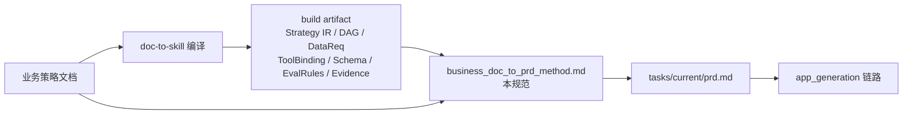

# 业务文档 → PRD 方法论

## 状态

本规范定义 `业务策略文档 → PRD` 的转换方法。它位于 doc-to-skill 与 app_generation 两条链路之间：上游消费 [`document-to-skill-engineering-package/`](../document-to-skill-engineering-package/) 编译产物（`strategy_ir.yaml / workflow.dag.yaml / data_requirements.yaml / tool_bindings.yaml / output_schemas/ / eval_rules.yaml / evidence_schema.yaml`），下游产物 `tasks/<slot>/prd.md` 被 [`docs/app_generation_prd_to_local_app_spec.md`](app_generation_prd_to_local_app_spec.md) 与 [`growth_dev/team/app_generation.py`](../growth_dev/team/app_generation.py) 消费，生成本地应用。

读者：写 PRD 的产品/业务负责人、Agent Team 中的 product 角色、评审 PRD 的工程师。不面向 Skill 编译器开发者。

## 上下文图



核心主张三条：

- 业务文档不直接进 PRD：原文是策略叙述，不是产品契约。
- PRD 不复述 Skill：Skill 已经定义的 DAG / 字段 / 阈值 / 输出形状，PRD 引用即可。
- PRD 区分「标准段」与「定制段」：标准段交给模板渲染器，定制段交给 Code Agent。

---

## 1. Skill 与 PRD 的边界（开篇必读）

### 1.1 一句话定位

- Skill = 业务能力内核 + 运行契约。它回答「业务上做什么、用什么数据、按什么规则得结论」。
- PRD = 把该 Skill 包装成某个具体本地应用的产品契约。它回答「为谁、以什么形态、在什么本地环境、达到什么验收」。

类比：Skill 像存储引擎 + SQL 优化器，PRD 像基于该引擎搭建的某业务应用。换业务应用，Skill 可以复用；换数据规则，Skill 要重新编译，PRD 跟着升级。

### 1.2 Skill 已覆盖的部分

| 制品 | 覆盖范围 |
| --- | --- |
| `strategy_ir.yaml` | 业务目标、关键问题、子场景、判断结论 |
| `workflow.dag.yaml` | 工作流节点、依赖、节点类型、输入输出 |
| `data_requirements.yaml` | 每个节点需要的数据字段、新鲜度、来源、Evidence 字段 |
| `tool_bindings.yaml` | 每条数据的首选工具与降级链路 |
| `output_schemas/*.json` | 每张输出表的结构化形状 |
| `eval_rules.yaml` | 判断阈值、评分公式、硬性约束、质量指标 |
| `evidence_schema.yaml` | Evidence Pack 形状 |

PRD 不要重述以上任何一项。引用即可。

### 1.3 PRD 独占的 8 件事

1. 应用形态（report_generator / dashboard / monitor / canvas / cli …）。
2. 用户与角色（谁打开它，承担什么职责，看到什么状态）。
3. 状态机与交互（节点之间用户视角的页面跳转、保存、回退、复跑）。
4. UI 契约（表单字段顺序、卡片绑定哪张 schema、Evidence 抽屉如何展示）。
5. 本地环境与运行边界（端口、持久化、是否允许出网、降级回路）。
6. 降级与失败可见性（缺数据时显示什么文案、阻断哪些下游）。
7. 非业务功能（导出、对比、复盘、推送、版本切换）。
8. 应用级验收（用户视角的端到端通过条件，可被 coverage matrix 派生）。

### 1.4 Code Agent 视角差异

[`growth_dev/team/app_generation.py`](../growth_dev/team/app_generation.py) 消费 `input_prd.md`，由它派生 acceptance、coverage matrix、TDD 计划、slices。Skill 产物不直接进入这条链路；它们通过 PRD 的引用进入。也就是说：PRD 是 Code Agent 唯一可见的产品契约，Skill 是 PRD 背后的依据。

### 1.5 两类病态

- 只有 Skill 没有 PRD：业务对，但产品不成立。没有应用形态、没有交互、没有降级路径，Code Agent 不知道该生成什么。
- 只有 PRD 没有 Skill：UI 顺，但数字编造、阈值不一致、结论无证据。验收过不了 `eval_rules.yaml` 的硬性约束。

---

## 1.1 PRD 标准段 vs 定制段（为模板化生成留接口）

### 1.1.1 三层应用观

把一个由 PRD 生成的本地应用拆成三层：

| 层 | 名称 | 决定者 | 模板可枚举度 | 是否需要 Code Agent |
| --- | --- | --- | --- | --- |
| 1 | 应用骨架壳 Shell | 框架（同类应用统一） | 高 | 否 |
| 2 | Skill 驱动业务区 Slot | Skill 产物 | 中（模式固定，内容由 Skill 给） | 否 |
| 3 | PRD 定制区 Custom | PRD 独有声明 | 低 | 是 |

- 第 1 层：静态托管、路由、表单组件、Evidence 抽屉、错误展示、导出按钮。任何 `report_generator` 类应用都一样。
- 第 2 层：表单字段来自 `data_requirements.yaml`，DAG 节点来自 `workflow.dag.yaml`，表格 schema 来自 `output_schemas/*.json`，规则阈值来自 `eval_rules.yaml`。结构稳定，内容跟 Skill 走。
- 第 3 层：导出报告的 Markdown 模板、对比模式、定时复盘、特殊文案、与已有内部工具的桥接。PRD 才能给出。

### 1.1.2 标准段 / 定制段映射

- 标准段 = 第 1 + 2 层。可由模板渲染器零 LLM 生成，复用 [`docs/app_generation_deterministic_fallback_spec.md`](app_generation_deterministic_fallback_spec.md) 的 SPA + Node 兜底壳。
- 定制段 = 第 3 层。必须由 Code Agent 实现。每条以「位置 / 行为 / 验收」三件套声明，否则视为模糊需求，拒绝实施。

### 1.1.3 PRD 8 节中各节归属

| PRD 节 | 段类型 | 说明 |
| --- | --- | --- |
| 目标 | 标准段 | 引用 Skill Purpose |
| 用户与场景 | 标准段 + 定制段 | 角色枚举属标准段；特殊行业场景属定制段 |
| 输入 | 标准段 | 表单字段来自 `data_requirements.yaml` |
| 工作流 | 标准段 | 引用 `workflow.dag.yaml` |
| 输出 | 标准段 | 表格 schema 直接绑定 `output_schemas/*.json` |
| 规则与阈值 | 标准段 | 引用 `eval_rules.yaml` 的 `rule_id` |
| 安全与证据策略 | 标准段 | 引用 Evidence Schema 与 SKILL.md Data Policy |
| 降级文案 / 非业务功能 / 特殊交互 | 定制段 | PRD customizations 清单 |

### 1.1.4 customizations 清单约束

PRD 必须在文末列出 `customizations[]`。否则 Code Agent 没有输入，整篇 PRD 就只是 Skill 的复述。每条至少包含：

- `id`：定制项 ID
- `position`：在 UI / 工作流 / 报告中的位置
- `behavior`：期望行为
- `acceptance`：可被验收测试派生的条件

### 1.1.5 反陷阱

- 不要把 PRD 的所有 UI 决策塞进定制段。否则模板渲染器失去价值。
- 不要假设模板能覆盖业务流程之外的产品功能。定时推送、跨应用对比、外部 IM 通知，这些必须显式声明为定制段。

### 1.1.6 演进路径

本次先用现有 deterministic + codex 双路径：

- 标准段：由 deterministic fallback 生成骨架壳与 Skill 驱动业务区。
- 定制段：由 codex executor 按 PRD customizations 清单实现。

未来可立项「AppShell DSL + 模板渲染器」，把 PRD 标准段编译为渲染配置，定制段单独走 Code Agent，与 [`docs/app_generation_agent_bridge_spec.md`](app_generation_agent_bridge_spec.md) 的 `patch_app / delegate_code_repair` 契约对齐。

---

## 2. 目的与边界

本规范服从根仓库三条铁律：

1. 业务文档不直接变 Prompt：业务文档必须先编译为 Skill 产物，再被 PRD 引用。
2. 无证据不出结论：PRD 的输出 schema 必须含 `evidence_ids`，验收必须含 `evidence_required_for_each_conclusion`。
3. Tool 必须有 Contract：PRD 引用的所有外部工具，都必须能在 `tool_bindings.yaml` 找到 `primary_tool` 与 `fallback_tools`。

不在本规范范围：

- doc-to-skill 编译器的实现（见 [`document-to-skill-engineering-package/`](../document-to-skill-engineering-package/)）
- PRD → 本地应用代码的生成（见 [`docs/app_generation_prd_to_local_app_spec.md`](app_generation_prd_to_local_app_spec.md)）
- Skill 自身规范（见 `document-to-skill-engineering-package/specs/SKILL_SPEC.md`）

---

## 3. 输入物与必备前置

### 3.1 业务文档可识别的 9 个结构

写 PRD 前先确认业务文档里这 9 项都能找到对应段落。缺哪项，对应 Skill 产物就会空，PRD 也只能空。

1. 业务场景定位
2. 经营目标与关键问题
3. 输出成果清单
4. 流程步骤
5. 判断标准与阈值
6. 数据来源
7. 工具表单
8. 子场景与变体
9. 总结与最终标准

### 3.2 必备前置

doc-to-skill 已编译，产物完整存在于 `build/<skill_id>/`：

```
build/<skill_id>/
  SKILL.md
  skill.yaml
  strategy_ir.yaml
  workflow.dag.yaml
  data_requirements.yaml
  tool_bindings.yaml
  output_schemas/*.json
  eval_rules.yaml
  evidence_schema.yaml
  missing_tools_report.md
```

`missing_tools_report.md` 必须复核：里面列出的工具就是 PRD「外部依赖与降级策略」必须解释清楚的工具。

---

## 4. 转换规则映射表

| 业务文档章节 | Skill 产物 | PRD 章节 | 段类型 |
| --- | --- | --- | --- |
| 业务场景 / 目标 | `strategy_ir.yaml`、`SKILL.md` Purpose | 目标、用户与场景 | 标准段 |
| 输出成果表 | `output_schemas/*.json` | 输出 + UI 卡片绑定 | 标准段 |
| 流程步骤 | `workflow.dag.yaml` 节点 | 工作流 | 标准段（直接引用） |
| 数据来源 | `data_requirements.yaml` | 输入 CSV 槽位字段 | 标准段 |
| 工具来源 | `tool_bindings.yaml` | 外部依赖与降级策略 | 标准段 + 文案为定制段 |
| 判断标准 / 阈值 | `eval_rules.yaml` | 规则与阈值 | 标准段（禁止 PRD 二次发明） |
| 子场景 | `strategy_ir.yaml` 子场景 | 应用模式 / 用例分支 | 部分标准段 shell_kind，部分定制段 |
| 文档「最终标准」段 | `eval_rules.yaml` `hard_requirements` | 验收 | 标准段框架 + 定制段验收点 |

---

## 5. PRD 章节固定模板（8 节）

PRD 严格按以下 8 节展开。每节给四栏：

| 栏 | 含义 |
| --- | --- |
| 来自 Skill | 引用哪个 Skill 产物 / 字段 / rule_id |
| 标准段 | PRD 选择项，可被模板枚举 |
| 定制段 | PRD 独有，需 Code Agent，必须进 customizations 清单 |
| 禁止包含 | 反模式提醒 |

### 5.1 目标

- 来自 Skill：`SKILL.md` Purpose、`strategy_ir.yaml` business_questions
- 标准段：一句话定位、面向用户类型
- 定制段：所属组织 / 团队的具体定位差异
- 禁止包含：复述业务文档原文、列举数字目标但无依据

### 5.2 用户与场景

- 来自 Skill：业务文档场景段
- 标准段：角色枚举（操作者、评审者、维护者）
- 定制段：行业 / 公司 / 阶段特定子场景
- 禁止包含：把所有可能用户都列出但无主次

### 5.3 输入

- 来自 Skill：`data_requirements.yaml` 每项的 `required_fields`
- 标准段：表单字段顺序、CSV 上传槽位与 `data_requirements.id` 一一对应
- 定制段：字段默认值、占位文案、对接已有内部表单
- 禁止包含：私自增删 required_fields、把字段拆成新含义

### 5.4 工作流

- 来自 Skill：`workflow.dag.yaml` 节点列表与依赖
- 标准段：节点顺序、节点状态机（待输入 / 计算中 / 完成 / 降级 / 失败）
- 定制段：节点级特殊交互（例如某节点允许跳过、某节点强制人工复核）
- 禁止包含：在 PRD 中改 DAG 拓扑、增删节点

### 5.5 输出

- 来自 Skill：`output_schemas/*.json` 全部 schema
- 标准段：每张表对应哪张卡片、卡片包含表格 + 结论 + 证据
- 定制段：报告导出 Markdown 模板、对比视图、PDF 风格
- 禁止包含：在 PRD 中重定义 schema 字段

### 5.6 规则与阈值

- 来自 Skill：`eval_rules.yaml` 的 `rule_id` 与公式
- 标准段：引用 rule_id、在哪条结论上生效
- 定制段：阈值越线时的文案、告警样式
- 禁止包含：在 PRD 中重新设定与 eval_rules.yaml 不一致的阈值

### 5.7 安全与证据策略

- 来自 Skill：`evidence_schema.yaml`、`SKILL.md` Data Policy 与 Evidence Policy
- 标准段：每条结论绑定 evidence_ids、Evidence 抽屉展示来源与时间
- 定制段：脱敏要求、内部系统访问令牌处理
- 禁止包含：放开「未授权抓取真实电商 API」「绕过登录」

### 5.8 验收

- 来自 Skill：`eval_rules.yaml` 的 `hard_requirements` 与 `quality_metrics`
- 标准段：硬性约束直接列入应用级验收
- 定制段：定制段每条 `customization` 的「位置 / 行为 / 验收」
- 禁止包含：只写"全部表格能展示"而不绑定 schema_id / rule_id

---

## 6. 反模式清单（明确禁止）

1. 把业务文档原文成段贴进 PRD 当需求。
2. 在 PRD 中重述 Skill 已经定义的 DAG / 字段 / 阈值。
3. 在 PRD 中设定与 `eval_rules.yaml` 不一致的阈值。
4. LLM 输出 GMV / 销量 / 增长率 / 评分等事实数字。
5. 没有 `evidence_ids` 的结论。
6. 接真实电商 API、绕过手动登录、做指纹欺骗。
7. 在 PRD 中扩展业务文档与 Skill 都未提及的功能（例如自动下单、自动改价）。
8. 把所有 UI 决策塞进定制段（让模板失去价值）。
9. 没有 customizations 清单的 PRD（Code Agent 没输入）。
10. 没有降级路径的外部工具依赖（违反 `tool_bindings.yaml` 契约）。

---

## 7. 字段穿透示例（以市场洞察为例）

挑 2 条规则做端到端示范，说明「业务文档 → Skill → PRD → 应用规则引擎 → 报告呈现」如何对齐。

### 7.1 `strong_hot_gene`（强爆款基因）

| 阶段 | 内容 |
| --- | --- |
| 业务文档 | "TOP50 占比 ≥ 30% / TOP100 占比 ≥ 20% / 买家占比 ≥ 30% / GMV 占比 ≥ 30%，任意两项即判强爆款基因" |
| Skill 产物 | `eval_rules.yaml` `rule_id: strong_hot_gene` |
| PRD 引用 | 「输出 > 行业前 300 商品分析表」结论段绑定 `rule_id: strong_hot_gene` |
| 应用规则引擎 | 由代码计算，不由 LLM 计算 |
| 报告呈现 | 表格下方结论卡显示「强爆款基因 ✅」，悬浮显示触发的两项指标 |

### 7.2 `opportunity_score`（机会评分）

| 阶段 | 内容 |
| --- | --- |
| 业务文档 | "需求 20 + 增长 20 + 竞争 15 + 利润 15 + 供应链 15 + 差异化 15 = 100，≥85 立项 / 70-84 测试 / 60-69 观察 / <60 不开发" |
| Skill 产物 | `eval_rules.yaml` `rule_id: opportunity_score` |
| PRD 引用 | 「输出 > 机会评分卡」绑定 `rule_id: opportunity_score` |
| 应用规则引擎 | 由代码加权求和，分档逻辑写在规则配置中 |
| 报告呈现 | 评分卡显示分数与档位，明细抽屉展示六项分项与触发的 evidence_ids |

---

## 8. PRD 自检清单（写完后逐条对照）

- [ ] Skill 已有的内容是否被 PRD 重复了？（如果是，删掉并改成引用）
- [ ] PRD 8 节是否每节都有「PRD 独有部分」非空？（否则该节属于 Skill 不属于 PRD）
- [ ] customizations 清单是否每条都有「位置 / 行为 / 验收」三件套？
- [ ] 每个输出表是否能在 `output_schemas/` 找到对应 schema？
- [ ] 每个阈值是否引用 `eval_rules.yaml` 的 rule_id？
- [ ] 是否声明了安全边界与降级路径？
- [ ] 是否给出 acceptance criteria 让 Code Agent 可派生 coverage matrix？
- [ ] `missing_tools_report.md` 中每条缺失工具是否都在 PRD 降级策略段被显式覆盖？

---

## 9. 复用指引

换业务文档（竞品分析 / 价格带 / 产品升级 / 达人建联）时，方法保持一致：

1. 把新业务文档放入 `document-to-skill-engineering-package/examples/source_docs/`。
2. 用 doc-to-skill 编译，生成新的 `build/<new_skill>/`。
3. 按本规范 5 节模板写 PRD，每节四栏。
4. 同一 Skill 可被多 PRD 复用：
   - 单人报告型：`report_generator` shell
   - 团队看板型：`dashboard` shell
   - 定时监控型：`monitor` shell
   三者共享 Skill 的标准段，差异落在 shell_kind 与 customizations。

复用越多，证明 Skill 与 PRD 的边界画对了。如果换一个应用就要改 Skill，说明 Skill 里混入了产品决策；如果换业务领域 PRD 几乎不变，说明 PRD 里没有定制段。

---

## 附录 A：与现有规范的关系

| 文档 | 关系 |
| --- | --- |
| [`document-to-skill-engineering-package/specs/SKILL_SPEC.md`](../document-to-skill-engineering-package/specs/SKILL_SPEC.md) | 本规范上游：定义 Skill 制品形状 |
| [`docs/app_generation_prd_to_local_app_spec.md`](app_generation_prd_to_local_app_spec.md) | 本规范下游：定义 PRD → 本地应用 |
| [`docs/app_generation_deterministic_fallback_spec.md`](app_generation_deterministic_fallback_spec.md) | 标准段渲染依据 |
| [`docs/app_generation_agent_bridge_spec.md`](app_generation_agent_bridge_spec.md) | 定制段 Code Agent 接口契约 |
| [`docs/app_generation_acceptance_and_testing.md`](app_generation_acceptance_and_testing.md) | PRD 验收 → coverage matrix 派生规则 |