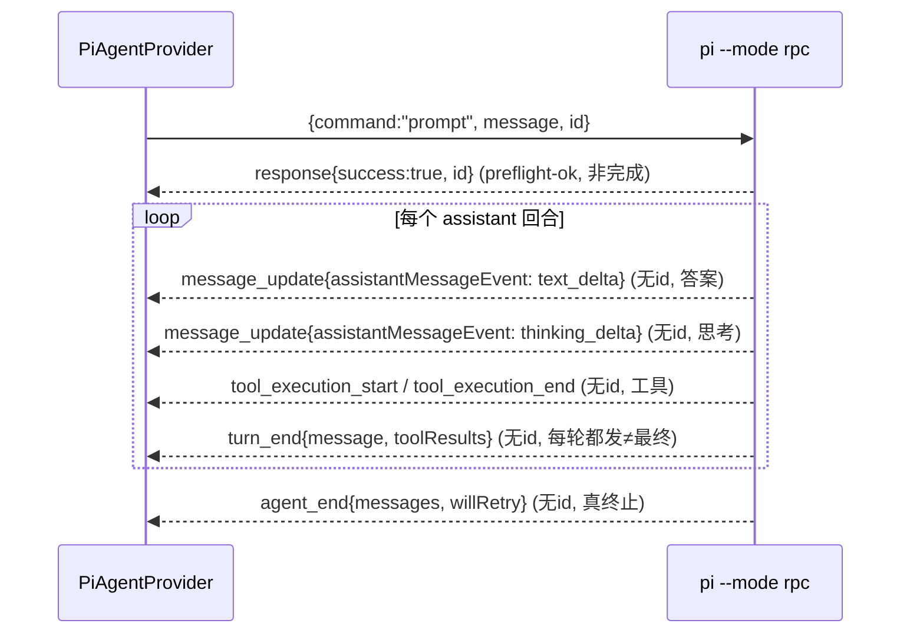

# 右侧 PI Agent 协议对齐与边界规格

## 状态

本文档定义可观测工作台**右侧实时 LLM Agent**接入 `pi --mode rpc` 的线协议契约与执行边界。它是 [app_generation_architecture.md](app_generation_architecture.md) 架构契约在右栏 Agent 维度的补充，**不改动** node 运行时、事实源与 pipeline。

本规格用于「先审后写」：批准本文档即同意据此重写 [growth_dev/team/pi_rpc.py](../growth_dev/team/pi_rpc.py) 的事件翻译/终止逻辑，并补齐右侧 Agent 边界。**终止模型已选定方案 A（仅 agent_end 终止）**（见 §4）。

适用范围锁定：PI scope = right_only。PI 只替换右侧 Agent 对话 Provider；codex provider 维持确定性 baseline 行为不变；中栏 node pipeline 与左栏 runs 不受影响。

---

## 1. 架构契约纳入

来自 [app_generation_architecture.md](app_generation_architecture.md) 的约束在右侧 Agent 维度落地为：

- **复用现有 Agent Team Runtime**：右侧 Agent 作为一个 Provider 接入既有编排，不新建平行编排器。
- **可审计 artifact**：右侧 Agent 的产物（建议、动作、scratch 变更）必须可保存为 run artifact，支持 replay。
- **隔离写入**：与「Codex 只能在隔离 worktree 生成代码、主工作区需人工 apply gate」同构——PI 的任何写操作只能落在独立 scratch 目录，主仓库不被直接修改。
- **三栏边界**：左 = runs、中 = node pipeline、右 = real-LLM agent。本规格只触碰右栏 Provider 与其翻译层。

### 模块关系

```text
前端右侧对话气泡 (dashboard/app_generation.js)
  ⇡ 归一化事件: message_delta / tool_call / tool_result / agent_end / upstream_error
SSE 层 (dashboard.py: stream_app_generation_agent_message)
  ⇡ StreamEvent
PiAgentProvider (agent_bridge.py)  ← Provider 边界，唯一对接右栏
  ⇡ StreamEvent (经 PiRpcClient 队列)
PiRpcClient (pi_rpc.py)
  ⇡ 唯一翻译点: default_event_parser  ← 本次重写核心
pi --mode rpc 子进程
  stdin: 命令 JSON 行 | stdout: 事件/回执 JSONL
```

`default_event_parser` 是**唯一翻译点**：把 pi 原生事件翻成前端只认的归一化事件名。前端识别集合见 [dashboard/app_generation.js](../dashboard/app_generation.js) 第 994-1003 行：`message_delta` / `tool_call` / `tool_result` / `agent_end` / `upstream_error`。

---

## 2. 真实 PI 线协议（权威，源码实锤）

事实源（pi 仓库）：

- `packages/coding-agent/src/core/agent-session.ts:124` — `AgentSessionEvent = Exclude<AgentEvent, agent_end> + 会话级扩展`
- `packages/agent/src/types.ts:408` — 基础 `AgentEvent` 联合
- `packages/ai/src/types.ts:358` — `AssistantMessageEvent` 联合（答案/思考的内层类型）
- `packages/coding-agent/src/modes/rpc/rpc-mode.ts:390-411` — `prompt` 命令回执时序

**本协议取代此前所有虚构协议假设**（旧代码里的 `{type:"agent_event", event_type:..., payload:..., id:...}` 包络是臆测，需删除）。

### 2.1 传输

- 命令：经 stdin 下发 JSON 行，例如 `{"command":"prompt","message":"...","id":"<uuid>"}`。
- 输出：经 stdout 逐行 JSONL，分两类——**流事件**（session 订阅回调直接输出 `AgentSessionEvent`，不带 id）与**命令回执**（`{type:"response", command, success, id}`，带 id）。

### 2.2 事件词汇表（顶层 type）

| 顶层 type | 含义 | 关键字段 | 归一化映射 |
|---|---|---|---|
| `message_update` | assistant 流式增量 | `assistantMessageEvent`（内层见 §2.3） | 见 §2.3 |
| `tool_execution_start` | 工具开始 | `toolCallId` / `toolName` / `args` | `tool_call` |
| `tool_execution_update` | 工具中途产出 | `toolCallId` / `partialResult` | 忽略 |
| `tool_execution_end` | 工具结束 | `toolCallId` / `toolName` / `result` / `isError` | `tool_result` |
| `turn_start` | 一个回合开始 | — | 忽略 |
| `turn_end` | **一个回合**结束（含工具的多轮里**每轮都发**） | `message` / `toolResults` | 见 §4（默认不终止） |
| `agent_end` | **整次会话**结束（真终止） | `messages` / `willRetry` | `agent_end` |
| `message_start` / `message_end` | 消息边界 | `message` | 忽略 |
| `auto_retry_start` / `auto_retry_end` | 自动重试 | `attempt` / `success` / `finalError` | 透传/参与终止判定 |
| `session_info_changed` 等会话杂项 | 会话元数据 | — | 忽略 |
| `response`（**回执，非流事件**） | 命令受理结果 | `command` / `success` / `id` / `error?` | 见 §2.4 |

### 2.3 答案 vs 思考（`message_update.assistantMessageEvent`）

内层 `assistantMessageEvent.type` 决定语义（源 `ai/src/types.ts:358-370`）：

| 内层 type | 字段 | 处理 |
|---|---|---|
| `text_delta` | `contentIndex` / `delta` / `partial` | **答案正文** → `message_delta {text: delta}` |
| `text_end` | `contentIndex` / `content` | 仅作兜底（正常流已由 `text_delta` 累积，避免重复） |
| `thinking_delta` / `thinking_start` / `thinking_end` | `delta` / `content` | **思考流，绝不进答案气泡** → 单独 `thinking_delta` 事件 |
| `toolcall_start` / `toolcall_delta` / `toolcall_end` | — | 忽略（真正执行看顶层 `tool_execution_*`） |
| `start` / `done` / `error` | `reason` / `message` | 忽略（生命周期由顶层事件承载） |

> 「答非所问/空答」的核心就是历史上没把 `text_delta.delta` 作为答案正文取出、或把思考流误当答案。

### 2.4 关键修正：`response` 不是答案完成信号

`rpc-mode.ts:390-411` 的 `prompt` 处理器中，`output(success(id,"prompt"))` 是在 `preflightResult(didSucceed=true)` 回调里**preflight 成功后立即发出**的，发生在任何 `text_delta` 之前。

因此：

- `response{success:true}` = **已受理（preflight-ok）**，**不是**回合完成 → **绝不可据此终止流**。
- `response{success:false}` = preflight 失败 → 发 `upstream_error` 并终止。
- 真正的完成信号是会话级 `agent_end`（见 §4）。

### 2.5 协议时序



### 2.6 路由规则（单活跃 prompt 模型）

因 PI scope=right_only + 写锁串行，采用单活跃 prompt：

- 流事件**不带 id** → 投递给当前 `_active_queue`。
- `response` 回执**带 id** → 按 id 匹配活跃 prompt；`success==false` 先投 `upstream_error`。
- 终止以 §4 选定模型为准，清空 `_active_prompt_id` / `_active_queue`。

---

## 3. 代码缺陷定位与修复（已落地）

[growth_dev/team/pi_rpc.py](../growth_dev/team/pi_rpc.py) `default_event_parser` 原有缺陷及修复：

- **缺陷 1（提前终止·主因，已修复）**：`response{success:true}` 被合成为 `agent_end`，而 `_dispatch`（`pi_rpc.py`）见 `agent_end` 即投 `_PROMPT_DONE` → 回合在第一个 `text_delta` 到达前就被关闭 → 空答/答非所问。现 `response{success:true}` 返回空、不终止。
- **缺陷 2（多轮早终止，已修复）**：`turn_end` 被合成为 `agent_end` → 带工具的多轮 Agent 在第一轮工具后即误终止。现 `turn_end` 忽略、不终止。
- **缺陷 3（残留虚构协议，已删除）**：`agent_event` 包络与裸 `message_delta/tool_use` 分支属臆测，已删。
- 保留并验证：`message_update.text_delta→message_delta`、`thinking_*→thinking_delta`（不进答案）、`tool_execution_start/end→tool_call/tool_result`；新增 `agent_end` 从 `messages[]` 提取 usage/stopReason/error，`willRetry==true` 不终止。

---

## 4. 终止模型（已选定：方案 A）

经评审确认，采用**方案 A — 仅 `agent_end` 终止**。`pi_rpc.py` 与测试已按 A 落地。下列其余方案保留作为备选记录。

### 方案 A — 仅 `agent_end` 终止（已采用）

- 只认会话级 `agent_end(messages, willRetry)` 为终止。
- `response{success:true}` 仅记 preflight-ok，不终止。
- `turn_end` 不终止（它在多轮里每轮都发）。
- `willRetry==true` 时不终止，等下一个 `agent_end` 或 `auto_retry_end`。
- `response{success:false}` / 进程提前关闭 → `upstream_error` 终止兜底（`_fanout_stream_closed`）。

优点：完全贴合源码语义，天然支持多轮工具与自动重试。
风险：若某 pi 构建异常未发 `agent_end`，依赖 `_fanout_stream_closed` 兜底。

### 方案 B — `agent_end` 为主 + `turn_end` 软兜底

- 在方案 A 基础上：若收到 `turn_end` 后超时（计时器）仍无任何后续事件，则视为终止。

优点：对异常 pi 构建更鲁棒。
风险：多轮工具场景下若计时器过短会早终止；引入计时器复杂度。

### 方案 C — 回执 + 内容双信号

- `response` 标记 preflight 已受理、`agent_end` 标记内容完成；两者都到才关流，可显式区分「已受理未完成 / 已完成」两态并上报前端。

优点：状态最完整。
风险：实现与测试复杂度最高，前端需新增中间态展示。

> 默认建议 A；若你更看重异常鲁棒性选 B；若你想要中间态可见性选 C。

---

## 5. 右侧 Agent 边界设计（已锁定决策）

| 维度 | 决策 | 落地方式 |
|---|---|---|
| 执行权 | `write_isolated` | pi 子进程 `cwd` = 独立 scratch 目录（**非 repo_root**，因 pi 无目录沙箱参数）；强制 diff 展示；不写 runs；标注为右侧工具副作用 |
| 工具门控 | 黑名单 | `--exclude-tools`（按需排除 write/edit/bash 等），无目录沙箱参数 |
| 建议→动作 | `structured_protocol` | PI 在答案尾部输出可解析 JSON 块（或 `propose_action`），Provider 解析成精确 `AgentAction` |
| 产物可见性 | `snapshot_copy` | 只读快照拷入 scratch，PI 自取 |
| scratch 归档 | `archive_evidence` | scratch 变更归档到 `runs/<id>/pi_evidence/` 供 replay |
| 凭据注入 | `.env` 统一键 | `PI_DEFAULT_MODEL=aicodemirror/gpt-5.5` 等注入 PI 子进程 env（`load_pi_env_overrides`），全程 `_redact` |

**分工**：PI Agent = 理解 + 建议；PiAgentProvider = 把建议转成可审计 / 可确认 / 可复现的动作。

### 数据流（边界）

```text
PRD/上下文 --snapshot_copy(只读)--> scratch 目录(pi cwd)
pi 在 scratch 内读写 --> 产生 diff
答案尾部 JSON 块 --parse--> AgentAction (可确认/可执行)
scratch 变更 --archive--> runs/<id>/pi_evidence/  (replay)
主仓库: 不被 pi 直接修改 (需人工 apply gate)
```

---

## 6. 验收标准

- 文档先过审，§4 终止模型选定。
- 真机右侧对话切题（不再 reasoning/空白）：首个 `message_delta` 即正式答案；至少一次 `tool_call`+`tool_result`；`agent_end` 带 usage。
- 测试 fixture 反映真实协议且全绿。
- codex provider 行为不变；node 运行时 / 事实源 / pipeline 不受影响。

---

## 7. 实施顺序（依赖序）

1. **协议对齐修复**（§2/§3，前置）：重写 `default_event_parser` 与 `_dispatch` 终止逻辑；改写 `tests/test_agent_bridge_pi_rpc.py` fixture 为真实协议。
2. **边界落地**（§5）：scratch cwd 隔离、`--exclude-tools` 门控、尾部 JSON 动作解析、`pi_evidence` 归档、diff 展示、`PI_DEFAULT_MODEL` 注入验证。
3. **真机探测与回归**：dump 真实 stdout 行确认字段/时序与 thinking 档位；回归对齐绿基线；清理临时脚本；交付 4 段复盘。