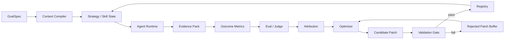
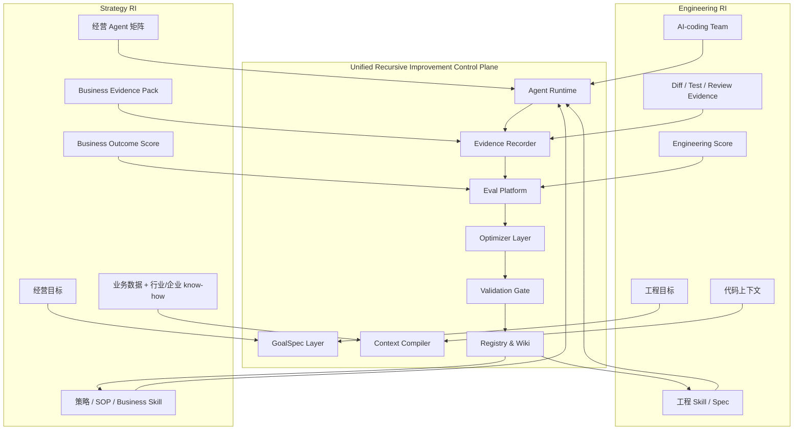
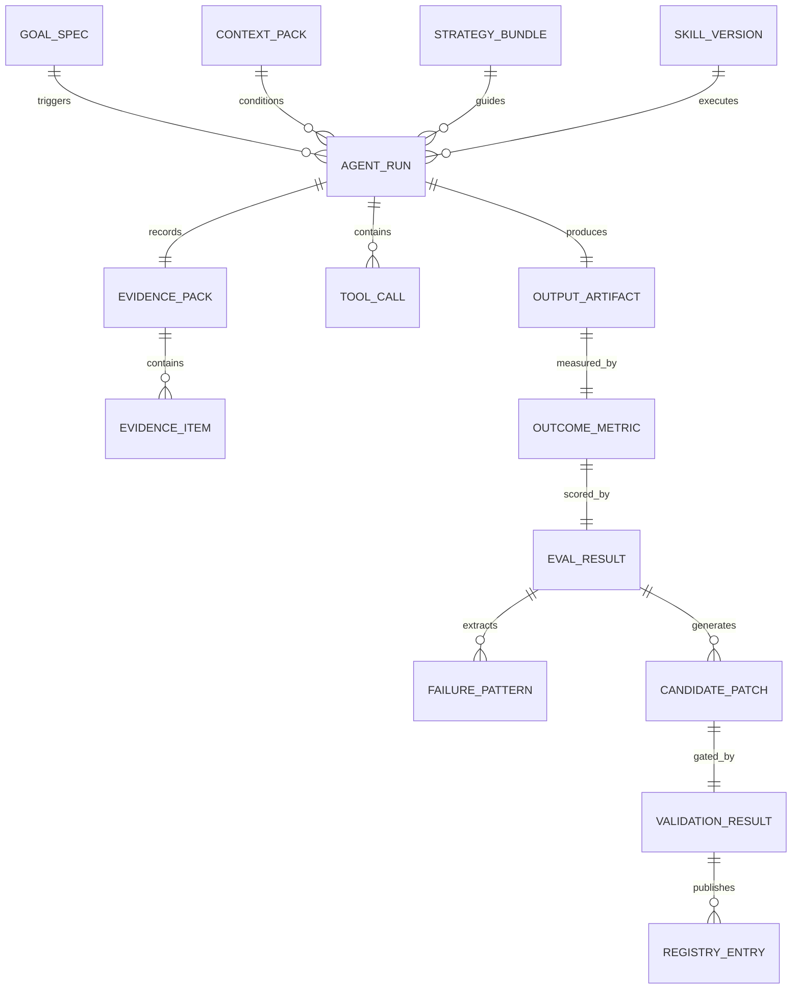
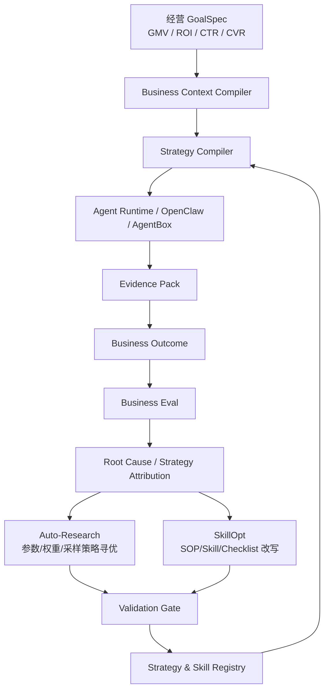
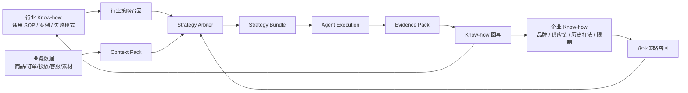
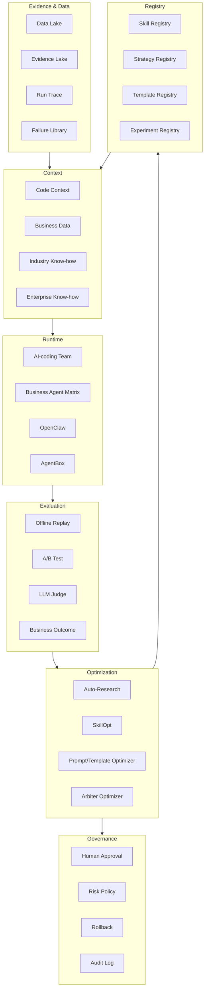
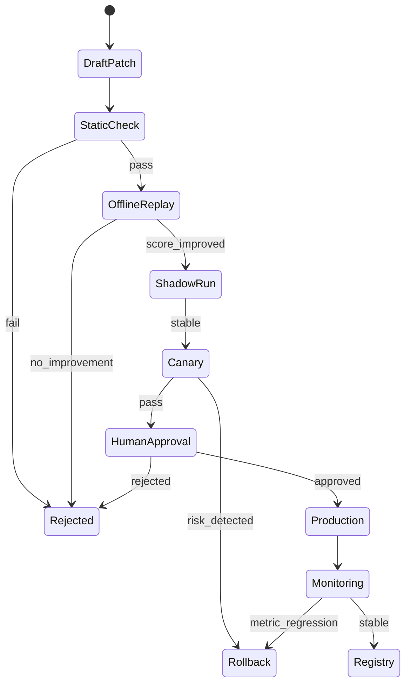
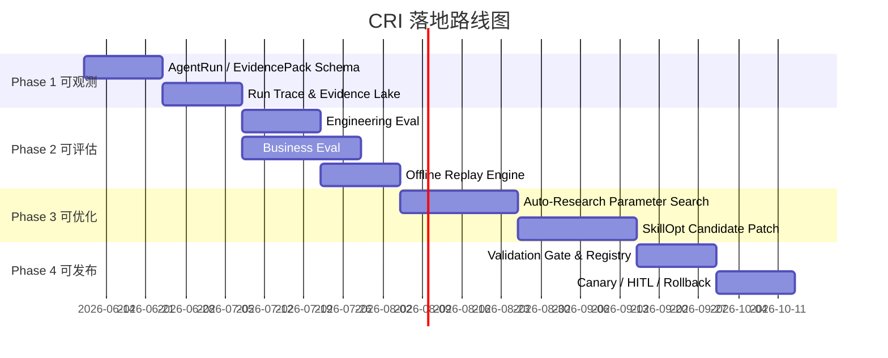

# 受控递归改进系统白皮书 V2

**面向：AI-coding team 与经营增长 OS**  
**版本：V2 - 形式化定义与架构图版**  
**核心主题：Controlled Recursive Improvement, CRI**

---

## 0. 摘要

本文将 Anthropic RSI 的思想抽象为一套可工程化落地的 **受控递归改进系统**：系统不直接追求“模型自我进化”，而是让 AI 在可观测、可评估、可回放、可灰度、可回滚的约束下，持续改进外部可控资产，包括：

- 工程资产：`Agents.md`、PRD 模板、Tech Spec、Coding Skill、Review Checklist、TDD Skill、Release Playbook。
- 经营资产：行业策略、企业策略、Strategy Bundle、Opportunity Card、Business Skill、SOP、评分权重、策略仲裁规则。

统一公式：

```text
CRI = GoalSpec -> Context -> Strategy/Skill -> AgentRun -> EvidencePack
      -> Outcome -> Eval -> Attribution -> Optimizer -> Candidate Patch
      -> Validation Gate -> Registry -> next AgentRun
```

---

## 1. 核心定义：Controlled Recursive Improvement, CRI

### 1.1 定义 1：受控递归改进系统

一个受控递归改进系统是八元组：

```text
CRI = <G, C, A, K, R, E, J, U>
```

其中：

| 符号 | 名称 | 含义 |
|---|---|---|
| G | GoalSpec Space | 目标空间，包括工程目标与经营目标 |
| C | Context Space | 上下文空间，包括代码、数据、业务、行业与企业 know-how |
| A | Agent Runtime | 多 Agent 执行系统，负责计划、调用工具、产出结果 |
| K | Knowledge/Skill State | 可进化资产，包括 Skill、SOP、策略、模板、规则 |
| R | Run Trace | 执行轨迹，包括工具调用、日志、diff、截图、输入输出 |
| E | Evidence Pack | 证据包，保存判断依据、执行过程、结果证据 |
| J | Evaluation Function | 评估函数，给出质量分、业务分、风险分、可复用分 |
| U | Update Operator | 更新算子，产生候选策略、Skill、参数或模板补丁 |

系统在第 t 轮的状态为：

```text
S_t = <K_t, Registry_t, EvalSet_t, FailureLibrary_t>
```

执行过程为：

```text
Run_t = A(G_t, C_t, K_t)
E_t   = Record(Run_t)
Score_t = J(G_t, C_t, Run_t, E_t, Outcome_t)
Patch_t = U(E_t, Score_t, Failure_t, K_t)
K_{t+1} = Gate(Patch_t, EvalSet_t, RiskPolicy) ? Apply(K_t, Patch_t) : K_t
```

这一定义的关键是：**AI 不直接改生产系统；AI 只能提出 candidate patch，必须经过验证门才进入 Registry。**

---

## 2. 统一公式

### 2.1 最小闭环公式

```text
L = <g, c, k, a, e, y, j, p, v>

其中：
g = 目标
c = 上下文
k = 当前策略/Skill/模板状态
a = Agent 执行动作
e = 证据包
y = 结果指标
j = 评估分数
p = 候选改进补丁
v = 验证结论
```

闭环函数：

```text
f(g, c, k) -> a -> e -> y -> j -> p -> v -> k'
```

其中：

```text
k' = k + p, if v = pass
k' = k,     if v = fail
```

### 2.2 图 1：统一递归改进闭环



---

## 3. 两类系统抽象

### 3.1 系统 A：工程自改进系统 Engineering RI

**目标：让 AI-coding team 的交付质量持续提升。**

形式化定义：

```text
EngineeringRI = <G_eng, C_code, K_eng, A_dev, E_dev, J_eng, U_eng>
```

其中：

| 组件 | 对象 | 示例 |
|---|---|---|
| G_eng | 工程目标 | feature、bugfix、refactor、test、deploy |
| C_code | 代码上下文 | repo、历史 PR、测试日志、ADR、依赖图 |
| K_eng | 工程知识状态 | Agents.md、PRD 模板、Tech Spec、TDD Skill、Review Skill |
| A_dev | 开发型 Agent Runtime | PM Agent、Architect Agent、Coder、Reviewer、Tester、Release Agent |
| E_dev | 工程证据 | diff、test result、build log、review comment、runtime error |
| J_eng | 工程评估 | 测试通过率、架构一致性、需求覆盖、review 成本、bug 回流 |
| U_eng | 工程更新算子 | 修改模板、补充 checklist、优化 context 召回、改写 coding skill |

工程自改进的核心输出不是代码本身，而是：

```text
更好的工程生产协议 = better Agents.md + better Spec + better Skill + better Eval
```

### 3.2 系统 B：策略自改进系统 Strategy RI

**目标：让经营增长 OS 的行业策略、企业策略、场景 Skill 持续提升。**

形式化定义：

```text
StrategyRI = <G_biz, C_biz, K_biz, A_ops, E_biz, J_biz, U_biz>
```

其中：

| 组件 | 对象 | 示例 |
|---|---|---|
| G_biz | 经营目标 | GMV、ROI、CTR、CVR、机会发现、内容转化 |
| C_biz | 业务上下文 | 商品、订单、流量、投放、客服、素材、竞品、平台趋势 |
| K_biz | 策略知识状态 | 行业 SOP、企业打法、Strategy Bundle、Business Skill、机会评分规则 |
| A_ops | 经营型 Agent Runtime | Data Agent、Insight Agent、Opportunity Agent、Content Agent、Execution Agent |
| E_biz | 业务证据 | 数据证据、评论证据、竞品证据、内容证据、执行截图、结果指标 |
| J_biz | 业务评估 | ROI uplift、CTR/CVR uplift、机会卡质量、策略命中、可执行性 |
| U_biz | 策略更新算子 | Auto-Research 参数优化、SkillOpt 方法论优化、策略仲裁规则优化 |

策略自改进的核心输出是：

```text
更好的经营策略生产协议 = better Strategy + better Skill + better Evidence + better Eval
```

---

## 4. 两类系统的统一架构

### 4.1 图 2：双系统统一架构



### 4.2 统一平台分层

```text
L6. Governance Layer
    Risk Policy / HITL / Approval / Audit / Rollback

L5. Optimization Layer
    Auto-Research / SkillOpt / Prompt Optimizer / Strategy Arbiter Optimizer

L4. Eval Layer
    Offline Replay / Benchmark / LLM Judge / Business Outcome / A-B Test

L3. Runtime Layer
    AI-coding Team / Business Agent Matrix / OpenClaw / AgentBox / Tool Runtime

L2. Context Layer
    Code Context / Business Context / Industry Know-how / Enterprise Know-how

L1. Evidence & Data Layer
    Data Lake / Evidence Lake / Run Trace / Outcome Metrics / Failure Library

L0. Registry Layer
    Skill Registry / Strategy Registry / Template Registry / Experiment Registry
```

---

## 5. 关键对象模型

### 5.1 图 3：核心对象关系



### 5.2 核心 Schema

```yaml
GoalSpec:
  id: string
  domain: engineering | business
  objective: string
  constraints: list[string]
  success_metrics: list[string]
  risk_policy: string

AgentRun:
  id: string
  goal_spec_id: string
  context_pack_id: string
  strategy_bundle_id: string
  skill_versions: list[string]
  tool_calls: list[ToolCall]
  evidence_pack_id: string
  output_artifact_id: string
  status: success | failed | needs_review

EvidencePack:
  id: string
  input_evidence: list[EvidenceItem]
  reasoning_summary: string
  execution_trace: list[string]
  output_evidence: list[EvidenceItem]
  outcome_metrics: list[Metric]
  failure_events: list[string]

CandidatePatch:
  id: string
  target_type: skill | strategy | template | parameter | arbiter_rule
  target_id: string
  patch_type: add | delete | replace | reweight
  diff: string
  rationale: string
  expected_improvement: string
  risk_level: low | medium | high
```

---

## 6. 工程自改进系统：AI-coding team

### 6.1 图 4：AI-coding team 自改进链路

```mermaid
sequenceDiagram
  participant User as 业务/产品输入
  participant PM as PM Agent
  participant Arch as Architect Agent
  participant Code as Coding Agent
  participant Test as Test Agent
  participant Review as Review Agent
  participant Eval as Engineering Eval
  participant Opt as Skill/Spec Optimizer
  participant Reg as Engineering Registry

  User->>PM: Feature / Bug / Refactor GoalSpec
  PM->>Arch: PRD + 边界条件
  Arch->>Code: Tech Spec + 文件边界
  Code->>Test: Code Diff
  Test->>Review: Test Results + Coverage
  Review->>Eval: Review Comments + Risk Findings
  Eval->>Opt: Score + Failure Attribution
  Opt->>Reg: Candidate Patch to Agents.md / Skill / Checklist
  Reg-->>PM: Validated Engineering Protocol
```

### 6.2 工程自改进的评分函数

```text
J_eng = 0.25 * RequirementCoverage
      + 0.20 * TestPassRate
      + 0.15 * ArchitectureCompliance
      + 0.15 * Maintainability
      + 0.10 * SecurityRiskScore
      + 0.10 * ReviewEfficiency
      + 0.05 * RollbackReadiness
```

硬门槛：

```text
HardGate_eng = tests_passed
             AND typecheck_passed
             AND no_forbidden_file_change
             AND no_security_policy_violation
             AND rollback_plan_exists
```

### 6.3 可优化资产

| 资产 | 优化方式 | 验证方式 |
|---|---|---|
| Agents.md | 调整 Agent 分工、交接协议、升级条件 | 历史任务回放 + 新任务 A/B |
| PRD 模板 | 增加边界条件、异常状态、验收标准 | 需求覆盖评分 |
| Tech Spec | 增加模块边界、接口契约、状态机 | 架构一致性评分 |
| Coding Skill | 增加文件修改规范、错误处理规范 | 测试通过率 + review 成本 |
| Review Checklist | 增加安全、性能、可维护性检查 | 缺陷捕获率 |
| TDD Skill | 改进测试样例生成策略 | 覆盖率 + bug 回流率 |

---

## 7. 策略自改进系统：经营增长 OS

### 7.1 图 5：经营策略自改进链路



### 7.2 策略自改进的评分函数

```text
J_biz = 0.20 * EvidenceStrength
      + 0.20 * StrategyFit
      + 0.15 * ExecutionFeasibility
      + 0.20 * OutcomeLift
      + 0.10 * RiskControl
      + 0.10 * Reusability
      + 0.05 * Freshness
```

不同场景可替换 `OutcomeLift`：

| 场景 | OutcomeLift |
|---|---|
| 商机洞察 | 机会卡被采纳率、后续实验成功率、竞品弱点命中率 |
| 内容策划 | CTR uplift、互动率、收藏率、内容生产效率 |
| 商品诊断 | 根因命中率、行动计划完成率、7日指标改善 |
| 投放优化 | ROI uplift、CPA 降低、预算利用率、转化稳定性 |

### 7.3 Auto-Research 与 SkillOpt 分工

```text
Auto-Research 优化参数：
- 关键词扩展数量
- 平台采样深度
- 聚类阈值
- 证据权重
- 机会评分权重
- 实验分桶策略

SkillOpt 优化方法论：
- 商机洞察 SOP
- 竞品分析 Skill
- 内容策划 Skill
- 投放诊断 Skill
- Evidence Checklist
- 策略仲裁规则说明
```

关键原则：

```text
Auto-Research 发现“什么参数更有效”。
SkillOpt 将有效规律固化为“可复用的 Skill / SOP / Checklist”。
Eval 决定它是否真的变好。
Registry 决定它是否进入生产。
```

---

## 8. 行业 know-how 与企业 know-how 的融合

### 8.1 图 6：策略编译与仲裁器



### 8.2 策略仲裁评分

```text
ArbiterScore(strategy_i) =
  0.30 * EnterpriseEvidenceStrength
+ 0.20 * HistoricalOutcomeScore
+ 0.15 * IndustryGeneralizationScore
+ 0.15 * ExecutionFeasibility
+ 0.10 * RiskPenaltyAdjustedScore
+ 0.10 * FreshnessScore
```

仲裁规则：

```text
Rule 1: 企业证据强时，企业策略优先。
Rule 2: 企业证据弱但行业证据强时，行业策略作为显性补充。
Rule 3: 企业策略与行业策略冲突时，必须输出 conflict_reason 与 validation_plan。
Rule 4: 高风险策略不得自动执行，必须进入 HITL。
Rule 5: 所有策略进入生产前必须绑定 EvidencePack 与 EvalResult。
```

### 8.3 Strategy Bundle 标准结构

```yaml
StrategyBundle:
  id: string
  goal_spec_id: string
  selected_strategies:
    - strategy_id: string
      source: industry | enterprise | hybrid
      confidence: number
      evidence_refs: list[string]
  conflicts:
    - conflict_type: string
      enterprise_view: string
      industry_view: string
      resolution: string
  execution_constraints:
    - string
  validation_plan:
    metric: string
    window: string
    baseline: string
    expected_lift: string
```

---

## 9. 基础设施如何建设

### 9.1 图 7：基础设施分层架构



### 9.2 数据分层

| 数据层 | 内容 | 作用 |
|---|---|---|
| Grounding Data | 代码、业务数据、行业数据、企业知识 | 支撑生成与决策 |
| Execution Data | Agent 输入输出、工具调用、日志、截图、diff | 支撑回放与归因 |
| Outcome Data | 测试结果、线上指标、ROI、CTR、CVR、GMV | 支撑真实效果判断 |
| Learning Data | 成功/失败案例、人工审核、A/B 结果、Rejected Patch | 支撑优化器学习 |

---

## 10. 验证门与发布机制

### 10.1 图 8：Candidate Patch 生命周期



### 10.2 验证门定义

```text
ValidationGate(patch) =
  StaticCheck(patch)
  AND OfflineReplayScore(patch) > Baseline + Delta
  AND RiskScore(patch) < RiskThreshold
  AND RegressionScore(patch) <= RegressionThreshold
  AND ApprovalPolicy(patch)
```

其中：

```text
Delta_eng = 工程任务历史集上至少提升 5%-10%
Delta_biz = 业务离线评估或小流量实验至少提升 3%-5%
```

---

## 11. 落地建议和节奏

### 11.1 总体原则

```text
先记录，再评估；先回放，再优化；先参数，再 Skill；先灰度，再生产。
```

### 11.2 四阶段路线图



### 11.3 Phase 1：可观测，2-4 周

目标：所有 Agent 运行都能被记录、追踪、复盘。

交付物：

```text
- AgentRun Schema
- EvidencePack Schema
- SkillVersion Schema
- OutcomeMetric Schema
- Run Trace Collector
- Evidence Lake 最小表结构
```

验收标准：

```text
任意一次工程任务或经营任务，都能回答：
- 输入是什么？
- 使用了哪个 Skill 版本？
- 调用了哪些工具？
- 产生了什么输出？
- 证据在哪里？
- 结果指标是什么？
```

### 11.4 Phase 2：可评估，3-5 周

目标：建立工程 Eval 与业务 Eval。

工程侧：

```text
- 20 个历史开发任务回放集
- 需求覆盖评分
- 架构一致性评分
- 测试通过评分
- Review 成本评分
```

业务侧：

```text
- 30 个商机洞察 / 商品诊断案例集
- 机会卡质量评分
- EvidenceStrength 评分
- StrategyFit 评分
- OutcomeLift 评分
```

### 11.5 Phase 3：可优化，4-6 周

目标：先让 Auto-Research 优化参数，再让 SkillOpt 优化 Skill。

优先优化对象：

```text
Engineering RI:
- context top_k
- test generation strategy
- review checklist weight
- coding skill constraints

Strategy RI:
- 关键词扩展参数
- 平台采样参数
- 机会评分权重
- 聚类阈值
- 证据门槛
```

### 11.6 Phase 4：可发布，3-4 周

目标：Candidate Patch 经过验证门，进入 Registry，支持灰度和回滚。

交付物：

```text
- Candidate Patch 格式
- Validation Gate
- Skill Registry
- Strategy Registry
- Canary Policy
- Rollback Policy
- Rejected Patch Buffer
```

---

## 12. MVP 推荐

### 12.1 MVP 1：AI-coding team 自改进

目标：优化 `Agents.md + TDD Skill + Review Checklist`。

范围：

```text
- 选 20 个历史开发任务
- 固定模型和代码库
- 对比旧工程协议 vs 新工程协议
- 指标：测试通过率、review 修改次数、bug 回流、交付时间
```

最小闭环：

```text
Task -> AgentRun -> Diff/Test Evidence -> Engineering Eval -> Failure Attribution
-> Candidate Patch to Review Checklist -> Offline Replay -> Registry
```

### 12.2 MVP 2：经营增长 OS 策略自改进

目标：优化“商机洞察 Skill + 机会卡评分权重”。

范围：

```text
- 选 30 个历史商机洞察案例
- 固定数据快照
- 多组参数并行跑 Auto-Research
- SkillOpt 只允许小范围改写 opportunity_insight.skill.md
- 指标：机会卡质量、证据充分性、可执行性、后续实验成功率
```

最小闭环：

```text
Frozen Data -> Opportunity Agent -> Opportunity Card -> Business Eval
-> Auto-Research Parameter Update -> SkillOpt SOP Patch
-> Offline Replay -> Strategy Registry
```

---

## 13. 风险与治理

| 风险 | 表现 | 治理方式 |
|---|---|---|
| 自我强化错误 | 错误策略被不断放大 | held-out eval + 人工审核 + failure library |
| 指标投机 | 优化器只追局部指标 | 多目标评分 + 业务结果校验 |
| 策略漂移 | 企业定位被行业通用策略覆盖 | Strategy Arbiter + 企业约束硬门槛 |
| 执行失控 | Agent 自动执行高风险动作 | HITL + 权限边界 + 风险策略 |
| 知识污染 | 低质量案例进入 know-how | Evidence Gate + Source Quality Score |
| 工程破坏 | 自动 patch 破坏架构 | static check + regression + rollback |

---

## 14. 结论

你要建设的不是抽象的 RSI，而是面向工程与经营的 **Controlled Recursive Improvement Layer**。

最终系统应具备四种能力：

```text
1. 可观测：每次 Agent 执行都有 EvidencePack。
2. 可评估：每次输出都有 Engineering Score 或 Business Score。
3. 可优化：Auto-Research 优化参数，SkillOpt 优化方法论。
4. 可治理：所有改进必须经过 Validation Gate、Registry、灰度和回滚。
```

对于 AI-coding team，这会形成：

```text
更强的工程协议 -> 更高质量的代码交付 -> 更多工程证据 -> 更强的工程协议
```

对于经营增长 OS，这会形成：

```text
更强的行业/企业策略 -> 更好的经营执行 -> 更多业务结果证据 -> 更强的行业/企业策略
```

这就是适合你当前方向的业务版 RSI：

```text
Business & Engineering Recursive Improvement System
= 受控、自证、可回放、可发布的工程与经营策略自进化层。
```

---

## 15. 参考概念

- Anthropic Institute, Recursive Self-Improvement.
- Microsoft Research, SkillOpt: Executive Strategy for Self-Evolving Agent Skills.
- Auto-Research / offline parameter optimization.
- Evidence Pack / Eval Gate / Skill Registry / Strategy Wiki.
