# Skill Runtime 详细设计（前端 / 后端 / 智能体协同 · 商机洞察 walkthrough）

> 本文是 [`docs/skill-runtime-architecture-v5.html`](skill-runtime-architecture-v5.html) 的工程协同 spec。
> 它把架构图里的盒子展开成三方都能照着实现的契约，并用 [`/Users/yichen/Desktop/产品方案设计/insight-discovery-paradigm.html`](file:///Users/yichen/Desktop/产品方案设计/insight-discovery-paradigm.html) 中的商机洞察作为端到端 walkthrough 闭环验证。
> 设计原则与不变量沿用 [`docs/skill-runtime-whitepaper.md`](skill-runtime-whitepaper.md)，项目身份口径沿用 [`docs/PROJECT_OVERVIEW.md`](PROJECT_OVERVIEW.md)。

---

## § 0  读者地图

按角色读路：

| 角色 | 必读 | 可跳过 |
| --- | --- | --- |
| 前端工程师 | §1 §2 §3 §7 前端切片 §8 | §4 §5 §6 |
| 后端工程师（能力运行时） | §1 §2 §4 §7 后端切片 §8 | §3 |
| 智能体 / 编译团队 | §1 §2 §5 §6 §7 编译切片 §8 §9 | §3 |
| PM / 架构评审 | §1 §2 §7 §8 §9 §10 | §3 §4 §5 |

三方对齐点都在 §2（共享语义层）。任何 §3 / §4 / §5 的设计冲突，先回到 §2 与 §8 仲裁。

---

## § 1  架构对齐（坐标系）

本文档不重画 v5，只用一张精简坐标系标边界：

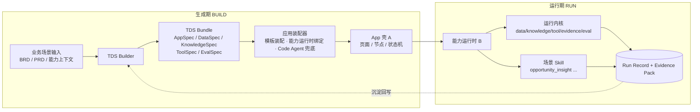

**本文档的不变量**（任何分歧以此为准，继承自 whitepaper §10）：

1. App 壳与能力运行时职责分离；壳可漂移，能力是单一真相。
2. 每个服务端点都有 input schema、output schema、evidence 三段式。
3. 能力运行时先以裸服务上线，端点签名稳定后再内部封装为 Skill 包；阶段升级前端零改动。
4. Code Agent 的产物默认是「提议」，必须经「可验证 / 可回滚 / 可审计 / human-confirmed apply」四闸才采纳。
5. 运行期的事实计算与流程执行永远落在能力运行时，不交概率组件。
6. 沉淀走运行期 evidence / 反馈回写能力运行时，不从 App 代码逆向蒸馏。

---

## § 2  共享语义层（三方共用术语 + 数据形状）

本节是前/后/智能体三方的**唯一对齐面**。所有字段都用人话描述：含义、来源、消费方、生命周期，不写代码。任何 §3/§4/§5 的字段都必须能映射回这里的对象。

### 2.1 六个核心对象一览

| 对象 | 作用域 | 阶段 | 谁产出 | 谁消费 |
| --- | --- | --- | --- | --- |
| TDS Bundle | 生成期单一交付包 | BUILD | TDS Builder Agent | 应用装配器 |
| Skill 包 | 运行期能力封装单元 | BUILD（封装）/ RUN（加载） | 蒸馏 Agent / 人工 | 能力运行时 |
| Service Endpoint Contract | 跨端跨期统一契约 | BUILD + RUN | 后端 + Skill 作者 | 前端 + 内部调用方 + 证据系统 |
| Node State | 单节点运行态 | RUN | App 壳 + 能力运行时联合维护 | 前端渲染 + 后端编排 |
| Evidence Pack | 每条结论的可追溯证据 | RUN | 端点产出 | 报告 / 蒸馏 / 审计 |
| Run Record | 一次跨节点会话归档 | RUN → 沉淀期 | 能力运行时 | 蒸馏 Agent / eval / 复盘 |

### 2.2 TDS Bundle

**一句话**：PRD 编译后的单一交付包，是装配器的唯一输入。包含五个子包，互相不内联、靠 id 引用。

| 子包 | 描述什么 | 关键字段（人话版） | 谁是后续消费方 |
| --- | --- | --- | --- |
| AppSpec | App 壳的页面 / 节点 / 槽位 / 视图绑定 | 节点列表、节点顺序、每个节点的视图类型、用户交互姿态、依赖前置节点 | 模板装配器 + 前端 |
| DataSpec | 节点要的字段口径与数据来源 | 字段名、字段语义、单位、来源端点、刷新策略、空值口径 | 后端场景端点 + 前端表格 / 列定义 |
| KnowledgeSpec | 业务规则与判定阈值 | 规则名、适用场景、判定条件、阈值参数、圈层切片维度 | 后端打分 / 筛选 + 智能体 prompt 上下文 |
| ToolSpec | 节点要绑哪些工具 | 工具 id、调用姿态（同步/异步/轮询）、鉴权要求、超时上限、重试策略、降级策略 | 后端工具注册表 + 内核工具服务 |
| EvalSpec | 节点 / Skill 的验收口径 | 验收维度、硬门禁、回归用例、人评 prompt、容忍区间 | 评估服务 + 蒸馏 Agent |

**生命周期**：编译产出 → 装配器消费 → 装配完成后冻结进 Run Record；运行期不可改，要改回 BUILD 重编译。

**与 v5 的对位**：v5 图中"TDS Bundle"盒子内部展开就是这五子包。

### 2.3 Skill 包

**一句话**：能力运行时挂载的"场景能力单元"，封装了一个场景的契约 + 知识 + 工具 + 评估 + 执行计划，可注册可路由可版本化。

目录形状对齐 [`benchmarks/.../reference_skill_pack/`](../benchmarks/opportunity_insight_benchmark_pack/benchmarks/skill_creator/opportunity_insight/reference_skill_pack)：

```text
skill.yaml                 # 标识 + 触发器 + rsi_feedback
contracts/                 # input / output / data / tool / knowledge / eval schema
runtime/                   # execution_plan / guardrails / error_policy
knowledge/                 # claim_pack / strategy_rules / negative_cases
prompts/                   # planner / executor / reviewer / failure_triage
tools/                     # tool_manifest（声明依赖哪些内核工具）
evals/                     # benchmark / regression_cases / scoring_rubric
examples/                  # positive / negative / edge cases + sample IO
app/                       # ui_components / app_spec_template（生成期可消费）
```

**关键字段**：

| 字段 | 含义 | 阶段语义 |
| --- | --- | --- |
| skill_id | 全局唯一标识（如 `ecommerce.opportunity_insight`） | 路由键 |
| version | 语义化版本 | 回滚 / 灰度单位 |
| trigger.when_to_use / when_not_to_use | 是否激活本 Skill 的硬条件 | 装配期 + 运行期路由门 |
| rsi_feedback.collect | 运行期要收集哪些反馈 | 沉淀回写来源 |
| rsi_feedback.update_targets | 反馈可以改哪几类工件 | 蒸馏 Agent 的写入白名单 |

**阶段语义**：阶段 0 时 Skill 包可以"只声明 contracts 与 tools，runtime 用裸函数实现"；阶段 1 时 prompts/runtime/knowledge 全部到位，端点签名不变。

### 2.4 Service Endpoint Contract（端点三段式）

**一句话**：内核横切端点 + 场景业务端点共用同一种契约形状。三段式：input / output / evidence，缺一不可。

| 段 | 字段 | 含义 |
| --- | --- | --- |
| input | endpoint_id | 端点全名（如 `data.warehouse.precise_words`、`opportunity_insight.keyword.compute`） |
| input | params | 参数键值，受 input schema 约束 |
| input | auth_context | 鉴权透传上下文（authSessionId / tenantId / userId） |
| input | call_mode | sync / async / poll，三选一 |
| input | idempotency_key | 同一节点同一上下文重复调用的去重键 |
| output | status | succeeded / failed / partial / pending（async 模式专属） |
| output | data | 受 output schema 约束的业务负载 |
| output | metrics | 计时 / 用量 / token / 行数等观测指标 |
| output | next_action_hint | 给前端的下一步建议（继续轮询 / 等待用户 / 进入下一节点） |
| evidence | sources | 这条结论引用了哪些数据快照、哪些 LLM trace、哪些上游端点输出 |
| evidence | snapshot_refs | 数据快照存储位置（指向 Run Record 内的不可变副本） |
| evidence | failure_event | 失败时填：超时 / 上游空 / LLM 拒答 / 证据缺失 四类之一 + 详细信息 |
| evidence | producer | 产出本结论的 endpoint_id + skill_id + version |

**生命周期**：input 提交那一刻冻结；output 完成时一次性写入；evidence 与 output 同生命周期，必须原子提交。

**不变量映射**：等价于本文档不变量 #2。任何端点缺三段式中任一段的，都不允许进入装配器路由表。

### 2.5 Node State（节点状态机）

**一句话**：App 壳里每个业务节点的状态字段。前后端共用一份语义，前端只渲染、后端是唯一写入方。

**状态枚举**：

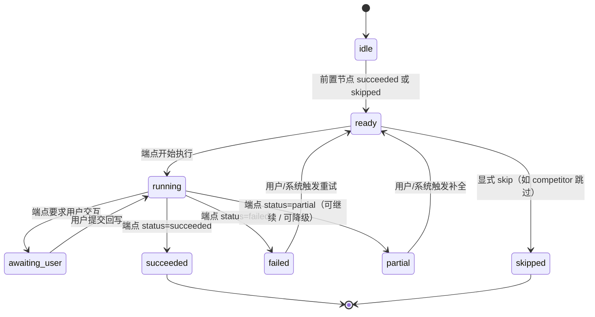

**字段一览**：

| 字段 | 含义 | 写入方 |
| --- | --- | --- |
| node_id | 节点唯一标识（如 `keyword` / `social` / `competitor` / `final`） | 装配期 |
| ord | 排序序号 | 装配期 |
| state | 枚举：idle / ready / running / awaiting_user / succeeded / failed / partial / skipped | 后端 |
| call_mode | sync / async / poll | 装配期（来自 ToolSpec） |
| poll_meta | 轮询间隔、上限、当前次数（仅 poll 模式） | 后端 |
| user_input_required | 是否需要用户交互 + 交互 schema 指针 | 装配期 |
| produced_output_ref | 产出的端点 output 在 Run Record 中的引用 | 后端 |
| evidence_ref | 关联的 Evidence Pack 引用 | 后端 |
| depends_on | 前置节点 id 列表 | 装配期 |
| hard_deps_met / soft_deps_met | 硬 / 软依赖是否满足（如 final 硬依赖 keyword+social） | 后端 |

### 2.6 Evidence Pack

**一句话**：每条业务结论的可追溯证据，跟着 output 走，不可后补。

| 字段 | 含义 |
| --- | --- |
| evidence_id | 全局唯一标识 |
| claim | 这条证据支持的业务结论文本（如"某关键词机会分 82"） |
| sources[] | 证据来源条目：数据快照 / LLM trace / 三方采集 / 上游端点 output |
| sources[].kind | snapshot / llm_trace / upstream_output / external_collection |
| sources[].ref | 不可变快照路径 / trace id / upstream evidence_id |
| sources[].fingerprint | 内容指纹（用于回放 diff） |
| producer | 产出方 endpoint_id + skill_id + version |
| timestamp | 产出时间 |
| failure_event | 仅失败时填：超时 / 上游空 / LLM 拒答 / 证据缺失 + 详细信息 |

**生命周期**：随 output 原子提交 → 进入 Run Record → 沉淀期可被蒸馏 Agent 只读消费，不可被运行期改写。

### 2.7 Run Record

**一句话**：一次会话的执行归档，是沉淀期与审计期的唯一真相。

| 字段 | 含义 |
| --- | --- |
| run_id | 全局唯一标识 |
| session_ctx | 会话上下文（用户、租户、类目、需求描述等） |
| tds_bundle_ref | 本次使用的 TDS Bundle 版本指针 |
| skill_refs[] | 本次加载的 Skill 包及版本 |
| nodes[] | 每个节点的 Node State 快照（终态） |
| endpoint_calls[] | 每次端点调用的 input/output/evidence 三段式归档 |
| llm_calls[] | LLM 调用的 prompt 模板 id / 输入 hash / 输出 / 计时 |
| diffs[] | 装配期产物 diff（如 Code Agent 兜底片段） |
| reviews[] | 人评 / 自动评审记录 |
| feedback[] | rsi_feedback 收集到的反馈条目 |

**生命周期**：run 结束时冻结；只允许只读引用；蒸馏 Agent 据此产 Skill 候选。

### 2.8 对象关系总览

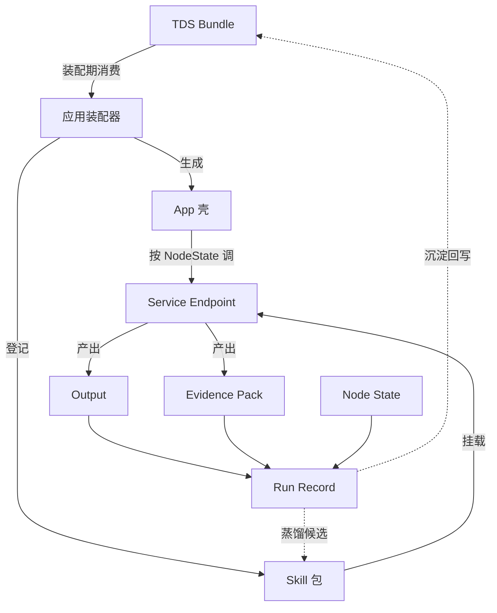

---

## § 3  前端视角契约（App 壳）

前端只是"会跟着节点 schema 行走的视图层"。它**不持有业务规则**，**不发起 LLM**，**不解释证据**；它只做四件事：渲染节点视图、维护用户交互输入、按节点声明发起端点调用、把后端写回的 Node State 翻译成 UI 状态。

### 3.1 壳能拿到什么

装配器在 BUILD 阶段从 `TDS Bundle.AppSpec` 派生出**前端清单**，是壳启动时唯一吃进去的配置。形状如下：

| 清单字段 | 含义 | 来源 |
| --- | --- | --- |
| pages[] | 页面 id + 路由 + 布局类型（canvas / drawer / report 三选一） | AppSpec |
| nodes[] | 节点 id + ord + 所属 page + 视图绑定 + 交互模式 | AppSpec |
| nodes[].view | 视图组件 id（受限组件库）+ 数据列定义指针 | AppSpec + DataSpec |
| nodes[].interaction | 交互姿态：none / single_select / multi_select / form_submit | AppSpec |
| nodes[].endpoint | 该节点绑定的场景端点 id + call_mode | AppSpec + ToolSpec |
| nodes[].polling | poll 模式专属：interval_ms / max_attempts / timeout_ms | ToolSpec |
| nodes[].depends_on | 前置节点 id 列表 | AppSpec |
| copywriting[] | 节点标题、提示文案、空状态、错误文案的多语言条目 | AppSpec |

**关键约束**：前端永远不直接拿 KnowledgeSpec、EvalSpec、原始 schema。这些是后端 / 智能体的事；前端只看派生清单。

### 3.2 节点调用的三种统一姿态

一个节点只允许属于**一种**姿态，姿态由 `nodes[].endpoint.call_mode` 决定。这是前端轮询、超时、重试、UI 状态翻译的唯一依据。

| 姿态 | 适用场景 | 前端行为 | 商机洞察示例 |
| --- | --- | --- | --- |
| sync | 一次取数 / 一次回写 | 一次请求 → 等响应 → 更新 Node State | keyword 拉精准词表、hot_product 保存选品 |
| async + poll | 长耗时生成、采集类任务 | 第一次请求只拿 task ack → 进入 poll 循环 → 直到 succeeded/failed | competitor 评论问大家采集、final 报告生成 |
| user_submit | 等用户填表 / 选择 | 渲染交互组件 → 用户提交 → 一次回写请求 | launch 类目选择、keyword 单选确认、hot_product 多选 |

姿态切换不允许跨节点；如某节点既要拉数又要等用户交互，**必须拆成两个节点**（参考商机洞察中 `keyword` 节点：先 sync 拉表，再 user_submit 单选确认）。

### 3.3 节点状态机（前端视图翻译）

后端写入 Node State 字段（见 §2.5），前端用一张**固定**的状态 → UI 映射表渲染：

| Node State.state | UI 表现 | 用户可做的事 |
| --- | --- | --- |
| idle | 节点未亮（灰） | 无 |
| ready | 节点可点亮，但等待前置完成 | 无 |
| running | 显示 loading + 进度文案（来自 next_action_hint） | 取消 / 等待 |
| awaiting_user | 渲染 interaction 组件 | 提交表单、选择项、跳过 |
| succeeded | 渲染节点 view + 数据 | 进入下一节点、查看证据、回看 |
| partial | 渲染节点 view + 部分数据 + 补全入口 | 重试 / 补全 / 接受现状继续 |
| failed | 渲染失败文案 + 重试按钮 + 跳过按钮（仅软依赖节点可跳过） | 重试 / 跳过 / 联系支持 |
| skipped | 灰态显示"已跳过" | 撤销跳过（仅当下游未启动时） |

**硬性规定**：前端绝不基于业务字段（如 `keywords[].opportunity_score`）做状态决策；状态只由 `Node State.state` 驱动。这是不变量 #1 在前端的具体体现。

### 3.4 轮询契约表

`async + poll` 姿态需要前端定时去拉 Node State。轮询参数**只来自**装配器清单，前端不允许硬编码。下表是商机洞察现状映射到轮询契约的范例：

| 节点 | endpoint.call_mode | interval_ms | max_attempts | timeout_ms | 终态判定 |
| --- | --- | --- | --- | --- | --- |
| competitor 采集 | async + poll | 3000 | 200 | 600000 | Node State.state ∈ {succeeded, failed} |
| final 生成 | async + poll | 2000 | 900 | 1800000 | Node State.state ∈ {succeeded, failed} |

**轮询失败约定**：到达 `max_attempts` 或 `timeout_ms` 任一限制，前端将 state 翻译为 `failed`，并标记 `failure_event.kind = "timeout"`（要求后端在 Run Record 中也记录同一类型，便于复盘对账）。

### 3.5 三视图绑定规范

前端组件库受限于装配器认证过的视图（即 `app_spec_template` 中允许的组件集合）。本期固定三种：

| 视图类型 | 绑定的节点姿态 | 数据形状要求 |
| --- | --- | --- |
| canvas | sync 取数 / user_submit | 表格 / 卡片网格 / 表单，按 DataSpec 列定义渲染 |
| drawer | sync 取数（侧拉补充上下文） | KV 对 + 长文本块，按 DataSpec.detail 渲染 |
| report | async + poll 终态 | 长文档结构，按 DataSpec.report 渲染（机会卡 / 人群 / 场景卡 / 优先级） |

**绑定不变量**：一个节点只绑一种视图；如需多视图（如 final 节点既出 canvas 又出 report），**必须拆节点**或在 AppSpec 中显式声明"复合视图"（本期不启用）。

### 3.6 用户交互回写契约

`user_submit` 姿态下的交互输入会被前端打包成"端点 input.params"提交给后端。约束：

1. **schema 驱动**：前端表单字段来自 AppSpec.nodes[].interaction.schema 指针，前端不自造字段。
2. **本地不存业务态**：用户的选择只在提交那一刻成为 Node State 的一部分；前端不把它当作可读源。下次回访由后端从 Run Record 读出再回灌前端。
3. **去重键**：每次提交携带 `idempotency_key`（由"会话 id + 节点 id + 提交序号"派生），保证重复点击不脏数据。

### 3.7 前端禁区清单

| 行为 | 是否允许 | 原因 |
| --- | --- | --- |
| 在浏览器侧直接调 LLM 网关 | ❌ | 违反不变量 #5（事实计算与流程必须在能力运行时） |
| 在浏览器侧本地排序 / 重算业务字段 | ❌ | 违反单一真相；排序口径属于 DataSpec |
| 在浏览器侧解释 evidence、做"为什么是这个分数" | ❌ | evidence 解释属于后端 evidence 服务 |
| 在浏览器侧持久化跨会话数据 | ❌ | 持久化只能在能力运行时（Session / Report 落库） |
| 前端隐藏失败 / 静默重试 | ❌ | 必须把 failure_event 透出到 UI |
| 前端按业务字段切换组件树（如分数 > 70 显示绿色徽章） | ✅ | 视觉映射可以在前端，但映射规则来自 AppSpec.copywriting / view 配置，不在前端代码硬编码 |

---

## § 4  后端视角契约（能力运行时）

后端即"能力运行时" = 运行内核 + 场景 Skills。它对外只暴露**服务端点**，且每个端点都遵守 §2.4 三段式。本节给出端点分层、Skill 加载、持久化口径、失败语义。

### 4.1 端点分层

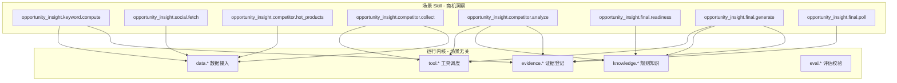

**职责边界一句话**：

| 内核端点族 | 职责 | 不做什么 |
| --- | --- | --- |
| `data.*` | 统一数据接入（数仓、缓存、内部表） | 不做业务规则判定 |
| `knowledge.*` | 业务规则与阈值（来自 KnowledgeSpec） | 不持有原始数据 |
| `tool.*` | 工具调度（LLM 网关、图片生成、三方采集 job、爬虫） | 不做规则裁决 |
| `evidence.*` | 证据登记 / 查询 / 回放 | 不产生新的业务结论 |
| `eval.*` | 离线评估、回归用例运行 | 不参与运行期业务 |

**场景端点** 全部以 `opportunity_insight.*` 命名空间组织，必须挂在 `ecommerce.opportunity_insight` Skill 包下（对齐 [`reference_skill_pack/skill.yaml`](../benchmarks/opportunity_insight_benchmark_pack/benchmarks/skill_creator/opportunity_insight/reference_skill_pack/skill.yaml) 的 `skill_id`）。

### 4.2 商机洞察 7 个场景端点（三段式）

下表是契约**字段级**口径。每条 evidence 都需挂回 Run Record。

#### 4.2.1 `opportunity_insight.keyword.compute`（sync）

| 段 | 字段 | 含义 |
| --- | --- | --- |
| input | category_id | 类目 id（必填） |
| input | demand_text | 需求描述（选填） |
| input | top_n | 返回的精准词数量上限 |
| output.data | keywords[] | 精准词列表（含机会分、供需比、搜索量等列，由 DataSpec 定义） |
| output.data | ranking_strategy | 排序口径名（如 `opportunity_score_desc`），便于前端展示 |
| evidence.sources | dw_snapshot:ads_cid_precise_word_analysis_d | 数仓表快照引用 |
| evidence.sources | rule_pack:keyword_scoring_v1 | KnowledgeSpec 中规则版本号 |

#### 4.2.2 `opportunity_insight.social.fetch`（sync）

| 段 | 字段 | 含义 |
| --- | --- | --- |
| input | session_ctx | 会话上下文（含已确认 keyword） |
| output.data | persona_groups[] | 社媒人群画像分组（原始） |
| output.data | xhs_scenes[] | 小红书场景（原始） |
| output.data | audience_scene_insights | 组装后的人群-场景对照 |
| evidence.sources | dw_snapshot:ads_ind_social_media_persona_groups | 数仓快照 |
| evidence.sources | dw_snapshot:dws_xhs_category_scene_note_preview | 数仓快照 |

注意：人群关键词筛选**不**在这里发生（详见 4.2.7）。

#### 4.2.3 `opportunity_insight.competitor.hot_products`（sync / user_submit 复合）

| 段 | 字段 | 含义 |
| --- | --- | --- |
| input | mode | `list` 取候选 / `commit` 保存选择 |
| input.params (commit) | selected_product_ids[] | 用户多选商品（最多 10） |
| output.data (list) | candidates[] | 选品池 |
| output.data (commit) | product_contexts | 已保存的选品上下文 |
| evidence.sources | dw_snapshot:ads_ind_trade_category_goods_w | 数仓快照 |

#### 4.2.4 `opportunity_insight.competitor.collect`（async + poll）

| 段 | 字段 | 含义 |
| --- | --- | --- |
| input | product_ids[] | 来自 4.2.3 commit |
| output.data | task_id | 三方采集 just-one job id |
| output.data | progress | 采集进度（轮询时回写） |
| output.status | pending → succeeded / failed | 轮询语义 |
| evidence.sources | tool_job:just-one-review-ask | 三方任务引用 |

#### 4.2.5 `opportunity_insight.competitor.analyze`（async）

| 段 | 字段 | 含义 |
| --- | --- | --- |
| input | task_id | 来自 4.2.4 |
| output.data | comparison_table | 横向对比表 |
| output.data | demand_word_cloud | 八大需求词云 |
| output.data | review_insight | 评价洞察（LLM 抽取） |
| output.data | qa_insight | 问大家洞察（LLM 抽取） |
| evidence.sources | llm_trace:review-insight | LLM 调用 trace id |
| evidence.sources | llm_trace:qa-insight | LLM 调用 trace id |
| evidence.sources | upstream:competitor.collect.output | 上游引用 |

#### 4.2.6 `opportunity_insight.final.readiness`（sync）

| 段 | 字段 | 含义 |
| --- | --- | --- |
| input | session_id | 会话 id |
| output.data | hard_deps_met | `{keyword: bool, social: bool}` |
| output.data | soft_deps_met | `{competitor: bool}` |
| output.data | next_action_hint | 缺哪个节点的提示文案 |
| evidence.sources | rule_pack:final_readiness_v1 | KnowledgeSpec 规则 |

#### 4.2.7 `opportunity_insight.final.generate` + `final.poll`（async + poll）

| 段 | 字段 | 含义 |
| --- | --- | --- |
| input | session_id | 会话 id |
| output.data | opportunity_cards[] | 机会清单 |
| output.data | persona_panels[] | 人群面板（含图片 url） |
| output.data | scene_cards[] | 场景卡（含图片 url） |
| output.data | priority_matrix | 优先级矩阵 |
| evidence.sources | llm_trace:persona_keyword_filter | 人群关键词筛选 LLM（回写 social.analysis） |
| evidence.sources | llm_trace:scene_text_completion | 场景文案补全 LLM |
| evidence.sources | llm_trace:final_report | 机会卡 LLM |
| evidence.sources | tool_job:persona_images | 图片生成任务 |
| evidence.sources | tool_job:priority_images | 图片生成任务 |

**回写时机契约**：`persona_keyword_filter` 是 final 阶段执行、但筛选结果**回写到 social.analysis**。回写发生在 final.generate 内部，必须在同一事务里：

1. final.generate 调 LLM 拿到筛选结果。
2. 立即写回 `SessionDataBundle.social.analysis.persona_keywords`。
3. 在 final 的 evidence 中记录 `cross_write:social.analysis` 指针。
4. Run Record 中同时增加 social 节点的"二次更新"事件，不改 social.fetch 的 evidence。

### 4.3 Skill 加载契约

能力运行时启动时按 `skill.yaml` 注册 Skill 包，登记到路由表。字段对照（见 [`skill.yaml`](../benchmarks/opportunity_insight_benchmark_pack/benchmarks/skill_creator/opportunity_insight/reference_skill_pack/skill.yaml)）：

| skill.yaml 字段 | 路由表条目 | 行为 |
| --- | --- | --- |
| skill_id + version | 路由命名空间前缀 | 多版本灰度可并存 |
| trigger.when_to_use | 路由门 | 不匹配则该 Skill 不响应该请求 |
| trigger.when_not_to_use | 拒绝条件 | 触发即返回"非本 Skill 范围" |
| contracts/*.json | input/output schema | 端点入口校验 |
| runtime/execution_plan.yaml | 端点内部 step 序列 | 阶段 0 退化为直接调内核端点 |
| tools/tool_manifest | 依赖的内核工具 | 启动期做依赖校验，缺则 Skill 不可挂载 |
| rsi_feedback | 反馈收集器登记 | 运行期把反馈写入 Run Record |

**阶段 0 → 阶段 1**：阶段 0 时 `runtime/execution_plan.yaml` 中的 step 可以由后端裸函数实现；阶段 1 升级为 prompts + knowledge 驱动的 step 编排，**端点 input/output schema 不变**，前端零改动（这是不变量 #3 在加载层的体现）。

### 4.4 持久化字段口径

商机洞察现有后端落库表与本架构对位：

| Prisma 表 | 本架构对位 | 写入端点 |
| --- | --- | --- |
| Session | Run Record 头 + session_ctx | session 建立时 |
| SessionDataBundle | 各节点的 produced_output 缓存 | 每个节点 succeeded 后 |
| Report | final 节点的 produced_output | final.poll succeeded 时 |
| Step | Node State 终态归档 | 每次状态翻转 |
| Message | 前端可见的 chat 流（提示、错误、确认） | 与 Step 同事务 |

**新增建议字段**（不强制，本期可挂在 JSON 列）：

| 字段 | 归属 | 用途 |
| --- | --- | --- |
| evidence_ref | Step / Report | 指向 Evidence Pack |
| skill_version | Session | 本次会话所用 Skill 版本号 |
| tds_bundle_ref | Session | 本次会话所用 TDS Bundle 版本 |

### 4.5 失败语义（四类）

每个端点 failed 时必须在 `evidence.failure_event.kind` 中明确标注。四类闭集合：

| failure_event.kind | 触发场景 | 推荐恢复路径 |
| --- | --- | --- |
| timeout | 端点自身或上游工具超时 | 重试（同 idempotency_key） / 缩短窗口 |
| upstream_empty | 数仓 / 三方返回空集 | 提示用户修改类目 / 关键词 |
| llm_refused | LLM 拒答、超 token、格式不合规 | 切换 prompt 版本 / 降级到无 LLM 路径 |
| evidence_missing | 必需的上游 evidence 缺失 | 阻塞下游 + 回到上游节点重跑 |

**失败传播**：上游 failed 时，下游 readiness 端点必须返回 `hard_deps_met = false` 并在 next_action_hint 指明应回退到哪个节点。前端据此渲染失败链路提示。

### 4.6 后端禁区清单

| 行为 | 是否允许 | 原因 |
| --- | --- | --- |
| 在场景端点里直接拼数仓 SQL | ❌ | 数仓接入必须走 `data.*` 内核端点 |
| 在场景端点里调外部 LLM SDK | ❌ | LLM 必须走 `tool.llm.*` 内核端点（统一 trace / 计时 / 鉴权） |
| 不写 evidence 直接 return | ❌ | 违反不变量 #2 |
| 在 Skill 内静默吞掉 failure_event | ❌ | 必须显式分类登记 |
| 跨 Skill 调用别的 Skill 的内部 step | ❌ | 跨 Skill 只允许通过对方端点入口 |
| 在运行期改 TDS Bundle 任何字段 | ❌ | 违反不变量 #6（沉淀走 Run Record，不写回壳） |

---

## § 5  智能体视角契约（四类 LLM 角色）

本节把"用到 LLM 的地方"明码列出来。共四类角色，**每一类**都有：输入契约、输出 schema、可用工具白名单、四闸门禁（可验证 / 可回滚 / 可审计 / human-confirmed apply）。

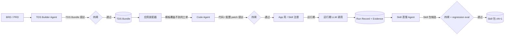

### 5.1 TDS Builder Agent（生成期 · 编译入口）

**职责**：吃 BRD / PRD + 可用能力上下文（已有 Skill 包清单、内核端点目录、组件库白名单），吐出**完整 TDS Bundle**。

| 维度 | 内容 |
| --- | --- |
| 输入 | BRD/PRD 文本；可用能力上下文（已注册 Skill 清单、内核端点目录、组件库白名单、历史 Run Record 索引） |
| 输出 schema | TDS Bundle 五子包（AppSpec / DataSpec / KnowledgeSpec / ToolSpec / EvalSpec）；每子包带 schema_version |
| 工具白名单 | 只读检索：现有 Skill 文档、端点目录、组件库 manifest；不允许写任何工件 |
| 禁区 | 不允许直接写 App 壳代码、不允许直接挂 Skill；不允许引用未注册的端点 |

**四闸门禁**：

| 闸 | 检查项 |
| --- | --- |
| 可验证 | TDS Bundle 通过 schema 校验；ToolSpec 中每个工具都能在端点目录里查到；DataSpec 中每个字段都能映射到内核数据端点 |
| 可回滚 | TDS Bundle 整体作为一个不可变版本写入仓库；回滚 = 切回上一个版本号 |
| 可审计 | 保留 prompt + 输入 hash + 输出 diff；每个字段标注产出原因（rationale） |
| human-confirmed | 装配器**不会**自动消费 TDS Bundle；必须有人评审通过 |

**对位现状**：商机洞察当前没有 TDS Bundle，是先有手写后端、再倒推契约。阶段 1 起把 PRD 编译产物切换为 TDS Bundle 作为单一交付包。

### 5.2 Code Agent（生成期 · 兜底）

**职责**：装配器三路中，**模板装配 + 能力运行时绑定都覆盖不到**的"少量定制 patch"才路由给它。绝不是兜底写整个 App。

| 维度 | 内容 |
| --- | --- |
| 输入 | 装配器开出的定制工单（缺口描述 + 上下文文件指针 + 验收用例） |
| 输出 schema | 代码 / 配置 patch（最小 diff）+ 自描述（改动文件、影响面、回滚指令） |
| 工具白名单 | 文件读写（限工单声明的路径）、本地 build / test runner |
| 禁区 | 不允许改 TDS Bundle、不允许改 Skill 契约、不允许触碰持久化层 schema、不允许跨工单合并改动 |

**四闸门禁**（与 [`docs/ai_coding_quality_gate.md`](ai_coding_quality_gate.md) 对齐）：

| 闸 | 检查项 |
| --- | --- |
| 可验证 | 工单声明的验收用例通过；不引入新 lint 错误；diff 局限在工单声明文件 |
| 可回滚 | 单 commit 单 patch；提供一键 revert 命令 |
| 可审计 | 完整 prompt + 工单上下文 + diff + 测试报告归档 |
| human-confirmed | patch 默认是"提议"状态；需要人显式 apply 才生效 |

### 5.3 Skill 蒸馏 Agent（沉淀期 · 离线）

**职责**：吃 Run Record + Evidence Pack，吐 Skill 包候选；不直接覆盖在线 Skill，只产候选。

| 维度 | 内容 |
| --- | --- |
| 输入 | 一批 Run Record（按 Skill / 类目 / 时间窗聚合）+ 关联 Evidence Pack |
| 输出 schema | 完整 Skill 包目录（contracts / runtime / prompts / knowledge / evals / examples），版本号 +1 |
| 工具白名单 | 只读 Run Record、Evidence、当前 Skill 包；写入"候选 Skill 仓库"（独立命名空间） |
| 禁区 | 不允许修改在线 Skill 路由；不允许回写 Run Record；不允许跳过 regression eval |

**四闸门禁 + 第五闸：regression eval pass**：

| 闸 | 检查项 |
| --- | --- |
| 可验证 | 候选 Skill 通过自带 evals 全套；与上一版本对比无回归（同 benchmark 上 score 不降） |
| 可回滚 | 候选 Skill 独立版本；晋升只需切路由表 |
| 可审计 | 蒸馏过程 trace：吃了哪些 run、产出哪些 prompts、规则改了什么 |
| human-confirmed | 晋升到在线 Skill 必须人评 |
| regression eval | 在线流量回放或 holdout 样本上跑回归，硬门禁不通过则拒绝晋升 |

**对位现状**：现状商机洞察 reference_skill_pack 是手工编写的 v0.1.0；阶段 1 引入蒸馏 Agent 后，v0.2.0 起由蒸馏 Agent 产出候选。

### 5.4 运行期 LLM 调用（被场景端点编排）

**职责**：在 Skill 内部、由场景端点编排的 LLM 调用。它们不是"智能体"，是"工具"。商机洞察现有 5 条 LLM 调用全部归此类。

| 调用 | prompt 角色 | 输入契约 | 输出 schema | 所属端点 | 用途分类 |
| --- | --- | --- | --- | --- | --- |
| review-insight | 结构化抽取 | 评论文本数组 | 评价洞察 JSON | competitor.analyze | 抽取 |
| qa-insight | 结构化抽取 | 问大家文本数组 | 问大家洞察 JSON | competitor.analyze | 抽取 |
| demand-cloud | 归类 | 评论 + 问大家洞察 | 8 大需求词云 JSON | competitor.analyze | 归类 |
| persona_keyword_filter | 归类 + 过滤 | 社媒人群 + 已确认 keyword | 强/中匹配人群 JSON | final.generate（回写 social） | 归类 |
| scene_text_completion | 补全 | 场景骨架 + 上下文 | 场景文案 JSON | final.generate | 补全 |
| final-report / persona | 生成 | 全节点 evidence | 机会卡 JSON | final.generate | 生成 |

**运行期 LLM 调用的硬规则**（不变量 #5 的落地）：

1. **只允许做四类工作**：结构化抽取、归类、补全、生成。
2. **不允许产出"事实结论"**：例如机会分数、人群规模、销量数字这些必须从数仓 / 规则得出；LLM 只能引用、不能新算。
3. **每次调用必须落 evidence**：prompt 模板 id、输入 hash、输出原文、计时、模型版本全部进 Run Record 的 `llm_calls[]`。
4. **失败必须可降级**：每条 LLM 调用都要在 Skill 的 `runtime/error_policy` 里声明降级策略（如 `demand-cloud` 失败时退化为关键词频次词云）。

### 5.5 四类角色禁区交叉表

| 角色 | 改 TDS Bundle | 改 App 壳 | 改 Skill 包 | 改运行内核 | 写 Run Record |
| --- | --- | --- | --- | --- | --- |
| TDS Builder | ✅（产出） | ❌ | ❌ | ❌ | ❌ |
| Code Agent | ❌ | ✅（工单内） | ❌ | ❌ | ❌ |
| 蒸馏 Agent | ❌ | ❌ | ✅（候选仓库） | ❌ | ❌（只读） |
| 运行期 LLM | ❌ | ❌ | ❌ | ❌ | ✅（被动登记） |

任何角色尝试越权，门禁系统应直接拒绝；这是不变量 #4 的具体边界。

---

## § 6  编译装配流水线（生成 · 首跑 · 沉淀 · 演进）

把 §2–§5 串成时间线。四阶段各一张 mermaid 时序图，明确标三方角色分工。

### 6.1 生成期（PRD → App 壳 + Skill 注册项）

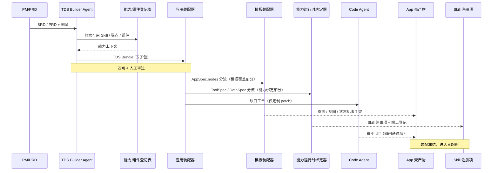

**三方分工**：

| 角色 | 这一阶段做什么 | 不做什么 |
| --- | --- | --- |
| 前端 | 提供组件库 manifest 给登记表；review TDS Bundle 中 AppSpec 切片 | 不写业务逻辑 |
| 后端 | 提供内核端点目录 / 已有 Skill 清单给登记表；review ToolSpec / DataSpec | 不在这一阶段加新端点（要加先回 PRD） |
| 智能体团队 | 跑 TDS Builder + Code Agent；维护四闸 | 不跑运行期 |

### 6.2 首跑期（用户首次跑通端到端）

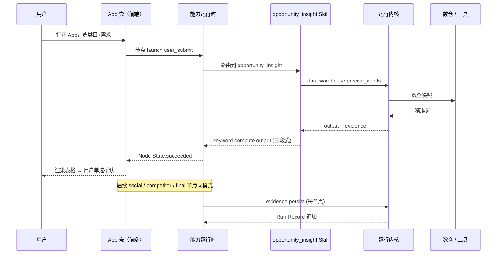

**三方分工**：

| 角色 | 这一阶段做什么 |
| --- | --- |
| 前端 | 按 Node State 渲染；按轮询契约表执行 poll；提交用户输入 |
| 后端 | 执行场景端点 → 调内核端点 → 写 evidence → 维护 Node State |
| 智能体团队 | 运行期 LLM 调用受场景端点编排，不主动决策 |

### 6.3 沉淀期（Run Record → Skill 候选）

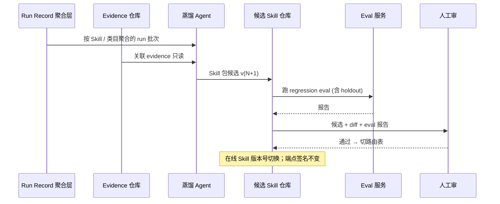

**三方分工**：

| 角色 | 这一阶段做什么 |
| --- | --- |
| 前端 | 无感（端点签名不变，零改动） |
| 后端 | 提供 Eval 服务、路由切换工具 |
| 智能体团队 | 跑蒸馏 Agent；维护 regression eval 用例集 |

### 6.4 演进期（阶段 0 → 阶段 1）

**阶段 0**：商机洞察当下姿态。运行内核 + 场景端点都是"裸服务"，Skill 包只有 contracts / tools 声明，runtime 由后端裸函数实现，prompts 散落在源码里。

**阶段 1**：Skill 包真正完整。`runtime/execution_plan.yaml` 接管 step 编排，prompts / knowledge / evals 从源码迁出到 Skill 包内，蒸馏 Agent 上线。

**升级检查点**（不变量 #3）：

| 检查项 | 阶段 0 | 阶段 1 |
| --- | --- | --- |
| 端点 input/output schema | 已稳定 | **不变** |
| evidence 三段式 | 必须有 | **不变** |
| prompts 位置 | 源码内 | 迁入 Skill 包 |
| runtime 执行计划 | 后端裸函数 | execution_plan.yaml 驱动 |
| rsi_feedback | 可选 | 必须 |
| App 壳 | — | **零改动** |

升级原则：**不可逆改动只发生在能力运行时内部**，前端始终零改动。这是阶段 0 之所以可以先上的根本原因。

---

## § 7  商机洞察 walkthrough（端到端样例）

本节把 [`insight-discovery-paradigm.html`](file:///Users/yichen/Desktop/产品方案设计/insight-discovery-paradigm.html) 的六节内容**重写**为本架构下的实例，证明 §2–§6 契约能承载真实场景。

节点链路：`launch → keyword → social → competitor (含 hot_product 子步骤) → final`。每节点走六视角切片：**PRD 切片 / TDS 编译产物 / 前端切片 / 后端切片 / 智能体切片 / 依赖与证据**。

> 范围声明：`price_band` 子能力**本期不启用**，仅在 §7.6 末尾"停用清单"列出；后端不实现，TDS Bundle 中 ToolSpec 不挂。

### 7.1 launch（发起入口）

**① PRD 切片**：用户进入 App，选类目（必选）+ 需求描述（选填）→ 生成查询上下文，进入 keyword 节点。

**② TDS 编译产物**：

| 子包 | 关键条目 |
| --- | --- |
| AppSpec | nodes[0] = `launch`，ord=0，page=`canvas`，interaction=`form_submit` |
| DataSpec | 字段：`category_id`（必填，来自类目树）/ `demand_text`（选填，自由文本） |
| ToolSpec | 绑定 `data.warehouse.category_tree`（兜底拉类目树，用于前端选择器） |
| KnowledgeSpec | 规则：`launch.required_fields_v1`（category_id 必填） |
| EvalSpec | 验收：表单校验通过率、跳转 keyword 成功率 |

**③ 前端切片**：

- 视图：canvas 页面承载类目选择器（树形或级联）+ 需求描述文本框 + "开始洞察"按钮。
- 状态机：launch 节点常驻 `awaiting_user`；用户提交后 → `running` → `succeeded` → 自动激活 keyword 节点的 `ready`。
- 调用姿态：`user_submit`；提交一次后冻结输入。

**④ 后端切片**：

- 主端点：`opportunity_insight.launch.commit`（sync，user_submit 提交后）。
- 内核依赖：`data.warehouse.category_tree`（取类目元数据用以校验）。
- 持久化：写 `Session` 头（含 category_id、demand_text、authSessionId / tenantId / userId）。
- 失败语义：upstream_empty 时（类目树为空）阻塞，next_action_hint = "请联系数据团队检查类目同步"。

**⑤ 智能体切片**：本节点**不调 LLM**。launch 是纯采集 + 元数据校验。

**⑥ 依赖与证据**：

| 项 | 内容 |
| --- | --- |
| 内核端点 | `data.warehouse.category_tree` |
| LLM 调用 | 无 |
| Evidence Pack | sources = `dw_snapshot:category_tree` + `user_input:launch_form` |
| 下游硬依赖 | keyword、final（无 category_id 则均无法启动） |

### 7.2 keyword（关键词分析）

**① PRD 切片**：拉精准词表（含机会分 / 供需比 / 搜索量）→ 用户单选一个精准词作为本次会话的"事实根"。

**② TDS 编译产物**：

| 子包 | 关键条目 |
| --- | --- |
| AppSpec | nodes[1] = `keyword`，由两个子节点构成：`keyword.fetch`（sync 拉表）+ `keyword.confirm`（user_submit 单选） |
| DataSpec | 字段集：`keyword / opportunity_score / supply_demand_ratio / search_volume / category_id`，ranking=`opportunity_score_desc` |
| ToolSpec | `data.warehouse.precise_words` → `ads_cid_precise_word_analysis_d` |
| KnowledgeSpec | 规则：`keyword.must_select_exactly_one_v1`、`keyword.scoring_v1`（机会分计算口径） |
| EvalSpec | 验收：精准词召回率、用户确认率 |

**③ 前端切片**：

- 视图：canvas 表格视图。
- 状态机：keyword.fetch `running` → `succeeded`（渲染表格）→ keyword.confirm 自动进入 `awaiting_user` → 用户选一行 → `running` → `succeeded` → 激活 social 节点。
- 禁区：前端不重算机会分；排序口径由 DataSpec 给定。

**④ 后端切片**：

- 主端点：`opportunity_insight.keyword.compute`（详见 §4.2.1）；`keyword.confirm` 走通用回写端点 `PUT /session/:id/data-bundle/node/keyword`。
- 内核依赖：`data.warehouse.precise_words` + `knowledge.keyword.scoring`。
- 持久化：`SessionDataBundle.keyword`（候选列表 + 已选词）+ `Report(keyword)`（用户可回看的快照）。
- 失败语义：upstream_empty 时下游全部阻塞，next_action_hint = "请换类目或细化需求描述"。

**⑤ 智能体切片**：本节点**不调 LLM**（机会分纯规则计算）。这是不变量 #5 的范例：事实数字一律走数仓 + 规则，不交给 LLM。

**⑥ 依赖与证据**：

| 项 | 内容 |
| --- | --- |
| 内核端点 | `data.warehouse.precise_words` / `knowledge.keyword.scoring` |
| LLM 调用 | 无 |
| Evidence Pack | sources = `dw_snapshot:ads_cid_precise_word_analysis_d` + `rule_pack:keyword_scoring_v1` |
| 下游硬依赖 | social（需 keyword 已确认）、final（硬依赖） |

### 7.3 social（会话 + 社媒）

**① PRD 切片**：建立会话上下文 → 拉社媒人群画像 + 小红书场景 → 组装 audience_scene_insights。**人群关键词筛选在 final 阶段执行后回写**。

**② TDS 编译产物**：

| 子包 | 关键条目 |
| --- | --- |
| AppSpec | nodes[2] = `social`，ord=2，自动节点（无用户交互），视图=drawer |
| DataSpec | 字段集：`persona_groups[]` / `xhs_scenes[]` / `audience_scene_insights` |
| ToolSpec | `data.warehouse.persona_groups`、`data.warehouse.xhs_scene_preview` |
| KnowledgeSpec | 规则：`social.audience_scene_assembly_v1`（人群 × 场景组装规则） |
| EvalSpec | 验收：人群非空率、场景非空率 |

**③ 前端切片**：

- 视图：drawer 侧拉，展示人群画像分组 + 小红书场景预览。
- 状态机：keyword 确认后 → social.ready → 自动 running → succeeded（无用户交互）。
- 调用姿态：sync。
- **二次更新提示**：final 阶段会回写 `social.analysis.persona_keywords`，前端需订阅 Node State 变化以重渲染 drawer。

**④ 后端切片**：

- 主端点：`opportunity_insight.social.fetch`（详见 §4.2.2）。
- 内核依赖：两条 `data.warehouse.*`。
- 持久化：`SessionDataBundle.social`（原始数据 + 组装结果）。
- 二次写入：final 阶段把 persona_keyword_filter 结果以**追加**方式写入 `social.analysis.persona_keywords`，原始 `social.fetch` 输出**不可变**。
- 失败语义：upstream_empty 时本节点 succeeded 但下游 final.readiness 会标记 `soft warning`；hard 失败则阻塞 final。

**⑤ 智能体切片**：

- 本节点**首跑期不调 LLM**。
- final 阶段的 `persona_keyword_filter` 会回写到本节点，但 LLM 调用本身归 final，不归 social。

**⑥ 依赖与证据**：

| 项 | 内容 |
| --- | --- |
| 内核端点 | `data.warehouse.persona_groups` / `data.warehouse.xhs_scene_preview` |
| LLM 调用 | 无（fetch 阶段）；persona_keyword_filter 回写挂在 final 的 evidence |
| Evidence Pack | sources = 两个数仓快照 + `rule_pack:audience_scene_assembly_v1` |
| 下游硬依赖 | final（硬依赖） |
| 跨写入指针 | `cross_write_from:final.generate.persona_keyword_filter` |

### 7.4 competitor（竞品分析，含 hot_product 子步骤）

> **关键说明**：`hot_product` **不是顶层节点**，而是 competitor 的子步骤 1（选品池）。这是与 [`insight-discovery-paradigm.html`](file:///Users/yichen/Desktop/产品方案设计/insight-discovery-paradigm.html) 节点卡片观感的对齐口径——前进式聊天流里它看起来像独立卡片，但 Node 链路上归在 competitor 之下。

**① PRD 切片**：从类目商品周榜拿候选 → 用户多选商品（最多 10）→ 后端建评论 / 问大家采集 job → 轮询采集完成 → LLM 横向对比 + 8 大需求词云。

**② TDS 编译产物**：

| 子包 | 关键条目 |
| --- | --- |
| AppSpec | nodes[3] = `competitor`，包含三个子节点：`competitor.hot_products`（user_submit）/ `competitor.collect`（async+poll）/ `competitor.analyze`（async） |
| DataSpec | 字段集：候选 / 选定商品 / 评论原文 / 问大家原文 / 横向对比 / 词云 |
| ToolSpec | `data.warehouse.category_goods_weekly`、`tool.just_one.review_ask`、`tool.llm.chat_json` |
| KnowledgeSpec | 规则：`competitor.select_at_most_10`、`competitor.demand_taxonomy_v1`（八大需求分类） |
| EvalSpec | 验收：采集成功率、LLM 抽取格式合规率、人评 insight 质量 |

**③ 前端切片**：

- 视图：competitor 主视图 canvas，承载三个子节点的进度条 + 词云结果区。
- 状态机：
  - `hot_products` ready → `running`（拉候选） → `awaiting_user`（多选）→ `succeeded`
  - `collect` ready → `running` → poll 循环（3000ms × 200）→ `succeeded` / `failed`
  - `analyze` ready → `running` → `succeeded`
- 跳过路径：用户可跳过整个 competitor → 整个节点 `skipped`，但 final.readiness 会标记 `soft_deps_met.competitor = false`。

**④ 后端切片**：

- 主端点：
  - `opportunity_insight.competitor.hot_products`（§4.2.3）
  - `opportunity_insight.competitor.collect`（§4.2.4）
  - `opportunity_insight.competitor.analyze`（§4.2.5）
- 内核依赖：`data.warehouse.*`、`tool.just_one.*`、`tool.llm.chat_json`。
- 持久化：`SessionDataBundle.hot_product`（选品） + `SessionDataBundle.competitor`（采集 + 分析） + `Report(competitor_detail_analysis)`。
- 失败语义：
  - collect 超时（200 次未 succeeded）→ failure_event = `timeout`，前端可选择重试或跳过。
  - analyze LLM 拒答 → failure_event = `llm_refused`，降级策略：词云退化为关键词频次词云（仅在 demand_word_cloud 失败时启用）。

**⑤ 智能体切片**：

| 调用 | prompt 角色 | 输入 | 输出 schema | 评估口径 |
| --- | --- | --- | --- | --- |
| review-insight | 结构化抽取 | 评论原文数组 | 评价洞察 JSON | 抽取条目数、格式合规率 |
| qa-insight | 结构化抽取 | 问大家原文数组 | 问大家洞察 JSON | 抽取条目数、格式合规率 |
| demand-cloud | 归类 | 评价 + 问大家洞察 | 8 大需求词云 JSON | 词云覆盖度、人评 |

禁区核查：三条 LLM 调用都**不产事实数字**（销量、用户数、价格）；它们只从已有文本里抽取、归类。

**⑥ 依赖与证据**：

| 项 | 内容 |
| --- | --- |
| 内核端点 | `data.warehouse.category_goods_weekly` / `tool.just_one.review_ask` / `tool.llm.chat_json` |
| LLM 调用 | review-insight / qa-insight / demand-cloud（共 3 条，前两条 chatJson、最后一条归类） |
| Evidence Pack | sources = 数仓快照 + 三方采集 task_id + 三条 LLM trace + 上游 evidence |
| 下游软依赖 | final（软依赖；跳过则 final 降级，不阻塞） |

### 7.5 final（最终报告）

**① PRD 切片**：先做就绪校验（硬依赖 keyword + social；软依赖 competitor）→ 异步生成（多阶段 LLM + 图片生成）→ 轮询每 2 秒上限 900 次 → 机会清单 / 人群 / 场景卡 / 优先级。

**② TDS 编译产物**：

| 子包 | 关键条目 |
| --- | --- |
| AppSpec | nodes[4] = `final`，包含三个子节点：`final.readiness`（sync）/ `final.generate`（async）/ `final.poll`（poll） |
| DataSpec | 字段集：机会卡 / 人群面板 / 场景卡 / 优先级矩阵 / 图片 url |
| ToolSpec | `tool.llm.chat_json`（多阶段）、`tool.image.gen`（persona_images + priority_images） |
| KnowledgeSpec | 规则：`final.readiness_v1`、`final.persona_match_v1`、`final.priority_matrix_v1` |
| EvalSpec | 验收：报告完整度、人群图片落盘成功率、人评机会卡质量 |

**③ 前端切片**：

- 视图：report 长文档抽屉。
- 状态机：
  - readiness `running` → `succeeded`（硬依赖满足）/ `failed`（回退到缺失节点）
  - generate `running` → `succeeded`（拿到 task ack）
  - poll `running` → 每 2000ms 查询一次（最多 900 次）→ `succeeded`（拿到完整报告）/ `failed`（timeout）
- 渲染：报告抽屉按 DataSpec.report 模板渲染四块区域，图片走 `/report/generated/*` 静态资源前缀。

**④ 后端切片**：

- 主端点：`opportunity_insight.final.readiness` / `final.generate` / `final.poll`（§4.2.6–4.2.7）。
- 内核依赖：`tool.llm.chat_json`、`tool.image.gen`、`knowledge.final.*`、`evidence.cross_write`（用于回写 social）。
- 持久化：`Report(final)` + 落盘图片 `backend/public/report/generated/*`，对外前缀 `/report/generated`。
- **跨节点回写时机**（与 §4.2.7 一致）：
  1. `final.generate` 启动后第一步调 `persona_keyword_filter`。
  2. 拿到强 / 中匹配人群结果。
  3. 在同一事务内回写 `SessionDataBundle.social.analysis.persona_keywords`，并登记 evidence 的 `cross_write:social.analysis` 指针。
  4. 继续执行场景文案补全、机会卡生成、图片生成。

**⑤ 智能体切片**：

| 调用 | prompt 角色 | 输入 | 输出 | 评估口径 | 备注 |
| --- | --- | --- | --- | --- | --- |
| persona_keyword_filter | 归类 + 过滤 | 社媒人群 + 已确认 keyword | 强 / 中匹配人群 JSON | 命中率、误召率 | 回写 social |
| scene_text_completion | 补全 | 场景骨架 + 上下文 | 场景文案 JSON | 文案完整率 | — |
| final-report | 生成 | 全节点 evidence | 机会卡 JSON | 人评质量、字段完整率 | — |
| persona_images | 图片生成 | persona 描述 | 图片 url | 落盘成功率 | 非 chat 网关 |
| priority_images | 图片生成 | 优先级条目 | 图片 url | 落盘成功率 | 非 chat 网关 |

禁区核查：所有数字（机会分、人群规模、优先级排序）来自上游 evidence，LLM 只引用 + 排版；图片生成是渲染补充，不影响事实结论。

**⑥ 依赖与证据**：

| 项 | 内容 |
| --- | --- |
| 内核端点 | `tool.llm.chat_json` / `tool.image.gen` / `knowledge.final.*` / `evidence.cross_write` |
| LLM 调用 | persona_keyword_filter / scene_text_completion / final-report（3 条 chatJson） |
| 图片调用 | persona_images / priority_images（2 条） |
| Evidence Pack | sources = 上游全部 evidence + 5 条 LLM/图片 trace + cross_write 指针 |
| 硬依赖 | keyword + social（缺则 readiness failed） |
| 软依赖 | competitor（缺则报告中竞品对比 / 词云区域降级） |

### 7.6 走通后的全局视图

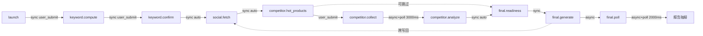

**停用 / 不启用清单**：

| 项目 | 状态 | 原因 |
| --- | --- | --- |
| price_band 子能力 | ❌ 本期不启用 | 业务暂未启用，ToolSpec 不挂避免后端误实现 |
| 价格带 LLM `price-band/analyze` | ❌ 停用 | 同上 |
| hot_product summary LLM | ⚠️ 旁路 | 仅 summary 接口用，主链路不调用，但 Skill 包内保留 prompt 以便复用 |

**与 reference_skill_pack 对位**：本 walkthrough 中所有契约口径与 [`reference_skill_pack/skill.yaml`](../benchmarks/opportunity_insight_benchmark_pack/benchmarks/skill_creator/opportunity_insight/reference_skill_pack/skill.yaml) + [`contracts/`](../benchmarks/opportunity_insight_benchmark_pack/benchmarks/skill_creator/opportunity_insight/reference_skill_pack/contracts) + [`runtime/execution_plan.yaml`](../benchmarks/opportunity_insight_benchmark_pack/benchmarks/skill_creator/opportunity_insight/reference_skill_pack/runtime/execution_plan.yaml) 一一对位；阶段 1 起完整对齐，阶段 0 容许 runtime 用裸函数实现。

---

## § 8  落地不变量与验收门禁

### 8.1 三视角不变量（在 §1 六条基础上细化）

| # | 不变量 | 前端表现 | 后端表现 | 智能体表现 |
| --- | --- | --- | --- | --- |
| 1 | 壳与能力运行时职责分离 | 不持业务规则、不发 LLM、不算字段 | 端点是唯一对外口径 | TDS Builder / Code Agent 不直接写运行期代码 |
| 2 | 端点三段式 input/output/evidence 缺一不可 | 拒渲染缺三段式的响应 | 缺一段不允许进路由表 | 任何角色不得绕过 evidence |
| 3 | 阶段升级前端零改动 | 端点签名不变 → 视图不变 | runtime 内部演化 | 蒸馏 Agent 只改 Skill 内部，不动 schema |
| 4 | Code Agent 产物默认是"提议" | 不直接生效 | apply 前需四闸通过 | 四闸不通过即拒绝 |
| 5 | 事实计算与流程永远在能力运行时 | 前端不重算业务字段 | 数仓 + 规则出数字，LLM 不出数字 | 运行期 LLM 只做抽取 / 归类 / 补全 / 生成 |
| 6 | 沉淀走 Run Record，不写回壳 | 前端只读 Node State | TDS Bundle 运行期不可改 | 蒸馏 Agent 只读 Run Record，写候选 Skill |

### 8.2 装配器三路晋升门禁

| 路径 | 可验证 | 可回滚 | 可审计 | human-confirmed |
| --- | --- | --- | --- | --- |
| 模板装配 | AppSpec schema 通过 + 组件库 manifest 命中 | 模板版本号回退即可 | 装配 trace 入仓 | PM / 前端组长签字 |
| 能力运行时绑定 | ToolSpec 中每条依赖在端点目录命中 + 兼容性检查 | 路由表条目可撤回 | 绑定 diff 入仓 | 后端 owner 签字 |
| Code Agent 兜底 | 工单验收用例通过 + 不引入 lint 错误 + diff 局限工单文件 | 单 commit revert | prompt + 工单 + diff + 测试报告 | 工程师显式 apply |

### 8.3 协同 checklist（三方各一份）

**前端**：
- [ ] 仅消费装配器派生清单，不读 TDS Bundle 五子包原始字段
- [ ] 节点状态机用 §3.3 固定表渲染
- [ ] 轮询参数来自清单，不写死
- [ ] failure_event 透出到 UI，不静默重试
- [ ] 用户输入用 idempotency_key 提交

**后端**：
- [ ] 每个端点都满足 §2.4 三段式
- [ ] 场景端点不直连数仓 / LLM SDK，统一走内核
- [ ] failure_event.kind 四类闭集合显式标注
- [ ] cross_write 必须登记 evidence 指针
- [ ] Run Record 字段齐全（含 skill_version / tds_bundle_ref）

**智能体团队**：
- [ ] TDS Builder 输出经过四闸 + 人评
- [ ] Code Agent 工单边界清晰，禁止跨工单合并
- [ ] 蒸馏 Agent 候选必须 regression eval pass
- [ ] 运行期 LLM 调用全部登记到 Run Record.llm_calls

---

## § 9  后续演进路线

### 9.1 阶段 0 → 阶段 1 升级检查点

| 检查项 | 阶段 0 现状 | 阶段 1 目标 | 升级前不可省 | 可暂缓 |
| --- | --- | --- | --- | --- |
| 端点三段式 | 必须有 | 必须有 | ✅ | ❌ |
| Run Record + Evidence | 必须有 | 必须有 | ✅ | ❌ |
| Skill 包 contracts | 已写 | 完整对齐 | ✅ | ❌ |
| Skill 包 runtime/execution_plan | 可空 | step 编排到位 | — | ✅ |
| Skill 包 prompts | 散在源码 | 迁入 Skill 包 | — | ✅ |
| Skill 包 evals | 可少量 | 完整 benchmark | — | ✅ |
| rsi_feedback | 可空 | 必须挂 | — | ✅ |
| 蒸馏 Agent | 不上线 | 上线 | — | ✅ |
| Code Agent 四闸 | 简化版 | 完整 | ✅ | ❌ |

**核心原则**：trace / evidence / 三段式三件套**永不可省**；prompts / runtime / 蒸馏可以分批迁移。

### 9.2 升级路径建议（按周）

| 阶段 | 工作内容 |
| --- | --- |
| Week 1–2 | 把现有商机洞察后端按 §4 端点分层重命名 + 显式登记 evidence；前端无改动 |
| Week 3–4 | 落 Run Record / Evidence Pack 持久层（可挂 JSON 列） |
| Week 5–6 | 把 prompts 从源码迁入 `reference_skill_pack/prompts/`；runtime 仍裸函数 |
| Week 7–8 | 引入 execution_plan.yaml 驱动，端点签名不变 |
| Week 9+ | 接入蒸馏 Agent，开始产 v0.2.0 候选 |

---

## § 10  开放问题清单

| # | 问题 | 当前倾向 | 谁定 |
| --- | --- | --- | --- |
| 1 | App 壳的组件库选型（antdv / 自研模板 / 别的） | 沿用 `fe-middle-website/apps/web-antd` | 前端组长 + 架构 |
| 2 | Skill 包版本化与回滚机制（git tag / 独立 registry） | 独立 registry，git 只做源码 | 后端 + 平台 |
| 3 | 蒸馏 Agent 触发条件（按 run 数 / 时间 / 手动） | run 数 + 人工触发并存 | 智能体团队 |
| 4 | 多租户下证据隔离粒度（按 tenantId 单独存储桶？） | tenantId 维度分桶 | 平台 + 安全 |
| 5 | canvas / 抽屉级别的交互回写如何回到 evidence（如用户手动修正机会卡） | 显式 `evidence.user_edit` 通道 | 后端 + 产品 |
| 6 | App 壳与 Skill 灰度版本不一致时的兼容策略 | 端点 schema_version 协商 | 后端 + 前端 |
| 7 | 失败链路上 Run Record 是否保留半成品 evidence | 保留，标记 `partial` | 平台 |

---

## 附录 A  术语表

| 术语 | 含义 | 出现章节 | 与现有文档对齐 |
| --- | --- | --- | --- |
| App 壳 | 节点 / 视图 / 状态机的容器，承载用户可见 UI | §1 §3 §7 | [whitepaper §3](skill-runtime-whitepaper.md) |
| 能力运行时 | 运行内核 + 场景 Skills 的统称 | §1 §4 | [whitepaper §4](skill-runtime-whitepaper.md) |
| TDS Bundle | PRD 编译产物，含五子包 | §2.2 §6.1 | [v5 架构图](skill-runtime-architecture-v5.html) |
| Skill 包 | 场景能力封装单元 | §2.3 §4.3 | [reference_skill_pack](../benchmarks/opportunity_insight_benchmark_pack/benchmarks/skill_creator/opportunity_insight/reference_skill_pack) |
| 端点契约 | input/output/evidence 三段式 | §2.4 §4 | whitepaper §5 |
| Node State | 节点运行态字段 | §2.5 §3.3 | — |
| Evidence Pack | 业务结论的可追溯证据 | §2.6 | whitepaper §6 |
| Run Record | 一次会话的执行归档 | §2.7 | whitepaper §7 |
| 装配器 | 把 TDS Bundle 装成 App 壳 + Skill 注册项 | §1 §6.1 | v5 架构图 |
| 三路分流 | 模板装配 / 能力绑定 / Code Agent 兜底 | §6.1 §8.2 | v5 架构图 |
| 四闸门禁 | 可验证 / 可回滚 / 可审计 / human-confirmed | §5 §8.2 | [ai_coding_quality_gate.md](ai_coding_quality_gate.md) |
| 运行期禁区 | LLM 不出事实数字、不算业务字段 | §3.7 §4.6 §5.4 | whitepaper §10 |

## 附录 B  端点契约字段一览表（人话版）

| 端点 | 姿态 | 关键 input | 关键 output | evidence sources |
| --- | --- | --- | --- | --- |
| `opportunity_insight.launch.commit` | sync user_submit | category_id / demand_text | session_ctx | dw_snapshot:category_tree + user_input |
| `opportunity_insight.keyword.compute` | sync | category_id / demand_text / top_n | keywords[] + ranking_strategy | dw_snapshot:precise_words + rule_pack:keyword_scoring_v1 |
| `opportunity_insight.social.fetch` | sync auto | session_ctx | persona_groups + xhs_scenes + audience_scene_insights | 两个数仓快照 + rule_pack |
| `opportunity_insight.competitor.hot_products` | sync + user_submit | mode + selected_product_ids[] | candidates / product_contexts | dw_snapshot:category_goods_weekly |
| `opportunity_insight.competitor.collect` | async+poll | product_ids[] | task_id / progress | tool_job:just-one-review-ask |
| `opportunity_insight.competitor.analyze` | async | task_id | comparison_table / demand_word_cloud / review/qa_insight | 3 条 llm_trace + upstream:collect |
| `opportunity_insight.final.readiness` | sync | session_id | hard/soft_deps_met / next_action_hint | rule_pack:final_readiness_v1 |
| `opportunity_insight.final.generate` | async | session_id | (启动 ack) | 启动期不出业务结论 |
| `opportunity_insight.final.poll` | async+poll | session_id | opportunity_cards / persona_panels / scene_cards / priority_matrix | 5 条 llm/tool trace + cross_write:social |

## 附录 C  与 reference_skill_pack 索引对照

| 本文档章节 | reference_skill_pack 路径 | 对位说明 |
| --- | --- | --- |
| §2.3 Skill 包 / §4.3 加载契约 | [`skill.yaml`](../benchmarks/opportunity_insight_benchmark_pack/benchmarks/skill_creator/opportunity_insight/reference_skill_pack/skill.yaml) | skill_id / version / trigger / rsi_feedback 字段对照 |
| §4.2 端点 input / output | [`contracts/input_schema.json`](../benchmarks/opportunity_insight_benchmark_pack/benchmarks/skill_creator/opportunity_insight/reference_skill_pack/contracts/input_schema.json) / [`contracts/output_schema.json`](../benchmarks/opportunity_insight_benchmark_pack/benchmarks/skill_creator/opportunity_insight/reference_skill_pack/contracts/output_schema.json) | 字段口径完整对齐 |
| §6.4 阶段升级 | [`runtime/execution_plan.yaml`](../benchmarks/opportunity_insight_benchmark_pack/benchmarks/skill_creator/opportunity_insight/reference_skill_pack/runtime/execution_plan.yaml) | step 序列；阶段 0 退化为后端裸函数 |
| §4.6 失败语义 | `runtime/error_policy.yaml` | failure_event.kind 四类映射 |
| §5.4 运行期 LLM 调用 | `prompts/` | 每条调用对应一个 prompt 模板文件 |
| §7 各节点知识规则 | `knowledge/` | claim_pack / strategy_rules / negative_cases |
| §8 验收门禁 | `evals/` | benchmark / regression_cases / scoring_rubric |
| §3.1 前端清单 | `app/ui_components` + `app/app_spec_template` | 生成期前端清单的来源模板 |

---

> 本文档不引入新代码与新 schema 文件；如需把契约落地为可执行 schema，请基于 reference_skill_pack 内现有文件做版本化演进，并按 §8 三方 checklist 走完晋升门禁。

---

## § 11  MVP 极简跑通（最小可演示路径）

目标：一周内**端到端跑通一条链路**，证明三段式 + Node State + Run Record 真的能承载商机洞察。其他全部砍。

### 11.1 砍到只剩"骨头"的范围

**只保留**：

| 项 | 保留范围 |
| --- | --- |
| 链路 | `launch → keyword → final`（三个节点） |
| 调用姿态 | sync 一种；不做 async + poll |
| 视图 | canvas 一种；不做 drawer、不做 report 抽屉 |
| LLM | 一条：`final.summary`（机会清单文本） |
| 证据 | 三段式必须有，但只落 JSON 文件，不做 evidence 仓库 |
| 持久化 | 单进程内存 + 一个 `runs/<run_id>/` 目录归档 |

**砍掉**（明确不在 MVP 内）：

| 项 | 不做的原因 |
| --- | --- |
| social / competitor / hot_product 节点 | 涉及数仓多表 + 三方采集 + 多 LLM，扩散过快 |
| async + poll 姿态 | 加状态机复杂度，最后再加 |
| 图片生成 | 不影响主链路验证 |
| persona_keyword_filter 跨节点回写 | 等 social 上线再做 |
| 蒸馏 Agent / Code Agent / TDS Builder | MVP 不跑生成期，手写 TDS Bundle |
| 多租户隔离、灰度、版本化 | 不阻塞跑通 |

### 11.2 MVP 链路（一张图看完）

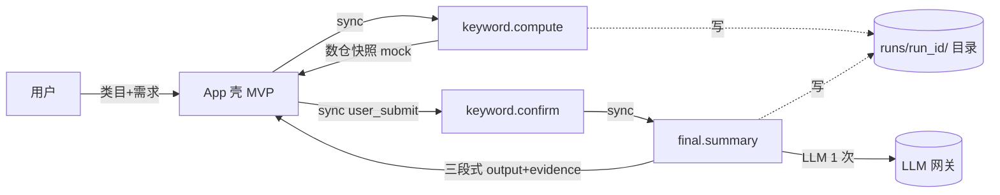

### 11.3 极简分工（三人即可，每人一条主线）

| 角色 | 一人即可承担 | MVP 周内只做这些 | 交付物 |
| --- | --- | --- | --- |
| **前端 FE** | 1 人 | App 壳（canvas 一种视图 + Node State 状态机 + sync 调用器） | 跑得起来的本地壳，能渲染表格 + 表单 + 文本块 |
| **后端 BE** | 1 人 | 三个端点：`keyword.compute` / `keyword.confirm` / `final.summary`，统一三段式；数仓暂用本地 mock JSON | 三个 HTTP 端点 + `runs/<run_id>/*.json` 归档 |
| **智能体/算法 AG** | 1 人 | 一条 prompt：`final.summary`；写一份 mock TDS Bundle（手写五子包 YAML） | prompt 模板 + TDS Bundle YAML + 一条 LLM 调用 trace 归档 |

**协作面**只有两张表，吵架就回这两张：

1. **端点契约表**：每个端点的 input / output / evidence 字段（按 §4.2 写下来即可）。
2. **Node State 翻译表**：FE 用的状态 → UI 映射（§3.3 那张表，三节点版）。

其他什么都不约。

### 11.4 一周时间表（按工作日颗粒度）

| 天 | FE | BE | AG | 联调 |
| --- | --- | --- | --- | --- |
| D1 | 选 antd + Vite 起壳，画三节点骨架 | 起 Fastify，写三段式公共中间件 | 写 TDS Bundle YAML + final.summary prompt 草稿 | — |
| D2 | 写 Node State store + sync 调用器 | 写 `keyword.compute`（接 mock JSON 数仓） | mock LLM gateway（先返回固定文本） | 约定端点契约表 |
| D3 | 接通 keyword 节点 → 渲染表格 | 写 `keyword.confirm`（落 `SessionDataBundle.keyword`） | LLM 接真实网关 | 跑通 launch → keyword |
| D4 | 接通 final 节点 → 渲染文本块 | 写 `final.summary`（调 LLM + 写 evidence） | 把 prompt 调到能拿可读结果 | 跑通 final |
| D5 | 状态机失败态 UI + 重试按钮 | 失败语义四类标注 + `runs/` 归档完整 | evidence 字段补齐 trace | **端到端 demo + 复盘** |

### 11.5 跑通判定（5 条硬条件）

满足这 5 条，MVP 才算"跑通"。一条不满足不算。

| # | 条件 | 验证方法 |
| --- | --- | --- |
| 1 | 用户选类目 + 输需求，能看到精准词表 | 打开 App，到 keyword 节点显示 ≥ 1 行 |
| 2 | 选一个精准词后，能拿到可读机会清单文本 | 进 final 节点看到非空文本 |
| 3 | 每个端点响应都含 input / output / evidence 三段式 | 看 `runs/<run_id>/*.json`，三段都不为空 |
| 4 | 失败可见：故意断 LLM 网关，前端能渲染失败态 + 重试 | 手动测试，UI 不静默吞错 |
| 5 | 一次完整 run 能从 `runs/` 目录复盘出：哪些端点被调了、LLM 调用的 prompt 和输出、evidence 指向哪些 mock 数据 | 直接看目录内容 |

### 11.6 MVP 之后第一件该做的事

**不是**接 social，**也不是**接图片，**而是**：

把 BE 现有的三个 mock JSON 数仓换成真数仓 `data.warehouse.*` 内核端点。一旦内核端点形状对了，后面 social / competitor / final 全是"加 Skill 端点 + 加节点 schema"的复制粘贴，不再动壳。

---

## § 12  两段式切刀：把"揉在一起的应用"切成 生成期 + 运行期

前提：你**已经有**三块料 —— App 壳定义、后端服务端点、工作流编排基础框架。现在不重写它们，只是**重新归位**。

### 12.1 一句话切法

中间画一条线，线之上叫**生成期产物**，线之下叫**运行期产物**。线本身是一份 **App 清单**（manifest）：纯数据、无逻辑、可读可 diff。

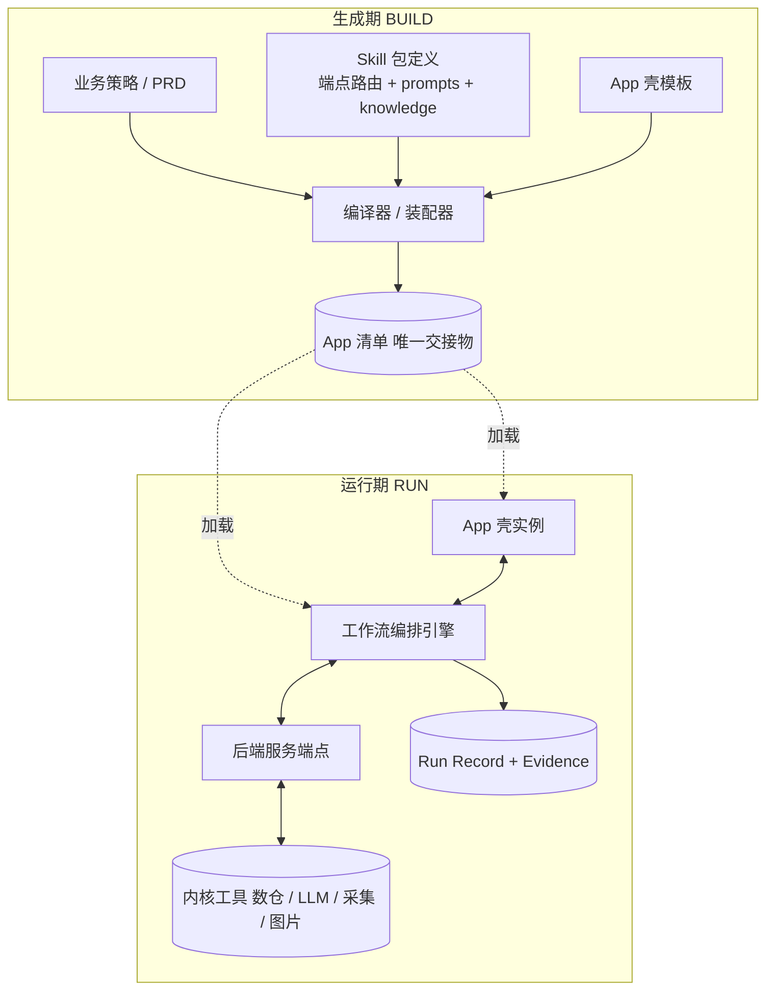

**铁律**：生成期产物**不参与运行期分支判断**；运行期产物**不修改生成期工件**。两段之间只通过 App 清单交换。

### 12.2 现有三块料怎么归位

| 现有的料 | 归到哪一段 | 在那一段里扮演什么 | 改造动作 |
| --- | --- | --- | --- |
| App 壳定义 | 运行期 | "清单解释器"——按清单渲染节点、调用端点、维护 Node State | 把**写死的节点顺序 / 写死的调用 URL** 抽出去到清单 |
| 后端服务端点 | 运行期 | 能力运行时对外口径 | 把**节点编排逻辑**（"keyword 完了走 social"）从端点里搬走，端点只做端点的事 |
| 工作流编排基础框架 | 运行期 | 读清单的 DAG → 调端点 → 写 Run Record | 把"商机洞察专属"的步骤名 / 跳转规则从代码搬到清单 |
| ❌ 散在三块里的"节点顺序、轮询参数、视图绑定、依赖关系、文案" | **生成期** | 集中到 App 清单 | 一份 YAML / JSON |

**判断一段代码归哪里的两个问题**（写在评审 checklist）：

1. 换一个商机洞察的兄弟应用（如"竞品分析专家"），这段代码**还能复用**吗？能 → 运行期；不能 → 生成期产物。
2. 这段代码里有**业务命名**（`keyword` / `social` / `competitor`）出现吗？有 → 应该挪到清单里，代码只读清单字段。

### 12.3 App 清单的最小字段集（交接面）

App 清单是**两段之间唯一的合同**。MVP 阶段先只放这些字段：

| 字段 | 谁产出 | 谁消费 | 内容 |
| --- | --- | --- | --- |
| app_id / version | 生成期 | 运行期 | 唯一标识，运行期挂在 Run Record |
| nodes[].id | 生成期 | 前端 + 编排引擎 | 业务节点 id（如 `keyword`） |
| nodes[].ord | 生成期 | 前端 | 节点顺序 |
| nodes[].view | 生成期 | 前端 | canvas / drawer / report 三选一 + 列定义指针 |
| nodes[].interaction | 生成期 | 前端 | none / single_select / multi_select / form_submit |
| nodes[].endpoint_id | 生成期 | 编排引擎 | 该节点调哪个后端端点 |
| nodes[].call_mode | 生成期 | 前端 + 编排引擎 | sync / async+poll / user_submit |
| nodes[].polling | 生成期 | 前端 | poll 模式专属：interval / max_attempts / timeout |
| nodes[].depends_on / soft_depends_on | 生成期 | 编排引擎 + 前端 | 前置节点 id 列表 |
| copywriting[] | 生成期 | 前端 | 标题 / 占位 / 错误 / 空态文案 |
| skill_refs[] | 生成期 | 能力运行时 | 本 App 加载哪些 Skill 包及版本 |

**不在清单里的东西**（重要）：

- 数仓表名 → 在 Skill 包内
- LLM prompt 全文 → 在 Skill 包内
- 业务规则阈值 → 在 Skill 包的 KnowledgeSpec
- 鉴权透传逻辑 → 在内核工具里

清单只描述"页面 / 节点 / 调谁 / 怎么调"，**不描述**"端点内部怎么算"。

### 12.4 一刀切完后，商机洞察长这样

**生成期产物**（一份 YAML，可手写、可机器编译）：

```yaml
app_id: opportunity_insight_app
version: 0.1.0
skill_refs:
  - ecommerce.opportunity_insight@0.1.0
nodes:
  - id: launch
    ord: 0
    view: canvas
    interaction: form_submit
    endpoint_id: opportunity_insight.launch.commit
    call_mode: user_submit
    depends_on: []
  - id: keyword
    ord: 1
    view: canvas
    endpoint_id: opportunity_insight.keyword.compute
    call_mode: sync
    depends_on: [launch]
  - id: keyword.confirm
    ord: 2
    view: canvas
    interaction: single_select
    endpoint_id: opportunity_insight.keyword.confirm
    call_mode: user_submit
    depends_on: [keyword]
  - id: social
    ord: 3
    view: drawer
    endpoint_id: opportunity_insight.social.fetch
    call_mode: sync
    depends_on: [keyword.confirm]
  - id: competitor.hot_products
    ord: 4
    view: canvas
    interaction: multi_select
    endpoint_id: opportunity_insight.competitor.hot_products
    call_mode: user_submit
    depends_on: [social]
  - id: competitor.collect
    ord: 5
    view: canvas
    call_mode: async+poll
    polling: { interval_ms: 3000, max_attempts: 200, timeout_ms: 600000 }
    endpoint_id: opportunity_insight.competitor.collect
    depends_on: [competitor.hot_products]
  - id: competitor.analyze
    ord: 6
    view: canvas
    call_mode: async
    endpoint_id: opportunity_insight.competitor.analyze
    depends_on: [competitor.collect]
  - id: final
    ord: 7
    view: report
    call_mode: async+poll
    polling: { interval_ms: 2000, max_attempts: 900, timeout_ms: 1800000 }
    endpoint_id: opportunity_insight.final.generate
    depends_on: [keyword.confirm, social]
    soft_depends_on: [competitor.analyze]
```

**运行期产物**（你已经有的三块料，但删掉硬编码）：

- App 壳：读清单 → 渲染节点 → 按 call_mode 派姿态调用器 → 按 Node State 翻表，不再 `if (node === 'keyword') ...`
- 后端服务端点：保留现有 7 个端点 + launch.commit；从端点内部**移除**节点顺序判断；保留三段式
- 编排引擎：读清单的 `depends_on` 自动算 DAG；读 `call_mode` 决定要不要 poll；不再 `if (currentStep === 'final-readiness') ...`

### 12.5 两段式带来的具体好处（用商机洞察例子）

| 需求 | 揉在一起时怎么改 | 切刀后怎么改 |
| --- | --- | --- |
| 临时跳过 `competitor` | 改前端跳转 + 改后端 readiness + 改编排 if/else | 改清单：`competitor.*` 节点加 `optional: true` |
| 把 `final` 轮询从 2s 改成 1.5s | 改前端常量 + 改后端 polling 配置 | 改清单一行 |
| 上线"竞品分析专家"兄弟应用 | 大段复制商机洞察的前后端代码 | **写一份新清单 + 加一个 Skill 包**，壳和编排不动 |
| 把 `keyword` 视图从表格换成卡片 | 改前端组件 + 找业务字段映射 | 改清单 `view` 字段 + 加列定义 |
| `social` 节点临时加个用户确认 | 改前端 + 改后端 + 改编排 | 清单里把 `social` 拆成 `social.fetch` + `social.confirm` 两节点 |

### 12.6 极简分工（两人就够）

| 角色 | 这一段干什么 | 不碰什么 |
| --- | --- | --- |
| **运行期工程师**（1 人） | App 壳改成"清单解释器"；端点抽掉编排逻辑；编排引擎读清单字段；落 Run Record | 不写商机洞察专属逻辑；不碰清单内容 |
| **生成期工程师**（1 人） | 写商机洞察 App 清单 YAML；后续兄弟应用也归他写；维护 Skill 包内 prompts/knowledge | 不改壳代码；不改端点内部实现 |

**交接面**只有 App 清单一份文件。改动评审只看一件事：**是改了清单字段，还是改了运行期代码**。两边混改不允许。

### 12.7 切刀的执行顺序（三步走，每步独立可验证）

| 步 | 动作 | 完成判定 |
| --- | --- | --- |
| ① 把硬编码挪到清单 | 仓库内新建 `apps/opportunity_insight/app_manifest.yaml`，把前端 / 后端里散落的节点顺序、URL、轮询参数、视图绑定**拷贝**进去（先不删源码里的，双轨跑） | 清单加载后，前端 / 编排引擎能"读清单等价生效"，与硬编码并行无差异 |
| ② 删掉硬编码，单源 | 删除前端 / 编排里的硬编码字段，**只**从清单读 | 商机洞察跑通；改清单一字段能反映到 UI |
| ③ 复制清单做兄弟应用 | 复制清单 → 改 5–10 行 → 拉起"竞品分析专家" demo | 不动一行壳 / 端点代码就能拉起第二个 App |

第 ③ 步是验证两段式有没有切干净的**唯一标尺**。切完前两步如果第三步还要回去改壳，就说明刀没切到位。

### 12.8 切刀过程中容易踩的三个坑

| 坑 | 现象 | 修正 |
| --- | --- | --- |
| 把"端点 ID"写死在壳代码里 | 节点配置只能配标题、配不了端点 | 清单必须能指定 `endpoint_id`；壳按 id 查路由表 |
| 把"业务条件"塞进清单 | 清单里出现 `if score > 70 then ...` 这种判定 | 业务规则**必须**回到 Skill 包的 KnowledgeSpec；清单只描述"调谁"，不描述"算什么" |
| 编排引擎里残留"商机洞察专属"步骤名 | 引擎里有 `case "keyword":` `case "final":` | 一律改成读 `depends_on` 算 DAG，不写 case 分支 |

---

## § 13  最小可编译运行规范（再砍一刀）

§11 / §12 仍然假设"App 壳能自己渲染清单"。再砍：**UI 不让编译器碰**。先人工写死一个 2 栏或 3 栏的产品框架代码，编译器只往这个框架里灌内容、接管节点流程和数据。

### 13.1 一句话

> 产品框架（UI 骨架）= **人写一次、所有 App 共用**。
> 编译器只负责把**业务文档**编成 5 件事：节点流程 / 节点产物 / 人机交互对产物的操作 / 节点数据来源 / 每节点 LLM 三段输入。

### 13.2 产品框架（人工写死的部分）

任选一种布局先写死一套，后续所有 App 都共用：

```text
┌────────── 2 栏布局（推荐起步）──────────┐
│ 左：节点 / 步骤导航                       │
│ 右：当前节点产物展示 + Agent 交互对话框   │
└──────────────────────────────────────────┘

┌────────── 3 栏布局（备选）──────────┐
│ 左：节点导航  │ 中：节点产物  │ 右：Agent 对话/操作 │
└────────────────────────────────────┘
```

**人工写死的内容**（编译器永不动）：

| 框架元素 | 谁写 | 什么时候改 |
| --- | --- | --- |
| 整体 2 栏 / 3 栏布局 | 前端工程师手写一次 | 产品框架升级才改 |
| 节点导航组件、产物展示槽位、Agent 对话框 | 前端工程师手写一次 | 同上 |
| 三种产物视图组件（表格 / 卡片 / 文档） | 前端工程师手写一次 | 同上 |
| Agent 操作面板（"重做该节点 / 修改输入 / 接受产物"等按钮） | 前端工程师手写一次 | 同上 |
| Node State 状态机翻译表（loading / failed / awaiting_user） | 前端工程师手写一次 | 同上 |

**编译器永远只能往槽位里灌"内容描述"**，不能改框架代码。

### 13.3 编译器只输出这 5 件事

编译器吃业务文档，吐**一份编译产物**（YAML/JSON）。这份产物**只能**包含以下 5 类条目，多一类都不行：

#### ① 节点执行流程

| 字段 | 内容 | 示例（商机洞察） |
| --- | --- | --- |
| nodes[].id | 节点 id | `keyword` / `social` / `final` |
| nodes[].ord | 顺序 | 0,1,2... |
| nodes[].depends_on | 依赖节点列表 | `[keyword.confirm, social]` |
| nodes[].mode | sync / async+poll / user_submit | — |
| nodes[].polling | 轮询参数 | `interval_ms=2000, max=900` |

编排引擎只读这些字段算 DAG，不写任何 case 分支。

#### ② 节点产物（artifact）描述

每个节点最终在产物展示槽里呈现什么，必须用三种产物类型之一：

| 产物类型 | 形状 | 适用场景 |
| --- | --- | --- |
| `table` | 列定义 + 行数据 | 精准词表、商品周榜 |
| `card_group` | 卡片列表（标题 + KV + 图） | 人群面板、机会卡 |
| `doc` | Markdown 文档块 | 报告聚合、场景文案 |

编译产物里写：

| 字段 | 内容 |
| --- | --- |
| nodes[].artifact.kind | table / card_group / doc |
| nodes[].artifact.schema_ref | 字段口径指针（列名、KV 键、文档段落） |
| nodes[].artifact.empty_text | 空态文案 |

前端框架按 `kind` 派一个写死的组件去渲染，**没有第四种**。

#### ③ Agent 交互对产物的操作

人通过 Agent 对话框对节点产物能做什么。统一枚举（前端框架已写死按钮）：

| 操作 | 语义 | 触发后果 |
| --- | --- | --- |
| `regenerate` | 重做该节点 | 清空当前 artifact → 重新执行该节点端点 |
| `refine_with_input` | 带补充输入重做 | 用户输入文本 → 拼到下一次端点 input.params.refine_hint |
| `accept` | 接受产物 | Node State → succeeded，激活下游 |
| `reject_and_skip` | 拒绝并跳过 | Node State → skipped（仅软依赖节点允许） |
| `clarify` | 反问 Agent | 进意图澄清子流（见 ④） |

编译产物里写：

| 字段 | 内容 |
| --- | --- |
| nodes[].agent_ops | 允许的操作子集（默认 `[regenerate, refine_with_input, accept]`） |
| nodes[].refine_hint_field | refine 文本拼到端点 input 哪个字段 |

#### ④ 用户意图澄清 + 最终报告聚合

两个特殊节点，**所有 App 都必须有**：

**意图澄清节点（intent_clarify）**：

| 字段 | 内容 |
| --- | --- |
| 位置 | 永远是 nodes[0] |
| mode | user_submit + LLM 反问环 |
| artifact.kind | doc（澄清问题清单 + 用户回答摘要） |
| 产出 | `clarified_intent` 对象，下游所有节点的 LLM 输入都能引用 |

**报告聚合节点（final_aggregate）**：

| 字段 | 内容 |
| --- | --- |
| 位置 | 永远是最后一个节点 |
| mode | async+poll |
| artifact.kind | doc |
| 输入 | 全部上游节点的 artifact + clarified_intent |
| LLM 任务 | 只做聚合 / 排版 / 摘要，不产新事实数字 |

这两个节点不需要业务文档定义，编译器**默认生成**。业务文档只描述中间节点。

#### ⑤ 每节点 LLM 三段输入拼装

每个节点要调 LLM，输入永远拼成三段 + 一段输出契约，**顺序固定**：

```text
[系统提示词] System Prompt
  └── 角色、风格、安全边界、输出格式硬约束

[业务逻辑] Business Logic
  └── 该节点的判定规则、阈值、口径、禁区（来自 Skill 包 KnowledgeSpec）

[数据装配] Data Pack
  └── 数仓 API 结果 + 知识库 API 结果 + 外部工具调用结果 + 上游 artifact 引用
  └── 已经过结构化（JSON / 表格），不允许塞原文长文档

[输出契约] Output Schema
  └── JSON schema 或字段清单；超出 schema 的输出一律丢弃
```

编译产物里每个调 LLM 的节点都必须有：

| 字段 | 内容 | 来源 |
| --- | --- | --- |
| nodes[].llm.system_prompt_ref | 系统提示词模板指针 | Skill 包 / 全局模板库 |
| nodes[].llm.business_logic_ref | 业务逻辑片段指针 | Skill 包 KnowledgeSpec |
| nodes[].llm.data_pack | 数据装配规则：拉哪些数据 API / 知识库 API / 工具调用，按什么形状塞 | Skill 包 ToolSpec + DataSpec |
| nodes[].llm.output_schema_ref | 输出契约指针 | Skill 包 contracts |

**三段独立可改**：调 prompt 风格只改第 1 段；调业务规则只改第 2 段；调数据源只改第 3 段；改输出格式只改第 4 段。互不串味。

### 13.4 数据装配的三种来源（与 ⑤ 配套）

`data_pack` 装的料只能来自这三类，且每条都要登记到 evidence：

| 类型 | 例子 | 编译产物里写 |
| --- | --- | --- |
| 数据 API | 数仓表 / 业务 DB | `data_pack[].source=data_api, endpoint=data.warehouse.xxx, params=...` |
| 知识库 API | KnowledgeSpec 规则集 / 行业知识检索 | `data_pack[].source=knowledge_api, ref=...` |
| 外部工具 | 三方采集 / LLM 子调用 / 图片生成 / 浏览器抓取 | `data_pack[].source=tool, tool_id=..., params=...` |

**编译器永远不直接生成 prompt 文本**——它只生成"装配规则"，运行期能力运行时按规则拼。这是 §1 不变量 #5 在编译器层面的落地。

### 13.5 编译器最终交付物（一张图）

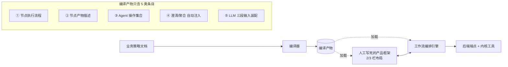

### 13.6 极简跑通判定（替换 §11.5）

满足下列 5 条即"最小可编译运行规范"跑通：

| # | 条件 |
| --- | --- |
| 1 | 用 2 栏框架渲染商机洞察，节点导航 + 产物展示 + Agent 操作三件齐 |
| 2 | 编译产物只含 §13.3 的 5 类条目，无第六类 |
| 3 | 任一节点的 LLM 输入按 4 段拼装：系统提示词 / 业务逻辑 / 数据装配 / 输出契约 |
| 4 | 用户能在 Agent 对话框点 `regenerate` / `refine_with_input` / `accept`，节点状态机正确翻转 |
| 5 | 意图澄清节点产出 `clarified_intent`，最终聚合节点能消费它 + 全部上游 artifact 出文档 |

### 13.7 三种角色的极简分工

| 角色 | 一次性投入 | 持续工作 |
| --- | --- | --- |
| **前端工程师**（1 人） | 写死 2 栏框架 + 3 种产物组件 + Agent 操作面板 + 状态机翻译表 | 仅在产品框架升级时改；日常零改动 |
| **编译器工程师**（1 人） | 实现编译产物生成器 | 给新 App 写业务文档 + 调编译产物 |
| **后端工程师**（1 人） | 实现端点三段式 + 数据/知识/工具内核 + LLM 三段装配器 | 增加新内核工具或新端点 |

新 App = **写一份业务文档 + 跑一次编译器**，前端零改动，后端只在缺工具时才扩。

### 13.8 不变量补充（写进 §8.1）

| # | 不变量 | 表现 |
| --- | --- | --- |
| 7 | UI 框架人工写死，编译器不生成 UI | 编译产物无任何"组件 / 布局 / 样式"字段 |
| 8 | 编译产物只含 5 类条目 | 多一类就拒绝晋升 |
| 9 | 每节点 LLM 输入按 4 段拼装且独立可改 | 一段污染另一段视为违规 |
| 10 | 意图澄清 + 报告聚合两节点默认存在 | 业务文档不写也要有 |

---

## § 14  节点骨架 × 输入灵活性 × Agent 框架 × 执行引擎（一锅端）

把前面几节拧成一句话：

> **骨架编译死、用料运行活；Agent 灵活但走窄门；引擎兜状态与存储；编译期 / 运行期共用同一套 schema。**

### 14.1 编译期固定 vs 运行期灵活

| 维度 | 编译期决定 | 运行期可变 |
| --- | --- | --- |
| 节点**个数** | ✅ 由编译产物冻结 | ❌ 不能新增/删除 |
| 节点 id / ord | ✅ | ❌ |
| `depends_on`（DAG 拓扑） | ✅ | ❌ |
| `artifact.kind`（table / card_group / doc） | ✅ | ❌ |
| `agent_ops` 允许集合 | ✅ | ❌ |
| LLM 4 段装配**模板 ref**（系统提示词 / 业务逻辑 / 数据装配 / 输出契约） | ✅ | ❌ |
| 数据 API / 知识 API / 工具调用**绑定关系** | ✅ | ❌ |
| 节点 input **实际值** | ❌ | ✅ 通道①②③④ 合并 |
| `refine_hint` 文本 | ❌ | ✅ Agent 对话框 |
| 重做 / 接受 / 跳过 触发 | ❌ | ✅ 用户/Agent |
| 上游 artifact 选择（同 kind 多选时） | ❌ | ✅ Agent 可挑 |
| 意图澄清答案 | ❌ | ✅ 对话产出 |

**节点个数**这一行是上一轮明确点：编译产物一旦生成就冻结，要改骨架=重新编译。

### 14.2 节点输入的 4 个通道（运行期合并）

每次节点执行，引擎把 input 从 4 个通道合并：

| # | 通道 | 来源 | 形状 |
| --- | --- | --- | --- |
| ① | 编译期常量 | `nodes[].input_defaults` | 静态 KV |
| ② | 上游 artifact 引用 | `depends_on` 上游节点的 artifact | 结构化对象 |
| ③ | 用户表单回写 | `mode=user_submit` 时的表单字段 | 表单 KV |
| ④ | **Agent 动态输入** | 右侧 Agent 对话框（`refine_with_input` / `clarify` 解析后的 patch） | 自由文本 + 解析后的 patch |

合并优先级：① < ② < ③ < ④（Agent 最高）。但**只能覆盖**编译产物里声明 `overridable=true` 的字段；其余字段为禁区，Agent 即使想改也会被引擎拒绝。

每个字段在编译产物里多带一个旗标：

| 字段元属性 | 含义 |
| --- | --- |
| `overridable` | 是否允许被 Agent / 用户在运行期覆盖 |
| `override_source` | 允许覆盖的来源白名单（user_form / agent_patch / both） |
| `validator_ref` | 覆盖后必须重新通过的 schema 校验 |

### 14.3 右侧 Agent 框架（灵活层，但工具集是窄门）

采用 ReAct / PI 风格的轻量 Agent 框架（参考 OpenCLAW 等"以工具调用为骨架"的范式），但**工具白名单在编译期定型**，运行期 Agent 不能扩展：

| 工具 | 语义 | 落点 |
| --- | --- | --- |
| `ops.regenerate(node_id)` | 重做节点 | 触发 transition → 重新执行 |
| `ops.refine_with_input(node_id, patch)` | 自然语言解析为 patch 注入 | 进通道 ④ |
| `ops.accept(node_id)` | 接受产物 | Node State → succeeded |
| `ops.reject_and_skip(node_id)` | 拒绝并跳过（仅软依赖节点） | Node State → skipped |
| `ops.clarify(question)` | 反问 | 进澄清子流 |
| `ctx.read_artifact(node_id)` | 读上游 artifact | 只读 |
| `ctx.read_run_state()` | 看整个会话 Node State | 只读 |

**Agent 不能直接调数据 API、工具、LLM 子调用**——所有副作用走 `ops.*`，由节点执行引擎落库。这条是 §1 不变量 #5（LLM 不产事实结论）的运行期映射。

灵活在哪里：

- Agent 内部的 prompt / 推理路径 / 自然语言对话风格不受编译产物约束
- Agent 可以多轮反问、提议组合操作（"我建议先 refine keyword 再 accept social"）
- 但每一步落地必须命中工具白名单

### 14.4 节点执行引擎（确定层）

编译期和运行期**共用同一份引擎定义**。职责：

| 职责 | 内容 |
| --- | --- |
| 状态机管理 | Node State 翻转的唯一来源；非法转移直接拒 |
| 持久化存储 | 每次 transition / artifact / evidence / agent_op 都落库 |
| DAG 调度 | 读 `depends_on` 决定下游 `ready` |
| 轮询 / 超时 / 重试 | 按编译产物 `polling` 配置执行，业务层零感知 |
| 输入合并 | ①②③④ 通道合并 + `overridable` 校验 + schema validator |
| Agent ops 路由 | 接 Agent 框架的 `ops.*` 调用，翻译成 transition |

Node State 字段（在 §2.4 基础上补）：

| 字段 | 含义 |
| --- | --- |
| `input_snapshot` | 本次执行最终合并后的 input |
| `input_overrides[]` | Agent / 用户的 patch 列表（含时间戳 + 来源） |
| `transition_history[]` | 状态翻转序列（含触发者：system / user / agent） |
| `evidence_refs[]` | 关联的 Evidence Pack id |
| `artifact_version` | 每次 regenerate +1，旧版不删（可回滚） |

最小持久化模型（统一表，前后端约定一致）：

| 实体 | 主键 | 内容 |
| --- | --- | --- |
| `run` | `run_id` | App + Skill + 用户 + 起止 |
| `node_state` | `(run_id, node_id, version)` | Node State 快照 |
| `transition` | `(run_id, node_id, seq)` | 翻转事件 + 触发者 |
| `artifact` | `(run_id, node_id, version)` | 产物快照 |
| `evidence` | `evidence_id` | 数据/工具/LLM 调用证据 |
| `agent_op` | `(run_id, op_seq)` | Agent 触发的 `ops.*` 记录 |

落盘目录沿用 §2.6：`runs/<run_id>/`，每张表对应一组 JSONL/parquet 文件，外加 `agent_ops.jsonl` 单独记 Agent 行为，方便事后审计 Agent 是不是越权。

### 14.5 两边同源：编译期与运行期共用一套定义

| 定义 | 编译期用法 | 运行期用法 |
| --- | --- | --- |
| 节点模板 schema | 校验编译产物每个节点字段合法 | 引擎读它做调度 + 输入合并 |
| Node State 状态机 | 校验声明的 transition 合法 | 运行时唯一状态变量 |
| Agent ops 白名单 | 校验 `nodes[].agent_ops` 都在白名单内 | Agent 框架的工具集 |
| LLM 4 段装配模板 | 校验 4 个 ref 都能解析 | 按模板拼真实 prompt |
| 持久化字段口径 | 校验 artifact / evidence schema 对齐持久化表 | 直接落库 |
| `overridable` 旗标 | 校验任何 overridable 字段都有 validator_ref | 运行期 Agent 想改先过校验 |

**硬规则**：任一侧改字段，编译器和运行时必须**同发版**。否则视为 broken contract，门禁拒绝晋升。

### 14.6 一张图：四层关系

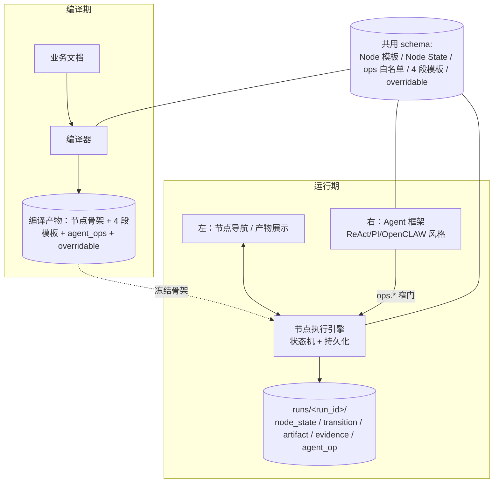

### 14.7 不变量补充（追加进 §8.1）

| # | 不变量 | 表现 |
| --- | --- | --- |
| 11 | 节点骨架编译期冻结 | 运行期新增/删除节点视为违规 |
| 12 | Agent 副作用只能走 `ops.*` | Agent 直接调 API/工具/LLM 视为违规 |
| 13 | 引擎是状态翻转的唯一来源 | 跳过引擎写状态视为违规 |
| 14 | 编译期 / 运行期共用同一套 schema | 任一侧改字段必须双侧同发版 |
| 15 | 输入覆盖只对 `overridable=true` 字段生效 | 越权覆盖必须被 validator 拒 |

### 14.8 跑通判定补丁（追加到 §13.6 之后）

| # | 条件 |
| --- | --- |
| 6 | 编译产物冻结节点个数，运行期 UI 不出现"加节点"入口 |
| 7 | 右侧 Agent 对话框任意一次操作都能在 `runs/<run_id>/agent_ops.jsonl` 找到记录 |
| 8 | 状态机翻转 100% 经引擎，旁路写状态视为违规 |
| 9 | Agent 注入的 patch 命中 `overridable=false` 字段时被 validator 拒绝并提示用户 |
| 10 | App 重启后从持久化恢复任意一次会话的 Node State 与 artifact 完全一致 |

---