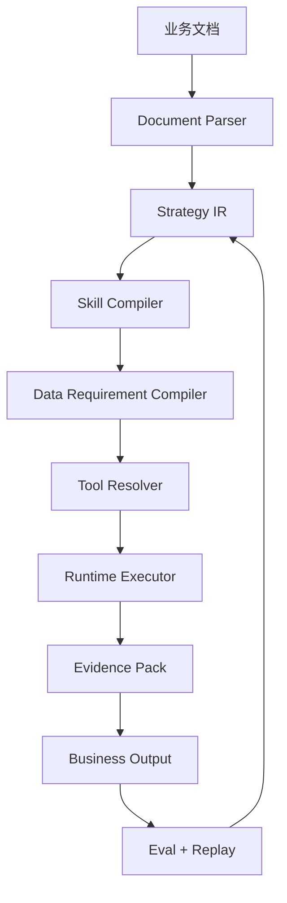
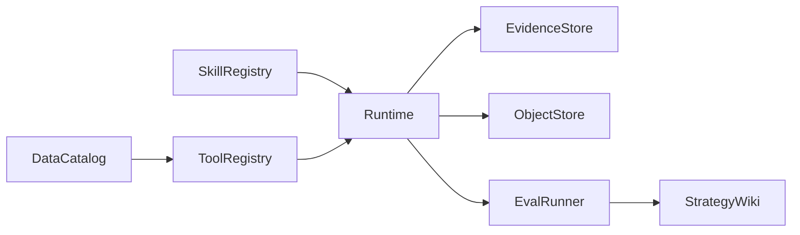

# 技术架构

## 1. 总体架构



## 2. 模块说明

### Document Parser

负责解析 Markdown / Docx / PDF / Wiki 文档，抽取：

- 标题层级。
- 流程步骤。
- 数据来源。
- 表格模板。
- 判断标准。
- 公式。
- 产出物。

### Strategy IR

统一中间表示，包含：

- `business_scenes`
- `business_questions`
- `outputs`
- `workflow_steps`
- `data_sources`
- `rules`
- `templates`

### Skill Compiler

将 Strategy IR 编译为：

- `SKILL.md`
- `skill.yaml`
- `workflow.dag.yaml`
- `output_schemas/*.json`
- `eval_rules.yaml`

### Data Requirement Compiler

把文档中的数据来源和执行动作转为标准数据需求。例如：

```text
导出行业前300商品榜单
```

转为：

```yaml
id: category_top_products_300
required_fields:
  - rank
  - shop_name
  - product_url
  - sales
  - gmv
  - price
```

### Tool Resolver

根据 Data Requirement 匹配：

1. 内部 API。
2. BI API。
3. 浏览器自动化。
4. 外部 Web Intelligence。
5. 人工上传。

### Runtime Executor

按 DAG 执行节点。MVP 使用 mock executor，生产阶段可接 LangGraph / OpenClaw / Temporal。

### Evidence Pack

每个结论、分数、建议必须有证据包。

## 3. 推荐生产拓扑


