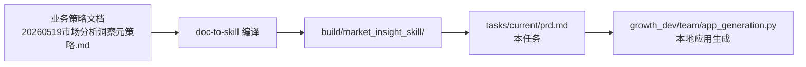

# Context: 市场分析洞察报告生成器

## 链路定位

本任务位于 `业务策略文档 → Skill → PRD → 本地应用` 链路的第三段（PRD 段）。上下文不能脱开以下三层关系阅读：

- 上游业务文档：`document-to-skill-engineering-package/examples/source_docs/20260519市场分析洞察元策略.md`
- 上游 Skill 制品：`document-to-skill-engineering-package/build/market_insight_skill/`
- 方法论：`docs/business_doc_to_prd_method.md`
- 下游 PRD → 本地应用规范：`docs/app_generation_prd_to_local_app_spec.md`
- 标准段渲染依据：`docs/app_generation_deterministic_fallback_spec.md`
- 定制段 Agent 接口：`docs/app_generation_agent_bridge_spec.md`

## 本任务边界

本任务交付 PRD 与配套规范，**不**直接生成应用代码。代码生成由下游 `app_generation` 链路完成。

交付物清单：

- `tasks/current/task.yaml` 任务元数据
- `tasks/current/domain.yaml` 领域契约
- `tasks/current/context.md` 本文件
- `tasks/current/prd.md` PRD 主体
- `tasks/current/tech_spec.md` 技术规范
- `tasks/current/ui_spec.md` UI 规范
- `tasks/current/eval.md` 评测计划
- `tasks/current/coding_prompt.md` Code Agent 约束
- `tasks/current/review_checklist.md` 评审清单
- `tasks/current/tdd_cases.md` TDD 用例骨架

## 标准段 / 定制段视角

按 `docs/business_doc_to_prd_method.md` 第 1.1 节定义：

- 标准段 = 应用骨架壳 + Skill 驱动业务区。来自 Skill 产物的字段、节点、表 schema、规则阈值都属于标准段。由模板渲染器（deterministic fallback 路径）零 LLM 生成。
- 定制段 = PRD 独有声明，由 Code Agent（codex executor 路径）实现。本 PRD 在文末以 `customizations[]` 显式列出。

## 安全边界

- 不接真实电商 API；不实现登录、抓取、指纹、代理。
- 所有事实数字（GMV、销量、增长率、买家占比）必须来自 CSV 上传或本地规则引擎计算；LLM 只能做归类、标签化与文案改写。
- 所有结论必须绑定 `evidence_ids`；缺数据时显示「待补数据」，不允许编造。
- 阈值与公式以 `eval_rules.yaml` 为唯一来源；PRD 与代码均不得二次发明。
- 跨平台趋势节点的浏览器自动化在原 Skill 中存在；本应用形态退化为 CSV 上传，浏览器路径列入未来版本，不进 v1。

## 关键引用

- `build/market_insight_skill/workflow.dag.yaml` 10 节点 DAG
- `build/market_insight_skill/data_requirements.yaml` 6 个数据契约 + Evidence 字段
- `build/market_insight_skill/output_schemas/` 10 张 JSON Schema
- `build/market_insight_skill/eval_rules.yaml` 4 条 hard_requirements + 4 条规则 + 4 项 quality_metrics
- `build/market_insight_skill/SKILL.md` 业务问题与策略

## 状态约束

PRD 文档完成前，下游 `app_generation` 链路不应被触发。`team.yaml` 的 `gates.before_coding` 已要求 `prd.md / tech_spec.md / ui_spec.md / eval.md` 全部齐备。