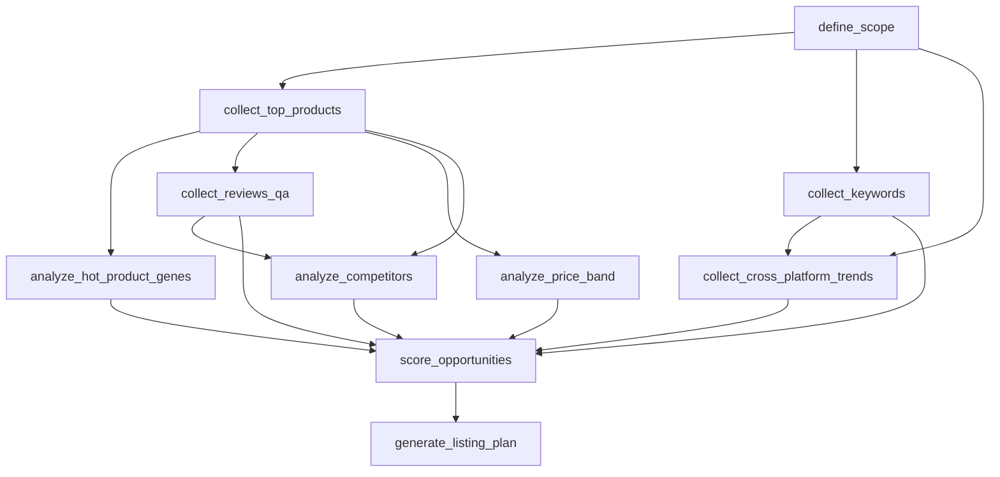

# PRD: 市场分析洞察报告生成器

> 本 PRD 严格遵循 [`docs/business_doc_to_prd_method.md`](../../docs/business_doc_to_prd_method.md) 的 8 节模板。每节四栏：来自 Skill / 标准段 / 定制段 / 禁止包含。
> 上游 Skill：[`document-to-skill-engineering-package/build/market_insight_skill/`](../../document-to-skill-engineering-package/build/market_insight_skill/)。
> 本 PRD 不复述 Skill；引用即可。

## 应用形态

- `shell_kind`: `report_generator`
- 部署形态：本地 SPA（`index.html` + `app.js` + `styles.css`）+ Node stdlib HTTP 服务（`server.js`）+ Python 规则引擎（FastAPI 或 stdlib HTTP 子进程，由 tech_spec 决定）。
- 持久化：浏览器 `localStorage` 保存表单与进度；服务端将上传 CSV 落盘到 `runs/<run_id>/uploads/`，Evidence Pack 落盘到 `runs/<run_id>/evidence/`。
- 网络：不出网，不调用真实电商 API。
- 输出物：10 张报告表 + 7+8 条结论 + 机会评分 + 链接规划，可一键导出为 `final_report.md`。

---

## 1. 目标

| 栏 | 内容 |
| --- | --- |
| 来自 Skill | `SKILL.md` Purpose、`strategy_ir.yaml` 8 个 business_questions |
| 标准段 | 把 8 个业务问题（卖得好 / 涨得快 / 用户搜什么 / 用户抱怨什么 / 哪里竞争弱 / 应该做什么 / 怎么打 / 链接规划）压成一份结构化报告；面向单人或小团队的离线分析场景 |
| 定制段 | 报告默认面向「淘系类目运营」语境；其他平台需自行替换 CSV 字段语义；本 PRD 不为非淘系平台定制 |
| 禁止包含 | 复述业务文档「为什么要做市场洞察」；列举无依据的 GMV / 转化目标 |

---

## 2. 用户与场景

| 栏 | 内容 |
| --- | --- |
| 来自 Skill | `strategy_ir.yaml` 中的子场景与业务问题 |
| 标准段 | 角色：① 操作者（导入 CSV，填写边界，等待报告），② 评审者（读结论、对照 Evidence），③ 维护者（修 schema 或规则映射） |
| 定制段 | 主用例：「新类目立项」「老类目优化」「价格带扩张」三套预设；预设决定权重 hint 与默认展示顺序 |
| 禁止包含 | 列「营销 / 投放 / 客服」等明显超出 Skill 边界的角色 |

主场景（用户旅程）：

1. 操作者在「定义分析边界」表单填 8 项字段，选用例预设。
2. 系统提示需要上传的 6 类 CSV。操作者按节点逐项上传，或一次性上传。
3. 系统按 DAG 拓扑顺序计算，每个节点显示状态（待输入 / 计算中 / 完成 / 降级 / 失败）。
4. 节点完成后生成对应表格 + 结论卡 + Evidence 入口。
5. 全部节点完成后，展示「机会评分」「链接规划」两张总览卡。
6. 操作者点击「导出报告」，下载 `final_report.md`。

---

## 3. 输入

### 3.1 边界表单（来自 Skill `define_scope` 节点）

| 字段 | 类型 | 必填 | 说明 |
| --- | --- | --- | --- |
| `category` | string | 是 | 类目名（如 "女装连衣裙"） |
| `product_line` | string | 是 | 产品线（如 "夏季法式"） |
| `shop_stage` | enum | 是 | new_brand / growing / established |
| `goal` | enum | 是 | validate_new_line / optimize_existing / expand_price_band |
| `period` | string | 是 | 分析周期（如 "2025Q3"） |
| `target_price_band` | string | 否 | 目标价格带（如 "200-400"） |
| `target_audience` | string | 否 | 目标人群 |
| `advantages` | string | 否 | 自有优势描述 |

### 3.2 CSV 上传槽位（一一对应 `data_requirements.yaml`）

| 槽位 | data_requirements.id | 必填 | required_fields 数 |
| --- | --- | --- | --- |
| 1 | `category_top_products_300` | 是 | 16 |
| 2 | `category_keywords_top300` | 是 | 8 |
| 3 | `competitor_reviews_qa` | 是 | 9 |
| 4 | `price_band_distribution` | 否（可由 1 计算） | 7 |
| 5 | `competitor_landscape` | 是 | 10 |
| 6 | `cross_platform_trend_signals` | 否 | 11 |

| 栏 | 内容 |
| --- | --- |
| 来自 Skill | 6 个 `data_requirements` 的 `required_fields` 完整列表 |
| 标准段 | 表单字段顺序、CSV 槽位与 `data_requirements.id` 一一对应、缺字段时给出明确报错 |
| 定制段 | CSV 列名兼容映射表（例如「支付买家数」「成交买家数」均归一为 `sales_or_pay_buyer_count`） |
| 禁止包含 | 私自增删 required_fields、私自重命名字段语义 |

---

## 4. 工作流

### 4.1 DAG（直接引用）

来源：[`workflow.dag.yaml`](../../document-to-skill-engineering-package/build/market_insight_skill/workflow.dag.yaml)。本 PRD 不修改拓扑。



### 4.2 节点状态机（标准段）

每个节点统一 5 状态：`pending_input` / `running` / `ok` / `degraded` / `failed`。

- `pending_input`：等待上游或等待 CSV。
- `running`：规则引擎或归类 LLM 在跑。
- `ok`：输出 schema 校验通过且结论已绑定 evidence_ids。
- `degraded`：数据缺失但非阻断节点，允许下游继续，但下游结论会被标注「数据不全」。
- `failed`：硬性约束失败（例如 `evidence_required_for_each_conclusion` 不满足）。下游阻断。

| 栏 | 内容 |
| --- | --- |
| 来自 Skill | `workflow.dag.yaml` 节点列表与依赖 |
| 标准段 | 5 状态状态机；左侧节点进度条按 DAG 拓扑顺序展示 |
| 定制段 | `collect_cross_platform_trends` 在缺 CSV 时允许跳过且整体不阻断（定制项 `cross_platform_optional`） |
| 禁止包含 | 在 PRD 中修改 DAG、增删节点、调换依赖 |

---

## 5. 输出

### 5.1 表格卡片绑定

| 节点 | 输出 schema | 卡片标题 | 关联结论数 |
| --- | --- | --- | --- |
| `collect_top_products` | `top_300_product_analysis_table` | 行业 TOP300 商品分析 | 7 条 |
| `analyze_hot_product_genes` | `category_market_analysis_table` | 类目大盘 / 爆款基因 | 由规则触发 |
| `collect_keywords` | `keyword_demand_breakdown_table` + `keyword_root_top20_table` | 关键词需求拆解 + 词根 TOP20 | 8 条 |
| `collect_reviews_qa` | `review_qa_painpoint_table` | 评价与问大家痛点 | 由规则触发 |
| `analyze_price_band` | `price_band_opportunity_table` | 价格带机会 | 由规则触发 |
| `analyze_competitors` | `competitor_landscape_table` + `competitor_visual_service_comparison_table` | 竞品格局 + 主图/详情/客服对比 | 由规则触发 |
| `collect_cross_platform_trends` | `cross_platform_trend_table` | 跨平台趋势 | 由规则触发 |
| `score_opportunities` | `opportunity_scores`（derived） | 机会评分 | 触发 `opportunity_score` |
| `generate_listing_plan` | `product_development_listing_plan` | 产品开发与链接规划 | 由规则触发 |

### 5.2 统一卡片结构

每张表统一形状（与 `output_schemas/*.json` 对齐）：

```
{
  rows: [...],
  conclusions: [{ rule_id, label, supporting_metrics, evidence_ids }],
  evidence_ids: [...]
}
```

| 栏 | 内容 |
| --- | --- |
| 来自 Skill | `output_schemas/*.json` 共 10 张 |
| 标准段 | 卡片 = 表格 + 结论卡 + Evidence 抽屉入口；结论卡渲染 `label` + `supporting_metrics` 详情 |
| 定制段 | 报告导出 Markdown 模板（章节顺序、表头中文化、结论排版） |
| 禁止包含 | 在 PRD 重定义 schema 字段；让 LLM 直接输出表格数据 |

---

## 6. 规则与阈值

### 6.1 直接引用 `eval_rules.yaml`

| 触发位置 | rule_id | 说明 |
| --- | --- | --- |
| TOP300 商品分析结论卡 | `strong_hot_gene` | TOP50 / TOP100 / 买家 / GMV 占比任两项 |
| TOP300 商品分析结论卡 | `trend_hot_gene` | 高增速商品 / 关键词增长 / 买家增长 / 跨平台高热任两项 |
| 评价痛点 + 价格带 + 竞品综合 | `differentiated_opportunity_gene` | 痛点 / QA 顾虑 / TOP50 承接 / 价格带供给任两项 |
| 机会评分卡 | `opportunity_score` | 100 分加权，85/70/60 三档结论 |

| 栏 | 内容 |
| --- | --- |
| 来自 Skill | `eval_rules.yaml` 中 4 条 rule + hard_requirements + quality_metrics |
| 标准段 | 每张表结论卡引用 rule_id；规则计算由规则引擎执行；档位文案直接来自 rule output_label |
| 定制段 | 越线文案的措辞（强爆款基因 ✅ / 趋势爆款基因 🚀 / 差异机会 💡 / 暂不开发 ⏸） |
| 禁止包含 | 在 PRD 中重新设定阈值；让 LLM 计算评分 |

---

## 7. 安全与证据策略

| 栏 | 内容 |
| --- | --- |
| 来自 Skill | `evidence_schema.yaml`、`SKILL.md` Data Policy / Evidence Policy |
| 标准段 | 每条 CSV 上传落地为 Evidence Pack（`source_name / query_params / fetched_at / raw_response_id`）；每条结论的 `evidence_ids` 非空才能渲染 |
| 定制段 | Evidence 抽屉的展示形态（左侧时间线、右侧字段对照）；脱敏要求（默认无脱敏，仅供本地查看） |
| 禁止包含 | 接真实电商 API、绕过登录、自动浏览器抓取、上传敏感凭据；让 LLM 编造 GMV / 销量 / 增长率等事实数字 |

降级策略矩阵：

| 数据槽位 | 缺失时行为 |
| --- | --- |
| `category_top_products_300` | 阻断 `analyze_hot_product_genes / analyze_price_band / analyze_competitors / score_opportunities`，整体进入 `failed` |
| `category_keywords_top300` | 阻断 `collect_cross_platform_trends`，`score_opportunities` 降级（关键词维度计 0 分） |
| `competitor_reviews_qa` | `analyze_competitors` 降级；评价痛点表为空；`differentiated_opportunity_gene` 不触发 |
| `price_band_distribution` | 从 TOP300 计算（标记 `derived_from=category_top_products_300`） |
| `competitor_landscape` | `analyze_competitors` 降级 |
| `cross_platform_trend_signals` | 整体 `degraded`，机会评分注明「跨平台维度未参与」 |

---

## 8. 验收

### 8.1 硬性约束（来自 `eval_rules.yaml.hard_requirements`）

- `required_outputs_present`：10 张 schema 与 `opportunity_scores / listing_plan` 在最终 run artifact 中都存在。
- `evidence_required_for_each_conclusion`：每条结论的 `evidence_ids` 非空。
- `score_formula_required`：`opportunity_score` 的 6 项分项与权重必须可在 run artifact 追溯。
- `no_data_no_strong_claim`：被降级或缺数据的维度不得参与「强爆款基因」「差异机会基因」结论。

### 8.2 质量指标（来自 `eval_rules.yaml.quality_metrics`）

| 指标 | 目标 |
| --- | --- |
| workflow_node_success_rate | ≥ 0.95 |
| data_requirement_coverage | ≥ 0.90 |
| evidence_completeness | ≥ 0.95 |
| output_schema_validity | = 1.00 |

### 8.3 应用级验收（PRD 独有）

- 一份合成 fixture（覆盖 6 个 CSV）能跑完整 DAG，产生完整的 `final_report.md`。
- 缺失 `competitor_reviews_qa` 时整体进入 degraded，下游结论数减少但不阻断。
- 缺失 `category_top_products_300` 时整体进入 failed，UI 明确提示阻断节点。
- 一键导出 `final_report.md`，文件包含 10 章 + 机会评分 + 链接规划 + Evidence 索引。

| 栏 | 内容 |
| --- | --- |
| 来自 Skill | hard_requirements + quality_metrics |
| 标准段 | 硬性约束与质量指标直接列入应用级验收 |
| 定制段 | 8.3 的 4 条应用级验收（fixture 覆盖 / 降级行为 / 阻断行为 / 导出报告） |
| 禁止包含 | 只写「能展示」「跑得通」等无 schema_id / rule_id 引用的验收 |

---

## customizations 清单（PRD 独有，必填）

| id | position | behavior | acceptance |
| --- | --- | --- | --- |
| `report_export_md` | 全局右上角「导出报告」按钮 | 一键拼接 10 章 + 机会评分卡 + 链接规划 + Evidence 索引为单文件 Markdown | 导出文件含 10 节标题、所有结论附 `evidence_ids` 段、Evidence 索引段映射到上传 CSV 名 |
| `csv_field_aliases` | CSV 上传阶段 | 兼容常见列名变体，归一化为 `data_requirements` 字段；不识别的列警告但不报错 | 同一 fixture 用 3 套不同列名命名都能解析通过 |
| `case_preset` | 边界表单顶部 | 提供「新类目立项 / 老类目优化 / 价格带扩张」三套预设，预设决定展示顺序与权重 hint | 三套预设切换时表单默认值与节点排序变化，但 DAG 不变 |
| `evidence_drawer` | 全局右侧抽屉 | 点击任意结论的 evidence_ids 后弹出抽屉，左侧时间线，右侧字段对照 | 任意结论卡均可触发抽屉；抽屉关闭后不丢失状态 |
| `conclusion_copy` | 各表结论卡 | 标签文案：强爆款基因 ✅ / 趋势爆款基因 🚀 / 差异机会 💡 / 立项 / 测试 / 观察 / 不开发 | 文案与 rule output_label 一一对应；不增加未在 eval_rules 出现的标签 |
| `degraded_banner` | 全局顶部 | 任一节点 degraded 时显示横幅，说明跨平台或评价维度未参与 | 横幅消失条件为该节点重新进入 ok |
| `failed_block_dialog` | 阻断节点对应卡片 | 显示「需补：`<data_requirements.id>` CSV，缺以下字段：…」 | 字段列表来自 schema 校验返回，无字段时显示「文件未上传」 |
| `cross_platform_optional` | `collect_cross_platform_trends` 节点 | 允许跳过；整体不阻断；机会评分注明该维度未参与 | 跳过后 `score_opportunities.degraded_dimensions` 含 `cross_platform` |

每条定制项的实现属于 Code Agent 范围；标准段（DAG / 表 schema / 规则阈值 / Evidence 形状）由模板渲染器零 LLM 生成。

---

## 附录 A：与 Skill 的引用对照

| PRD 段 | 引用文件 |
| --- | --- |
| §3 输入 | `data_requirements.yaml` |
| §4 工作流 | `workflow.dag.yaml` |
| §5 输出 | `output_schemas/*.json` |
| §6 规则与阈值 | `eval_rules.yaml` |
| §7 安全与证据 | `evidence_schema.yaml`、`SKILL.md` |
| §8 验收硬性约束 | `eval_rules.yaml.hard_requirements` |